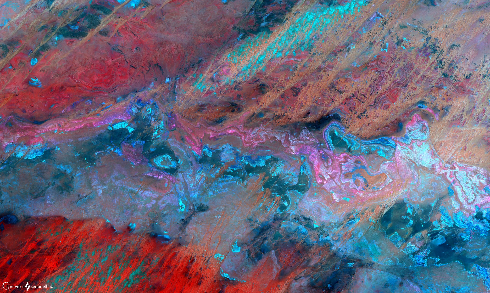

## Evaluate and visualize   
 - [EO Browser - Beijing, China](https://sentinelshare.page.link/dMD4){:target="_blank"} 
 - [EO Browser - Australian Landscape](https://sentinelshare.page.link/jjMp){:target="_blank"} 
 - [EO Browser - Desert Landscape of Eastern Algeria](https://sentinelshare.page.link/WecN){:target="_blank"}
 - [EO Browser - Saudi Arabia Dunes](https://sentinelshare.page.link/Saqv){:target="_blank"}  
 - [EO Browser - North-eastern Mali Landscape](https://sentinelshare.page.link/ifyM){:target="_blank"} 

## Author of the script

Monja Šebela
 
## General description of the script

This Sentinel-2 aesthetic script can be used to produce beautiful, neon looking results over urban and dry areas. The script is especially useful to highlight value differences in deserts. It's essentially an RGB composite, with a [B12 and B04 difference](https://sentinelshare.page.link/1iRd) (which does a good job at displaying certain desert features, like dunes) in the red, [B03](https://sentinelshare.page.link/ya4N) in the green, and [B02](https://sentinelshare.page.link/nu97) in the blue channel. Gain and gamma in the script can be modified to fit the location best; for gamma, -0.55 to -0.95 is recommended, while for gain, 2.3 fits most locations.

Compare the amount of information the script provides in dry areas compared to the true color composite. 

## Description of representative images

Neon imagery of Beijing, China. Acquired on 2020-01-23. 

Australian Landscape. Acquired on 2021-01-18. 

Desert Landscape of Eastern Algeria. Acquired on 2020-09-22. 

Saudi Arabia Dunes. Acquired on 2020-09-27. 

North-eastern Mali Landscape. Acquired on 2020-09-22. 

On [Sentinel Hub Flickr](https://www.flickr.com/photos/sentinelhub/albums/72157717397821836), there's an album with images created using Aesthetic Neon Script. 

