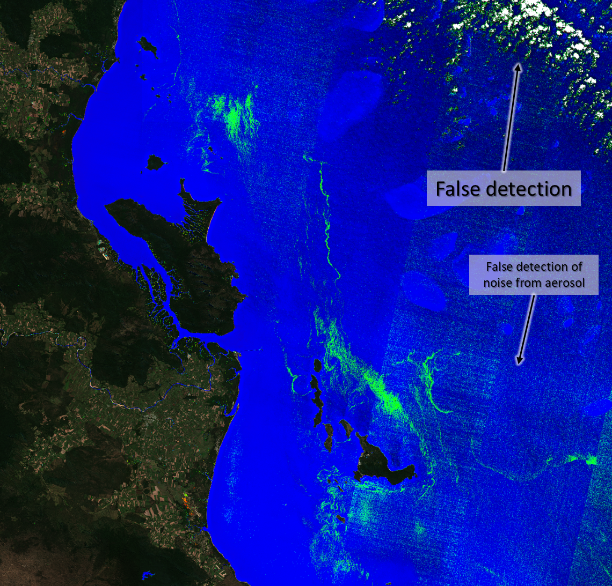

# Aquatic Plants and Algae Custom Script Detector (APA Script)

<a href="#" id='togglescript'>Show</a> script or [download](script.js){:target="_blank"} it.


      


## Evaluate and visualize   
 - [EO Browser](https://apps.sentinel-hub.com/eo-browser/?lat=-0.3213&lng=34.1359&zoom=10&time=2019-10-04&preset=CUSTOM&datasource=Sentinel-2%20L2A&layers=B03,B02,B01&evalscript=Ly9pbmRpY2VzIHRvIGFwcGx5IGEgbWFzayB0byB3YXRlciBib2RpZXMKbGV0IG1vaXN0dXJlID0gKEI4QS1CMTEpLyhCOEErQjExKTsgCmxldCBORFdJID0gKEIwMyAtIEIwOCkvKEIwMyArIEIwOCk7CmxldCB3YXRlcl9ib2RpZXMgPSAoTkRXSS1tb2lzdHVyZSkvKE5EV0krbW9pc3R1cmUpOwovL2luZGljZXMgdG8gaWRlbnRpZnkgd2F0ZXIgcGxhbnRzIGFuZCBhbGdhZQpsZXQgd2F0ZXJfcGxhbnRzID0gKEIwNSAtIEIwNCkvKEIwNSArIEIwNCk7CmxldCBOSVIyID0gQjA0ICsgKEIxMSAtIEIwNCkqKCg4MzIsOCAtIDY2NCw2KS8oMTYxMyw3IC0gNjY0LDYpKTsKbGV0IEZBSSA9IEIwOCAtIE5JUjI7Ci8vaW5kaWNlcyB0byBhcHBseSBhIG1hc2sgb3ZlciBjbG91ZHMKLy9jb2RlIHRha2VuIGZyb20gc2VudGluZWwtMiBjdXN0b20gc2NyaXB0cyBjYnlfY2xvdWRfZGV0ZWN0aW9uIGJ5IFBldGVyIEZvZ2gKbGV0IGJSYXRpbyA9IChCMDMgLSAwLjE3NSkgLyAoMC4zOSAtIDAuMTc1KTsKbGV0IE5ER1IgPSBpbmRleChCMDMsIEIwNCk7CmxldCBnYWluID0gMi41OwovLyBuYXR1cmFsIGNvbG9yIGNvbXBvc2l0aW9uCmxldCBuYXR1cmFsX2NvbG9yID0gWzMqQjA0LCAzKkIwMywgMypCMDJdOwoKLy8gY2xvdWQgbWFzawpmdW5jdGlvbiBjbGlwKGEpIHsKIHJldHVybiBNYXRoLm1heCgwLCBNYXRoLm1pbigxLCBhKSk7Cn0KCmlmIChCMTE%2BMC4xICYmIGJSYXRpbyA%2BIDEpIHsgLy9jbG91ZAogdmFyIHYgPSAwLjUqKGJSYXRpbyAtIDEpOwogcmV0dXJuIG5hdHVyYWxfY29sb3I7Cn0KCmlmIChCMTEgPiAwLjEgJiYgYlJhdGlvID4gMCAmJiBOREdSPjApIHsgLy9jbG91ZAogdmFyIHYgPSA1ICogTWF0aC5zcXJ0KGJSYXRpbyAqIE5ER1IpOwogcmV0dXJuIG5hdHVyYWxfY29sb3I7Cn0KLy9jbGFzc2lmeSB0aGUgcHJlc2VuY2Ugb2YgYWxnYWUgYW5kIHdhdGVyIHBsYW50cyBvdmVyIHdhdGVyIHN1cmZhY2VzCmlmIChORFdJIDwgMCAmJiB3YXRlcl9ib2RpZXMgPiAwKSByZXR1cm4gbmF0dXJhbF9jb2xvcjsKZWxzZSByZXR1cm4gW0ZBSSo4LjUsIHdhdGVyX3BsYW50cyo1LjUsIE5EV0kqMV07Cgo%3D){:target="_blank"} 

## General description of the script

The script allows to highlight aquatic plants and algae in lakes and lagoons. Applying the script, vegetation and algae in the water is displayed from turquoise colour to bright green and denser vegetation cover in bright yellow. The presented script is globally applicable to water bodies all over the world.

The technology of remote sensing is a valuable tool for monitoring spatial and temporal distribution of aquatic vegetation and algae. The most useful application of the script presented here is to monitor the distribution of invasive species in water bodies such as lakes or lagoons.

Aquatic plants are playing an important role in ecological functions of water environments. Even though this vegetation has a large capacity to absorb harmful substances and pollutants of the water body, invasive species of aquatic plants can have a serious impact on local freshwater ecosystems. Invasive aquatic plant species are often causing local extinction of native species. Under favourable growing conditions and environmental circumstances, these plants can create a thick layer of vegetation which stops the sunlight from reaching to native plants in the lake, they don't get the light they need and later the die-off of native plants affects fish and other animals. Another problem could be clogging of waterways or irrigation canals and pipes.

In the script, images from Sentinel-2 satellite (with atmospheric correction - L2A) were used to detect water bodies and aquatic plants and algae. The authors used a group of indices for applying a mask to water bodies so the land is displayed in true colours. These indices were moisture ((B8A-B11)/(B8A+B11)) and normalized difference water index or NDWI ((B03 - B08)/(B03 + B08)).

For visualizing floating aquatic plants and algae we used a simplified floating algae index (FAI) based on previous research (Hu, 2009) and an index designed by the authors (water_plants in the script) that uses Red and Vegetation Red Edge band ((B05 - B04)/(B05 + B04)). To avoid false detection of clouds over water bodies we helped ourselves with a custom script created by Peter Fogh (Fogh, 2018) who based on Braaten et al. (2015) research on cloud detection. Finally, the density of vegetation or algae on the water is classified by applying different colours to our indices. Blue colour signifies water, meanwhile turquoise corresponds to those areas with lower density of aquatic plants or algae; bright green colour means medium density; and yellow areas are the highest density areas of these species.

In a second order of results, turbid water is also identified by the set of indices presented in the script and, thus, these areas with a large amount of sediment in suspension are painted in brown and red to purple colours.

## Details of the script

The script presented allows identifying aquatic plants and algae in the bodies of water, since it highlights these spaces, while the rest of the territory is visualized in natural colour. Within the bodies of water, areas with vegetation or algae on the surface are distinguished: turquoise indicate a lower density than green or yellow colours, which means medium and high density areas respectively. In a second order of results, turbid water is also identified by the set of indices presented in the script and, thus, these areas with a large amount of sediment in suspension are painted in brown and red to purple colours.

As the script presented here is highlighting the water bodies and the vegetated areas with higher moisture content, the script does not fulfil its function in areas with recent episodes of rainfall. Thus, the script can falsely detect the vegetation on the land with higher content of water. Also shallow waters are detected as highly vegetated water areas. 

In the case of the appearance of high-altitude clouds (such as cirrus), these have been classified as turbid areas. These clouds above lakes or lagoons are also identified and painted. However, they are easily distinguished according to their shape. The false detection of clouds was minimized by using a custom script created by Peter Fogh (Fogh, 2018).
Finally, in some areas over the sea false detection of noise from aerosol particles in the atmosphere is displayed in green.

The script designed has been tested in different waters around the world. However, one of the most relevant examples has been the detection of water hyacinth (Eichhornia crassipes) in Lake Victoria, which is Africa's largest lake and the world's second-largest freshwater lake by surface area. In spite of Eichhornia crassipes, large amount of algae have also been identified in Victoria's Lake. The identification of this aquatic plant has been carried out in the northeast of the lake. 

One of the worst ecological problems in Victoria's lake is the problem caused by the water hyacinth, an aquatic freshwater plant native to the Amazon basin classified as one of the 100 most harmful invasive alien species in the world. Under favourable growing conditions and environmental circumstances, some estimates that it can double its biomass in only two weeks. Water hyacinth can create a thick layer of vegetation that the sunlight does not reach to native plants in the lake and so they don't get the light they need and later the die-off of native plants affects fish and other aquatic animals. Water hyacinth as well creates suitable habitat for disease-carrying insects, such as mosquitoes. Another problem this invasive plant causes is clogging of waterways or irrigation canals and pipes.

The localization of species in the water has also been carried out successfully in other lakes and lagoons of all continents such as in Lake Pontchartrain Estuarine System, in Louisiana, USA, and in Lake Taihu, in China.

Additionally, the detection of turbid waters can also be used to detect the flow of sediment from the rivers to the sea. In order to check this possibility, the authors have used recent images after the Gloria storm in the deltaic zones of the rivers Ter, Llobregat and Ebro (Catalan shoreline, Spain). 

The results obtained here are compiled in the [supplementary material](supplementary_material.pdf).

## Authors of the script

Anna Péliova, Carla Garcia-Lozano and Josep Sitjar from Service of Geographical Information Systems and Remote Sensing (SIGTE) of the University of Girona

## Description of representative images

1) The output of script shows the presence of aquatic plants and algae in Victoria Lake (Africa) in bright green colour while the turbid water is displayed in red. October 4th 2019.

2) Aquatic plants or algae visible on the shore of Palm Island, Queensland, Australia. Clouds are falsely detected by the script, whereas noise is also highlighted in bright green.
July 18th 2019.

3) Algae and turbid water in Taihu Lake, near Shanghai, China. December 10th 2019.

4) Algal bloom in Lake Pontchartrain Estuarine System, Louisiana. August 16th 2019. 

## Credits

[1] The identification of aquatic plants and algae was inspired by previous research about detecting water hyacinth using remote (Thamaga and Dube, 2018) sensing and a floating algae index (FAI) designed by Hu (2009).

[2] The false detection of clouds was minimized by using a custom script created by Peter Fogh (Fogh, 2018) who was inspired by previous research on cloud detection (Braaten et al., 2015). 

## References

[1] Braaten J, Cohen WB, Yang Z. (2015). [Automated cloud and cloud shadow identification in Landsat MSS imagery for temperate ecosystems. Remote Sensing of Environment. 169:128-138.](https://doi.org/10.1016/j.rse.2015.08.006){:target="_blank"}

[2] Fogh, P. (2018). Braaten-Cohen-Yang cloud detector custom script. [Retrieved from here](https://github.com/PeterFogh/custom-scripts/tree/master/sentinel-2/cby_cloud_detection#braaten-cohen-yang-cloud-detector]{:target="_blank"}

[3] Hu, C. (2009). [A novel ocean color index to detect floating algae in the global oceans. Remote Sensing of Environment, 113: 2118ñ2129.](https://doi.org/10.1016/j.rse.2009.05.012){:target="_blank"}

[4] Thamaga, K.H. and Dube, T. (2018). Remote sensing of invasive water hyacinth (Eichhornia crassipes): [A review on applications and challenges. Remote Sensing Applications: Society and Environment, 10:36-46.](https://doi.org/10.1016/j.rsase.2018.02.005){:target="_blank"}