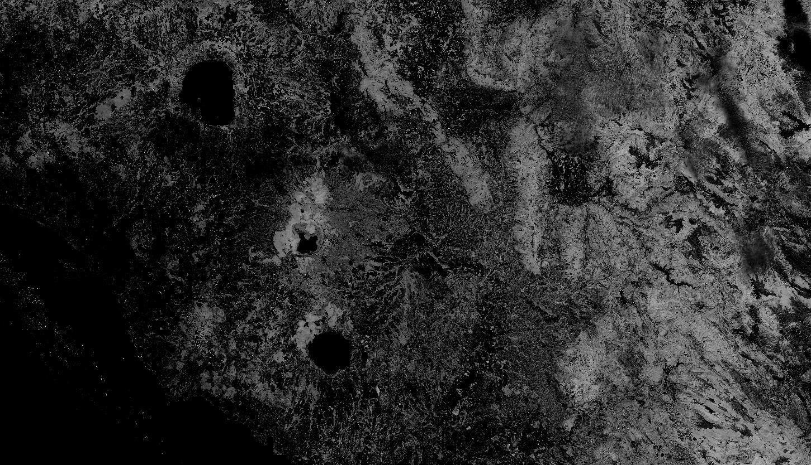

## General description of the script

ARVI is most useful in regions of high atmospheric aerosol content. It uses blue light reflectance measurements to correct for the atmospheric scattering effects, that also influence reflectance of red light.

General formula: 

**(NIR - RED - y * (RED - BLUE))/ (NIR + RED - y*(RED-BLUE))**

Values description: The range for an ARVI is -1 to 1 where green vegetation generally falls between values of 0.20 to 0.80.

## Description of representative images

The ARVI of Rome, Italy. Acquired on 08.10.2017, processed by Sentinel Hub. 

