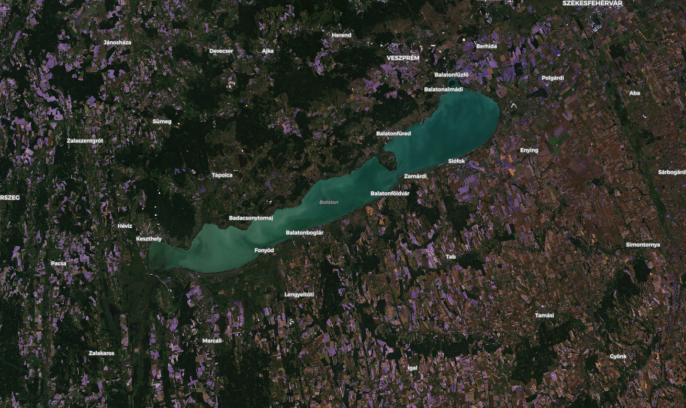

## General description of the script
The bare soil marker identifies all observations in which the feature of interest (FOI) is bare — with exposed bare soil as a result of ploughing or covered with non-photosynthetic vegetation as a consequence of harvest or vegetation drying up on the field.

For detailed information about the marker read the relative [blog post](https://medium.com/sentinel-hub/area-monitoring-bare-soil-marker-608bc95712ae).

Pixels identifies as bare soil are colored in blue.

## Author of the script

Domagoj Korais.

## Description of representative images

Bare soil script applied around lake Balaton, Hungary.

Image taken on 14/09/2020.

