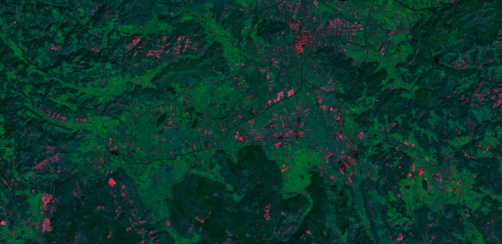

## General description of the script

The barren soil script applies the Bare soil index (BSI) to the red channel, with NIR B08 applied to the green channel and SWIR band B11 applied to the blue channel. The index is multiplied to increase its brightness. It shows all vegetation in green and barren ground in red colors. Water appears black. As the script displays barren ground in red, the user can use this information to figure out the status of the crops (growing, not yet growing), detect recent deforestation or monitor droughts. It can also be used to detect landslides or determine the extent of erosion in non-vegetated areas. Unfortunately, it also highlights certain buildings, making bare ground areas difficult to separate from dwellings. It should be noted, that the result depends on season vegetation and farming.

The bare soil index for Sentinel-2: 

**BSI = ((B11 + B04) - (B08 + B02)) / ((B11 + B04) + (B08 + B02))**

## Author of the script

Monja Sebela

## Description of representative images

Barren Soil script applied to Sentinel-2 image south of Ljubljana, Slovenia.

## Credits

The BSI used is the following one:  

**BSI = ((SWIR2 + R)−(NIR + B)) / ((SWIR2 + R)+(NIR + B))**

It was found in this article, page 3: 

- _A Modified Bare Soil Index to Identify Bare Land Features during Agricultural Fallow-Period in Southeast Asia Using Landsat 8_. Can Trong Nguyen, Amnat Chidthaisong, Phan Kieu Diem, Lian-Zhi Huo. Land 2021, 10, 231. Page 3. URL: https://www.mdpi.com/2073-445X/10/3/231/pdf
