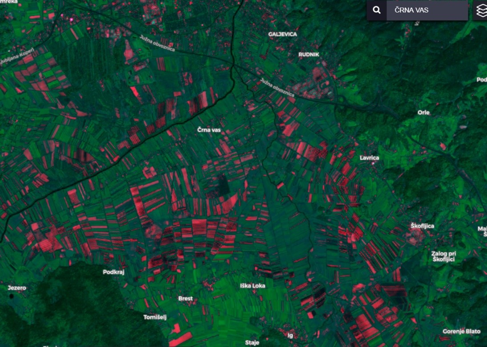

# Barren Soil Script

<a href="#" id='togglescript'>Show</a> script or [download](barren_soil_script.js){:target="_blank"} it.


      


## Evaluate and visualize
 - [Sentinel Playground](https://apps.sentinel-hub.com/sentinel-playground/?source=S2&lat=45.980084808039955&lng=14.508562088012695&zoom=13&preset=CUSTOM&layers=B01,B02,B03&maxcc=24&gain=1.0&gamma=1.0&time=2018-10-01%7C2019-04-16&atmFilter=&showDates=false&evalscript=Ci8qCkF1dGhvcjogTW9uamEgU2ViZWxhCiovCgoKZnVuY3Rpb24gZXZhbHVhdGVQaXhlbChzKSB7CiAgICBsZXQgdmFsID0gMi41ICogKChzWzBdLkIxMSArIHNbMF0uQjA0KS0oc1swXS5CMDggKyBzWzBdLkIwMikpLygoc1swXS5CMTEgKyBzWzBdLkIwNCkrKHNbMF0uQjA4ICsgc1swXS5CMDIpKTsKICAgIHJldHVybiBbMi41KiB2YWwsIHNbMF0uQjA4LCBzWzBdLkIxMV07Cn0KZnVuY3Rpb24gc2V0dXAoZHMpIHsKICAgc2V0SW5wdXRDb21wb25lbnRzKFtkcy5CMDIsIGRzLkIwNCwgZHMuQjA4LCBkcy5CMTEsIGRzLkIxMl0pOwogICBzZXRPdXRwdXRDb21wb25lbnRDb3VudCgzKTsgfQo%3D){:target="_blank"}    
 - [EO Browser](https://apps.sentinel-hub.com/eo-browser/?lat=45.98008&lng=14.50856&zoom=13&time=2019-04-16&preset=CUSTOM&datasource=Sentinel-2%20L1C&layers=B01,B02,B03&evalscript=LyoKQXV0aG9yOiBNb25qYSBTZWJlbGEKKi8KCgpmdW5jdGlvbiBldmFsdWF0ZVBpeGVsKHMpIHsKICAgIGxldCB2YWwgPSAyLjUgKiAoKHNbMF0uQjExICsgc1swXS5CMDQpLShzWzBdLkIwOCArIHNbMF0uQjAyKSkvKChzWzBdLkIxMSArIHNbMF0uQjA0KSsoc1swXS5CMDggKyBzWzBdLkIwMikpOwogICAgcmV0dXJuIFsyLjUqIHZhbCwgc1swXS5CMDgsIHNbMF0uQjExXTsKfQpmdW5jdGlvbiBzZXR1cChkcykgewogICBzZXRJbnB1dENvbXBvbmVudHMoW2RzLkIwMiwgZHMuQjA0LCBkcy5CMDgsIGRzLkIxMSwgZHMuQjEyXSk7CiAgIHNldE91dHB1dENvbXBvbmVudENvdW50KDMpOyB9Cg%3D%3D){:target="_blank"} 

## General description of the script

The bare ground index is the Bare soil index, applied to the red channel. It shows all vegetation in green and the bare ground in red. It could be useful for soil mapping since it informs the user where he can do remote sensing analysis on bare ground, where crops were collected or where crops are not growing, the location of landslides or the extent of erosion in non-vegetated areas. Unfortunately, it also highlights certain buildings, making bare ground areas difficult to separate from dwellings. It should be noted, that the result depends on season vegetation and farming.

## Author of the script

Monja Sebela

## Description of representative images

Barren Soil script applied to Sentinel-2 image south of Ljubljana, Slovenia.

More examples and details are available in the [supplementary material](supplementary_material.pdf).

## Credits

For the Barren soil script the Barren soil index was used.
