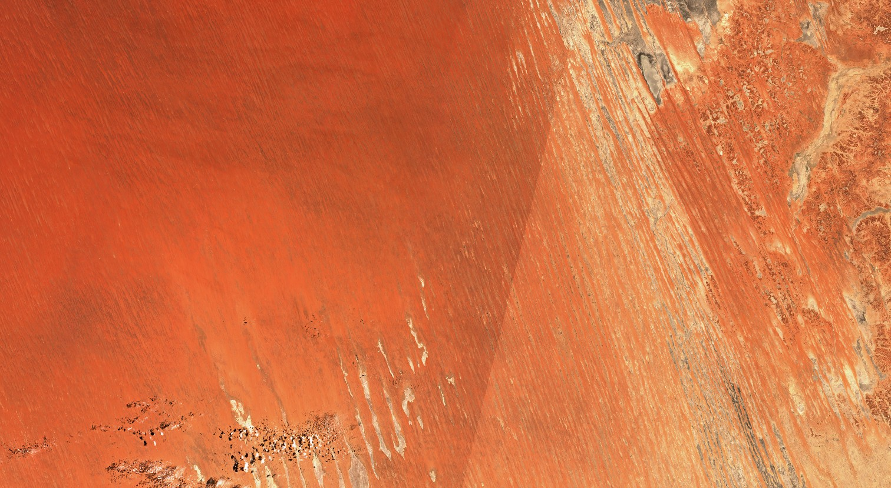
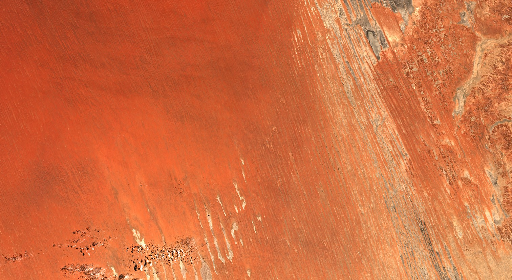

## General description of the script

Implementation of a Bidirectional Reflectance Distribution Function (BRDF) normalisation for Sentinel-2 scenes in a Sentinel Hub [Evalscript](https://docs.sentinel-hub.com/api/latest/evalscript/v3/).

The Evalscript proposed here is the "semi-empirical BRDF normalisation c-factor correction approach proposed by Luch et al. 2000 [1]. The formula is detailed in eq. 37 (using eq. 38 & 39). To avoid lookup tables and other complex modelling approaches, we use the fixed BRDF spectral model parameters derived from "the global year of highest quality snow-free MODIS BRDF product" conveniently defined for Sentinel-2 in Roy et al. 2017 [2] that were derived from the Landsat ones in Roy et al. 2016 [3].

The approach seems to perform generally quite well for most surfaces (except snow and ice) and high sun angles. Nevertherless, it relies on a certain number of approximations and may not always be suitable.

## Usage

BRDF corrections are available for Sentinel 2 bands 2, 3, 4, 8, 11 and 12. In the beginning of the script there is the option to define the bands which the correction should be applied to. It is also possible to set a luminance value in case RGB images are supposed to be generated. The luminance value is a multiplication factor designed to brighten the image for a better visualisation. By default, a factor of 2.5 is applied which works for most surface types. For darker surfaces, such as forests, a higher value may be required.

There are 3 output options available, a True Color and False Color visualization and the option to return Raw Values. Changing what the script does is just a matter of commenting and uncommenting the output options that are available. The output can also be customized following the same schema of the three available output options. This can for example be done to define custom composites using other bands.

## Description of representative images

**Top image**: True Colour RGB acquired with Sentinel-2 (L2A processing level) over the Australian desert, on the border between Queensland and South Australia. The image is composed of two acquisitions from different orbits from 2nd January 2022 and 4th January 2022.

**Bottom image**: Identical to the top image, with the BRDF normalisation applied.

## References

[1] W. Lucht, C. B. Schaaf and A. H. Strahler, "An algorithm for the retrieval of albedo from space using semiempirical BRDF models," in IEEE Transactions on Geoscience and Remote Sensing, vol. 38, no. 2, pp. 977-998, March 2000, doi: https://doi.org/10.1109/36.841980.

[2] David P. Roy, Jian Li, Hankui K. Zhang, Lin Yan, Haiyan Huang, Zhongbin Li, Examination of Sentinel-2A multi-spectral instrument (MSI) reflectance anisotropy and the suitability of a general method to normalize MSI reflectance to nadir BRDF adjusted reflectance, Remote Sensing of Environment, Volume 199, 2017, Pages 25-38, ISSN 0034-4257, https://doi.org/10.1016/j.rse.2017.06.019.

[3] D.P. Roy, H.K. Zhang, J. Ju, J.L. Gomez-Dans, P.E. Lewis, C.B. Schaaf, Q. Sun, J. Li, H. Huang, V. Kovalskyy, A general method to normalize Landsat reflectance data to nadir BRDF adjusted reflectance, Remote Sensing of Environment, Volume 176, 2016, Pages 255-271, ISSN 0034-4257, https://doi.org/10.1016/j.rse.2016.01.023.