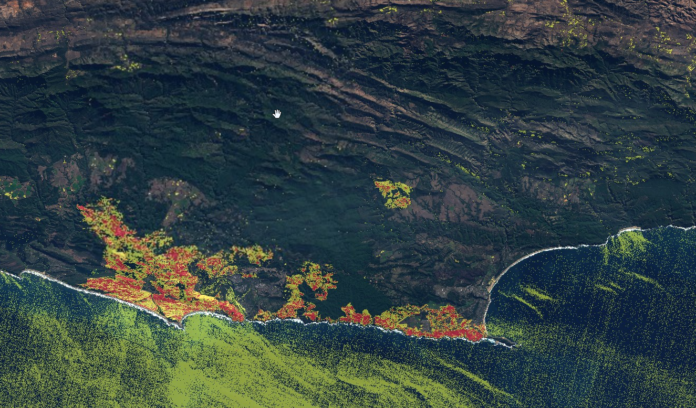

# Multitemporal burnt area analysis

<a href="#" id='togglescript'>Show</a> script or [download](script.js){:target="_blank"} it.


      


## Evaluate and visualize
 - [Sentinel Playground](https://apps.sentinel-hub.com/sentinel-playground-temporal/?source=S2&lat=-33.99119576995598&lng=23.16793441772461&zoom=12&preset=CUSTOM&layers=B01,B02,B03&maxcc=100&gain=1.0&gamma=1.0&time=2015-01-01%7C2017-07-03&atmFilter=&showDates=false&evalscript=Ly9WRVJTSU9OPTMgKGF1dG8tY29udmVydGVkIGZyb20gMSkKCmZ1bmN0aW9uIHNldHVwKCkgewogIHJldHVybiB7CiAgICBpbnB1dDogW3sKICAgICAgYmFuZHM6IFsKICAgICAgICAgICAgICAgICAgIkIwMiIsCiAgICAgICAgICAiQjAzIiwKICAgICAgICAgICJCMDQiLAogICAgICAgICAgIkIwNSIsCiAgICAgICAgICAiQjA4IiwKICAgICAgICAgICJCMTIiCiAgICAgIF0KICAgIH1dLAogICAgb3V0cHV0OiB7IGJhbmRzOiAzIH0sCiAgICBtb3NhaWNraW5nOiAiT1JCSVQiCiAgfQp9CgoKZnVuY3Rpb24gc3RyZXRjaCh2YWwsIG1pbiwgbWF4KSB7cmV0dXJuICh2YWwgLSBtaW4pIC8gKG1heCAtIG1pbik7fQoKZnVuY3Rpb24gZmlsdGVyU2NlbmVzIChzY2VuZXMsIGlucHV0TWV0YWRhdGEpIHsgIApyZXR1cm4gc2NlbmVzLmZpbHRlcihmdW5jdGlvbiAoc2NlbmUpIHsKLy8gc2V0IGRhdGVzIGZvciBwcmUtYW5kLXBvc3QgZmlyZSBhbmFseXNpcwp2YXIgYWxsb3dlZERhdGVzID0gWyIyMDE3LTA1LTE1IiwiMjAxNy0wNi0yNCJdOyAvLyBLbnlzbmEgZmlyZXMKLy8gZm9ybWF0IHNjZW5lIGRhdGUgdGltZXN0YW1wIHRvIG1hdGNoIGFsbG93ZWQgZGF0ZXMgCnZhciBzY2VuZURhdGVTdHIgPSBkYXRlZm9ybWF0KHNjZW5lLmRhdGUpOwppZiAoYWxsb3dlZERhdGVzLmluZGV4T2Yoc2NlbmVEYXRlU3RyKSE9IC0xKSByZXR1cm4gdHJ1ZTsKZWxzZSByZXR1cm4gZmFsc2U7CiAgfSk7Cn0KCi8vIE5vcm1hbGl6ZWQgQnVybiBSYXRpb24gY2FsY3VsYXRpb24KZnVuY3Rpb24gY2FsY05CUihzYW1wbGUpIHsKICB2YXIgZGVub20gPSBzYW1wbGUuQjA4K3NhbXBsZS5CMTI7CiAgdmFyIG5icnZhbCA9ICgoZGVub20hPTApID8gKHNhbXBsZS5CMDgtc2FtcGxlLkIxMikgLyBkZW5vbSA6IDAuMCk7CiAgcmV0dXJuIG5icnZhbDsKfQoKZnVuY3Rpb24gZGF0ZWZvcm1hdChkKXsgIAogIHZhciBkZCA9IGQuZ2V0RGF0ZSgpOwogIHZhciBtbSA9IGQuZ2V0TW9udGgoKSsxOwogIHZhciB5eXl5ID0gZC5nZXRGdWxsWWVhcigpOwogIGlmKGRkPDEwKXtkZD0nMCcrZGR9CiAgaWYobW08MTApe21tPScwJyttbX0KICB2YXIgaXNvZGF0ZSA9IHl5eXkrJy0nK21tKyctJytkZDsKICByZXR1cm4gaXNvZGF0ZTsKfQoKZnVuY3Rpb24gZXZhbHVhdGVQaXhlbChzYW1wbGVzLHNjZW5lcykgeyAgCiAgdmFyIG5icnByZSA9IDA7CiAgdmFyIG5icnBvc3QgPSAwOyAgCiAgCiAgLy8gZ2V0IHByZS1maXJlIGltYWdlCiAgbmJycHJlID0gY2FsY05CUihzYW1wbGVzWzFdKTsKICAvLyBnZXQgcG9zdC1maXJlIGltYWdlCiAgbmJycG9zdCA9IGNhbGNOQlIoc2FtcGxlc1swXSk7ICAKICAvLyBnZXQgZGlmZmVyZW5jZSAKICB2YXIgZG5iciA9IG5icnByZSAtIG5icnBvc3Q7CiAgLy8gc2V0IG91dHB1dCBkaXNwbGF5IGxheWVycwogIHZhciBzdHJldGNoTWluID0gMC4wNTsKICB2YXIgc3RyZXRjaE1heCA9IDEuMDA7CiAgdmFyIE5hdHVyYWxDb2xvcnMgPSBbc3RyZXRjaCgyLjggKiBzYW1wbGVzWzBdLkIwNCArIDAuMSAqIHNhbXBsZXNbMF0uQjA1LCBzdHJldGNoTWluLCBzdHJldGNoTWF4KSwgc3RyZXRjaCgyLjggKiBzYW1wbGVzWzBdLkIwMyArIDAuMTUgKiBzYW1wbGVzWzBdLkIwOCwgc3RyZXRjaE1pbiwgc3RyZXRjaE1heCksIHN0cmV0Y2goMi44ICogc2FtcGxlc1swXS5CMDIsIHN0cmV0Y2hNaW4sIHN0cmV0Y2hNYXgpXTsgIAogIHZhciBidXJuTW9kZXJhdGUgPSBbc3RyZXRjaCgyLjggKiBzYW1wbGVzWzBdLkIwNCArIDAuMSAqIHNhbXBsZXNbMF0uQjA1LCBzdHJldGNoTWluLCBzdHJldGNoTWF4KSswLjUsIHN0cmV0Y2goMi44ICogc2FtcGxlc1swXS5CMDMgKyAwLjE1ICogc2FtcGxlc1swXS5CMDgsIHN0cmV0Y2hNaW4sIHN0cmV0Y2hNYXgpKzAuNSwgc3RyZXRjaCgyLjggKiBzYW1wbGVzWzBdLkIwMiwgc3RyZXRjaE1pbiwgc3RyZXRjaE1heCldOyAgCiAgdmFyIGJ1cm5TZXZlcmUgPSBbc3RyZXRjaCgyLjggKiBzYW1wbGVzWzBdLkIwNCArIDAuMSAqIHNhbXBsZXNbMF0uQjA1LCBzdHJldGNoTWluLCBzdHJldGNoTWF4KSswLjUsIHN0cmV0Y2goMi44ICogc2FtcGxlc1swXS5CMDMgKyAwLjE1ICogc2FtcGxlc1swXS5CMDgsIHN0cmV0Y2hNaW4sIHN0cmV0Y2hNYXgpLCBzdHJldGNoKDIuOCAqIHNhbXBsZXNbMF0uQjAyLCBzdHJldGNoTWluLCBzdHJldGNoTWF4KV07CiAgcmV0dXJuIChkbmJyIDwgMC4yNyA%2FCiAgTmF0dXJhbENvbG9ycyA6IChkbmJyIDwgMC42NiA%2FCiAgYnVybk1vZGVyYXRlIDogYnVyblNldmVyZSkKICApOwogIAp9&temporal=true){:target="_blank"}
 
## General description of the script

The script takes two pre-defined dates as an input (in filterScenes) and calculates changes of the [normalised burn ratio index.](https://custom-scripts.sentinel-hub.com/sentinel-2/nbr/){:target="_blank"} [See the discussion here.](https://forum.sentinel-hub.com/t/temporal-analysis-burned-area/83/6){:target="_blank"}
## Author of the script

Designed by [FC Basson](https://forum.sentinel-hub.com/u/fcbasson/summary){:target="_blank"} and improved by [@Pierre_Markuse and visually](https://twitter.com/Pierre_Markuse?ref_src=twsrc%5Egoogle%7Ctwcamp%5Eserp%7Ctwgr%5Eauthor){:target="_blank"}

## Description of representative images

Burned area analysis applied to the South African coast.

