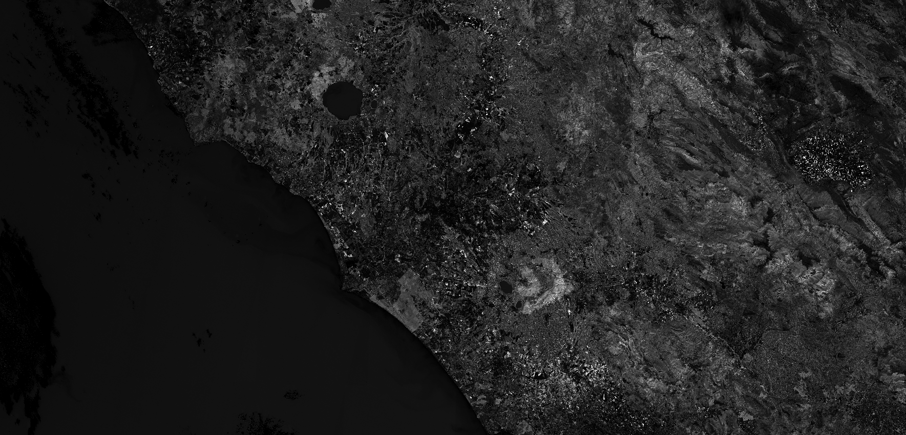

## General description of the script

Cab (leaf cholrophyll content (μg / cm ^ 2)) corresponds to the content of chlorophyll a, chlorophyll b and carotenoids per unit of leaf area.
Note that the Cab script is as implemented in SNAP but without input and output validation!
Input/output values which are suspect are not reported or changed. Most values, however, do not fall under this category.
Visualized as an interval from 0-300. This can be adjusted in the evaluatePixel method.

## Description of representative images

Leaf chlorophyl index of Rome. Acquired on 8.10.2017.

