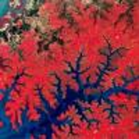
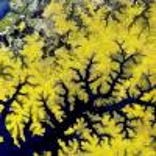
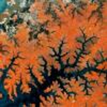
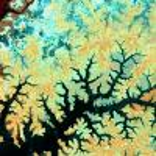
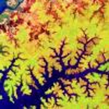

# Simple RGB Composites (Sentinel-2)

## True Color

### RGB (4, 3, 2)

True color composite uses visible light bands red (B04), green (B03) and blue (B02) in the corresponding red, green and blue color channels, resulting in a natural colored result, that is a good representation of the Earth as humans would see it naturally.

Custom script: **return [B04, B03, B02];

 - [Reference](https://sentinel.esa.int/web/sentinel/user-guides/sentinel-2-msi/definitions)

## False Color

### RGB (8,4,3)

False color imagery is displayed in a combination of standard near infra-red, red and green band. 
False color composite using near infrared, red and green bands is very popular. It is most commonly used to assess plant density and healht, as plants reflect near infrared and green light, while absorbing red. Since they reflect more near infrared than green, plant-covered land appears deep red. Denser plant growth is darker red. Cities and exposed ground are gray or tan, and water appears blue or black.

Custom script: **return [B08, B04, B03];

 - [Reference](https://earthobservatory.nasa.gov/features/FalseColor/page6.php)

## SWIR

### RGB (12,8,4)

Short wave infrared (SWIR) bands 11 and 12 can help scientists estimate how much water is present in plants and soil, as water reflects SWIR wavelengths. Shortwave-infrared bands are also useful for distinguishing between cloud types (water clouds versus ice clouds), snow and ice, all of which appear white in visible light. Newly burned land reflects strongly in SWIR bands, making them valuable for mapping fire damage. Each rock type reflects shortwave infrared light differently, making it possible to map out geology by comparing reflected SWIR light. In this composite, B8A is reflected by vegetation and shown in the green channel, while the reflected red band, highlighting bare soil and built up areas, is shown in the blue channel.

Custom script: **return [B12, B08, B04];

 - [Reference 1](https://earthobservatory.nasa.gov/features/FalseColor/page5.php)
 - [Refreence 2](https://gisgeography.com/sentinel-2-bands-combinations/)

## Agriculture

### RGB (11,8,2)

This composite, often called the Agriculture RGB composite, uses bands SWIR-1 (B11), near-infrared (B08) and blue (B02). It’s mostly used to monitor crop health, as both short-wave and near infrared bands are particularly good at highlighting dense vegetation, which appears dark green in the composite. SWIR measurements can help scientists estimate how much water is present in plants and soil, as water reflects SWIR light. Shortwave-infrared bands are also useful for distinguishing between snow, and ice, all of which appear white in visible light. Newly burned land reflects strongly in SWIR bands, making them valuable for mapping fire damage.

Custom script: **return [B11, B08, B02];

 - [Reference 1](https://earthobservatory.nasa.gov/features/FalseColor/page5.php)
 - [Refreence 2](https://gisgeography.com/sentinel-2-bands-combinations/)

## Geology

### RGB (12,11,2)

This composite, often called the Agriculture RGB composite, uses bands SWIR-1 (B11), near-infrared (B08) and blue (B02). It’s mostly used to monitor crop health, as both short-wave and near infrared bands are particularly good at highlighting dense vegetation, which appears dark green in the composite. SWIR measurements can help scientists estimate how much water is present in plants and soil, as water reflects SWIR light. Shortwave-infrared bands are also useful for distinguishing between snow, and ice, all of which appear white in visible light. Newly burned land reflects strongly in SWIR bands, making them valuable for mapping fire damage.

Custom script: **return [B12, B11, B02];

## Bathimetric

### RGB (4,3,1)

Custom script: **return [B12, B11, B02];

## RGB (8,6,4)

### RGB (8,6,4).

Custom script: **return [B08, B06, B04];

## RGB (8,5,4)

### RGB (8,5,4).

Custom script: **return [B08, B05, B04];

## RGB (8,11,4)

### RGB (8,11,4).

Custom script: **return [B08, B11, B04];

## RGB (8,11,12)

### RGB (8,11,12).

Custom script: **return [B08, B11, B12];

## RGB (11,8,3)

### RGB (11,8,3).

Custom script: **return [B11, B08, B03];

