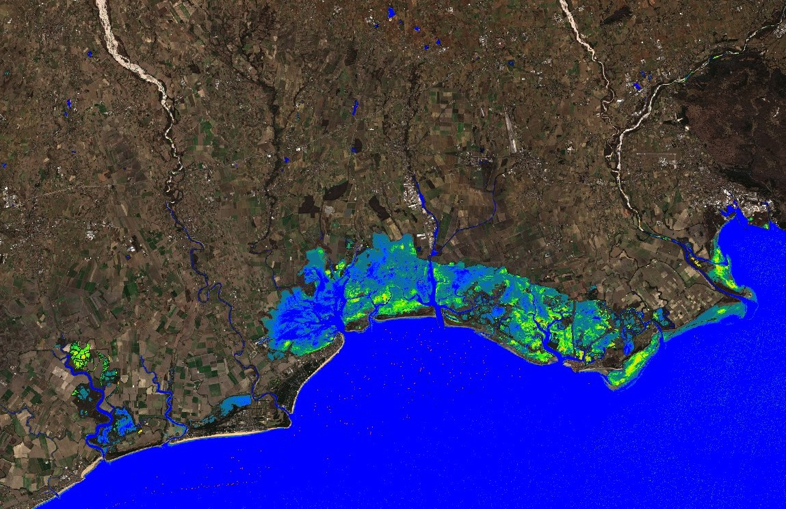
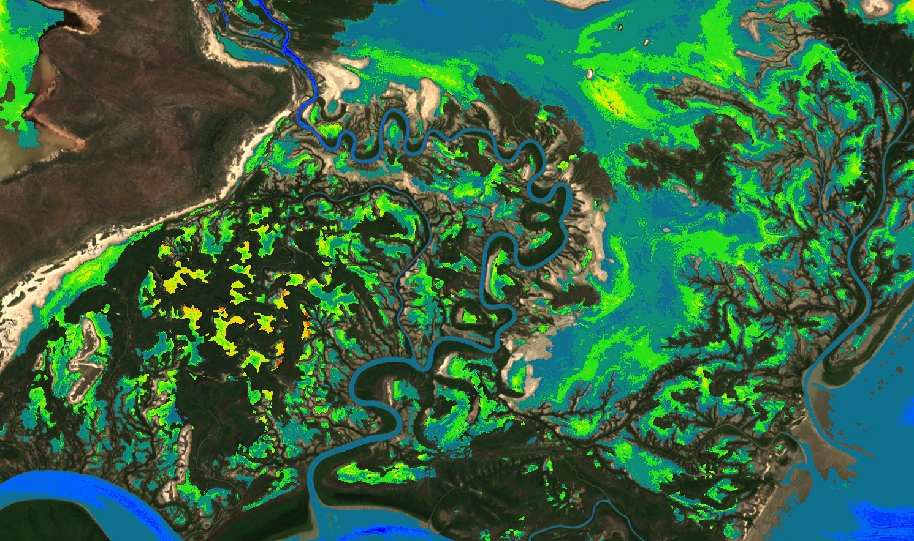

## General description of the script

Provides an estimate of chlorophyll-a for cyanobacteria blooms for surface waterbodies using the 
[Normalised Difference Chlorophyll Index](https://github.com/sentinel-hub/custom-scripts/tree/master/sentinel-2/ndci) for use with L1C Sentinel-2 data. 

The chlorophyll-a estimation is based on simulated dataset for cyanobacteria Microcystis Aeruginosa using 
methods that can be found in Kravitz et al., (2021). 

Also uses the Floating Algal Index (Hu, 2009) to detect surface blooms and floating vegetation. 

Uses the [water bodies mapping](https://github.com/sentinel-hub/custom-scripts/tree/master/sentinel-2/water_bodies_mapping-wbm) 
technique of Mohor Gartner. 

Visualises land using a simple RGB approach. 

## Technical details

A chl-a retrieval model was calibrated using a novel, high quality synthetic dataset of 
coincident S2-MSI remote sensing reflectance (Rrs) and pigment concentrations (figure below). 
The parameterization of the dataset was informed by 
the LIMNADES dataset [Lake Bio-optical Measurements and Matchup Data for 
Remote Sensing](https://www.limnades.org/) and compiled using the 
Hydrolight radiative transfer software (version 5.2, Sequoia Scientific, USA; Mobley, 1994). 
The unique dataset accounts for the optical complexity of mixed cyanobacteria 
phytoplankton assemblages, and immense optical variability typically found in 
global inland water bodies.

In order to produce a fast and robust chl-a estimate from S2, 
the normalized difference chlorophyll index (NDCI) was used to 
establish an empirically derived chl-a model (Mishra and Mishra, 2012). 
The NDCI model utilizes MSI spectral bands located at 665 nm and 705 nm, 
which are maximally sensitive to chl-a absorption, and backscattering induced reflectance, 
respectively. NDCI is calculated by taking the spectral difference of these two bands,
and normalizing by their sums, as follows:

    NDCI = [Rrs(705) – Rrs(665)] / [Rrs(705) + Rrs(665)]    (1)

The index was trained on synthetic data with the following restrictions to
limit uncertainty due to extreme cases:
1. Concentration of non-algal particles (Cnap) < 10 ug/L
2. Absorption due to coloured dissolved organic matter (CDOM) < 3 m-1
3. Chl-a concentrations less than 500 ug/L
4. Only cyanobacteria _M. aeruginosa_ used in training.

This resulting in 9836 samples, which were separated into a training dataset 
of 7868 samples (80%) and a dataset to test the predictive capability of the 
model of 1968 samples (20%). An exponential model resulted in the best fit on 
the training data (eq. 2) based on Pearson correlation coefficient (R2=0.52), 
with predictive statistics shown in the figure below.

    Chl-a = 17.441e(4.7038*NDCI)		(2)

Table 1: Predictive capability of calibrated NDCI model

| Log Bias | MAPE (%) | RMSE (mg/m3) | Log RMSE | Relative RMSE (%) |
|----------|----------|--------------|----------|-------------------|
| 0.0023   | 42.3     | 84.2         | 0.99     | 95.8              |

## Representative Images

Cyanobacteria Chlorophyll-a NDCI L1C applied to lagoons of Northeastern Italy. Image acquired on 2022-02-12.

Cyanobacteria Chlorophyll-a NDCI L1C applied to Roper river, Australia. Image acquired on 2019-02-23.

## Citation
If making use of this algorithm, please cite as follows: 

**Kravitz, J & Matthews M., 2020. Chlorophyll-a for cyanobacteria blooms from Sentinel-2. CyanoLakes.**

## References
[Hu, C. (2009). A novel ocean color index to detect floating algae in the global oceans.
Remote Sensing of Environment, 113(10), 2118-2129.
](https://www.sciencedirect.com/science/article/pii/S0034425709001710)

[Kravitz, J., Matthews, M., Lain, L., Fawcett, S., & Bernard, S. (2021). 
Potential for high fidelity global mapping of common inland water quality 
products at high spatial and temporal resolutions based on a synthetic data and 
machine learning approach. Frontiers in Environmental Science, 19.
](https://www.frontiersin.org/articles/10.3389/fenvs.2021.587660/full)

[Mishra, S., & Mishra, D. R. (2012). Normalized difference chlorophyll index: 
A novel model for remote estimation of chlorophyll-a concentration in turbid productive waters. 
Remote Sensing of Environment, 117, 394-406.
](https://www.sciencedirect.com/science/article/pii/S0034425711003737)
