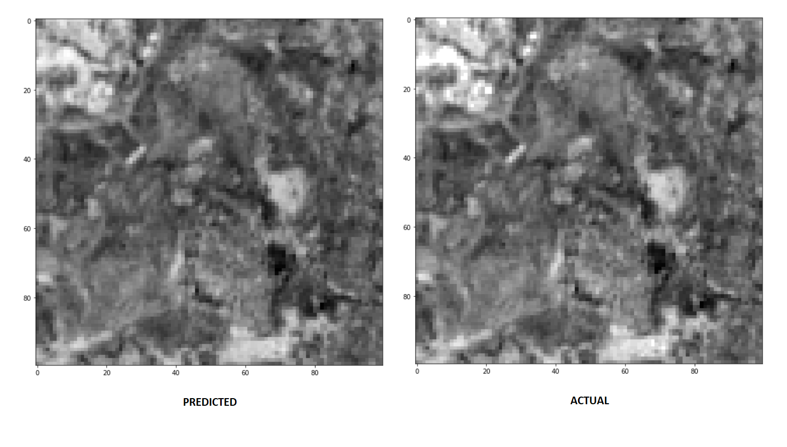

# Deep GNDVI Script

<a href="#" id='togglescript'>Show</a> script or [download](script.js){:target="_blank"} it.


      


## Evaluate and visualize   
 - [EO Browser](https://apps.sentinel-hub.com/eo-browser/?zoom=10&lat=41.9&lng=12.5&themeId=DEFAULT-THEME&datasetId=S2L2A&fromTime=2020-03-11T00%3A00%3A00.000Z&toTime=2020-03-11T23%3A59%3A59.999Z&visualizationUrl=https%3A%2F%2Fservices.sentinel-hub.com%2Fogc%2Fwms%2Fbd86bcc0-f318-402b-a145-015f85b9427e&evalscripturl=https%3A%2F%2Fraw.githubusercontent.com%2Froshni-b%2Feolearn-scripts%2Fmain%2FGNDVI_LGBM_eval.js#custom-script){:target="_blank"} 

## General description of the script

The raw data for Green Normalized Difference Vegetation Index (GNDVI) has been extracted using a [custom script](https://custom-scripts.sentinel-hub.com/sentinel-2/gndvi/) via Sentinel Hub's Feature Info Service (FIS). It performs elementary statistical computations - such as mean, standard deviation, etc. approximating the distribution of reflectance values - on remotely sensed data for a region specified in a given spatial reference system across different bands and time ranges. 

The next subsections describe the different stages of the methodology for data handling, performing the prediction and visualizing the prediction results.

1. The region chosen for training the model in this notebook is Empedrado, Chile.
From the bounding box coordinated for Emperdrado, the region in the GeoJSON split into smaller tiles from which a 5x5 grid is selected.

2. The EOPatches are filled with GNDVI data from Sentinel Hub having minimal cloud coverage.

3. EOPatches are created and manipulated using EOTasks, which are then chained in an EOWorkflow. The following workflow is created and executed:
- Create EOPatches with band and cloud data.
- Add mask of valid pixels.
- Calculate and add GNDVI data.
- Save EOPatches

4. The obtained data is pre-processed and prepared for training for which we create a new workflow that performs the following preprocessing:
Checks the ratio of the valid data for each EOPatch and for each time frame
Retain only time frames with > 80% valid coverage

5. The complete data array is split to train and test sets in the ratio 0.7 Additional variables Normalized Difference Vegetation Index (NDVI), Normalized Difference Water Index  (NDWI), Normalized Difference Built up Index (NDBI) are also used as features during the training process.
NDVI: (B08 - B04)/(B08 + B04)
NDWI: (B03 - B08)/(B03 + B08)
NDBI: (B11 - B08)/(B11 + B08)

6. The data is fit on a [LightGBMRegressor()](https://lightgbm.readthedocs.io/en/latest/pythonapi/lightgbm.LGBMRegressor.html).

## Details of the script

The Green Normalized Difference Vegetation Index (GNDVI) is a vegetation index for estimating photo synthetic activity and is a commonly used vegetation index to determine water and nitrogen uptake into the plant canopy. GNDVI is upto 5 times more sensitive to variation in chlorophyll content than is NDVI. (Gitelson et al., 1996)

This notebook shows steps towards constructing a machine learning pipeline for predicting the GNDVI for the region specified. We will use satellite images obtained by ESA's Sentinel-2 to train a model and use it for prediction.

Intents & Motivations:
This EOLearn-based methodology enables a user to predict the vegetation index of a given area of interest and a specified time period using the LBGMRegressor model and visualize it on EO Browser.

More details are available in the [supplementary material](supplementary_material.pdf){:target="_blank"}.

## Authors of the script

Roshni Biswas, Anurag Saha Roy

## Description of representative images

1) GNDVI = (NIR - Green)/(NIR + Green)
The photos here are in grayscale; are the predicted vs actual GNDVI values.

## References

[1] Gitelson A A, Kaufman Y, Merzlyak M N. [Use of a green channel in remote sensing of global vegetation from EOS-MODIS](https://www.sciencedirect.com/science/article/abs/pii/S0034425796000727). Remote Sensing Environ, 1996, 58: 289-298.