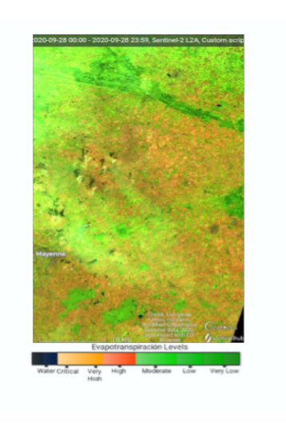
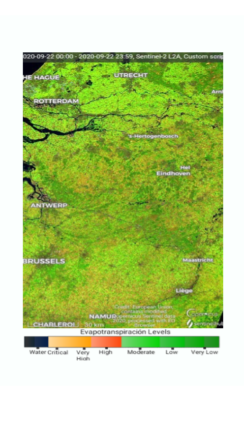
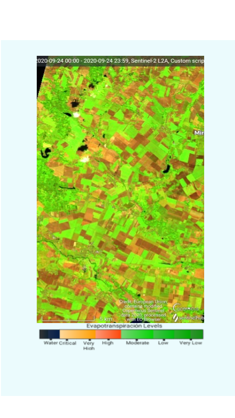

# Detection of Evapotranspiration Levels Composite

<a href="#" id='togglescript'>Show</a> script or [download](script.js){:target="_blank"} it.


      


## Evaluate and visualize   
 - [EO Browser](https://apps.sentinel-hub.com/eo-browser/?zoom=11&lat=51.6877&lng=4.80414&themeId=DEFAULT-THEME&datasetId=S2L2A&fromTime=2020-09-22T00%3A00%3A00.000Z&toTime=2020-09-22T23%3A59%3A59.999Z&visualizationUrl=https%3A%2F%2Fservices.sentinel-hub.com%2Fogc%2Fwms%2Fbd86bcc0-f318-402b-a145-015f85b9427e&evalscript=Ly9WRVJTSU9OPTMKZnVuY3Rpb24gc2V0dXAoKSB7CiAgcmV0dXJuIHsKICAgIGlucHV0OiBbIkIxMSIsIkIwOSIsIkIwMiIsICJkYXRhTWFzayJdLAogICAgb3V0cHV0OiB7IGJhbmRzOiA0IH0KICB9Owp9CgpmdW5jdGlvbiBldmFsdWF0ZVBpeGVsKHNhbXBsZSkgewogIHJldHVybiBbMi41ICogc2FtcGxlLkIxMSwyLjUgKiBzYW1wbGUuQjA5LDIuNSAqIHNhbXBsZS5CMDIsIHNhbXBsZS5kYXRhTWFzayBdOwp9&minQa=NaN){:target="_blank"} 

## General description of the script

The composition in false color (11.09.02) on Satelite Sentinel 2 (Level 2™); the evapotranspiration levels existing in a given area can be detected easily and with great precision. Analyze the variations of water vapor and humidity in soil and vegetation due to direct transpiration and evaporation from the place to be studied. Considering that ìthe amount of water required for the photosynthetic process is small and only constitutes approximately 0.01% of the total amount used by the plantî. (Azcon ñ Bieto, TalÛn, S·nchez ñ DÌaz, Aguirreolea 2013, p25). And that ìthroughout the life of a plant, approximately 95% of the absorbed water simply passes through it and is lost through perspirationî (Azcon ñ Bieto et al. 2013, p42). Hence the importance of the evapotranspiration process: on the one hand it allows the absorption of the CO2 necessary for photosynthesis, contributing to the balance between: the plant temperature in relation to the air temperature ñ atmospheric humidity ñ wind speed, it can be considered as an indicator of the health of the Vegetation because through transpiration (one of the processes that make up evapotranspiration) the flow of water through the plant provides an effective means for the transport of minerals that are absorbed by the roots and that move in the transpiratory current (tension-cohesion), without an additional energy expenditure that would imply the formation of root masses that explore large surfaces of the soil.

Now evapotranspiration consists of two processes: direct evaporation and transpiration from vegetation. ìTranspiration differs from evaporation in that the escape of water vapor is controlled to a great extent by foliar resistances which do not participate in the evaporation of a free water surfaceî (Azcon ñ Bieto et al. 2013, p.42 ). In other words, perspiration can be considered as a diffusion process where ìits intensity will depend on the one hand on the supply of energy to vaporize the water and on the other on the concentration gradient or vapor pressure and the magnitude of resistances î(Azcon-Bieto et al. 2013, p42). The availability of water at the soil-root interface can directly influence transpiration.

However, it is more likely that the decrease in the water potential of the soil (direct evaporation), causes a decrease in the hydric potential of the leaf and produces an increase in stomatal resistance due to the loss of turgor in the guard cells and a closure of the stomata, consequently the transpiration rate decreases due to an increase in stomatal resistance. This happens because:

Drought in the soil causes both an increase in the resistance to the flow of water towards the roots and a decrease in the water potential; Poor aeration and a decrease in soil temperature increase the resistance to water flow at the roots, and an increase in leaf and air temperature increases transpiration by increasing the water vapor concentration gradient or force drive from blade to air. Likewise, the closure of the stomata increases the resistance to the diffusion of water vapor outside the leaves. (Azcon ñ Bieto, TalÛn, S·nchez ñ DÌaz, Aguirreolea, 2013, p37).

As the soil dries, the water potential of the root decreases, partially compensating for the decrease in the water potential of the soil; perspiration increases in relation to the increase in temperature but decreases as the relative humidity of the air increases. It can then be inferred that as the temperature increases, the water pressure increases; the relative humidity of the air decreases. Therefore it is understood that the driving force of perspiration is the difference in vapor pressure (?P) between the water in the leaf (P) and the water in the air (PO); wind can increase or decrease perspiration.

If the air mass that passes through the leaf is loaded with humidity, transpiration decreases, while if it is dry air, and the leaf temperature is higher than the air temperature, the wind generates a cooling effect on the leaf surface (the cool sheet).

In conclusion, the development of a script that allows detecting fluctuations in evapotranspiration levels can be considered as a performance indicator since high levels of transpiration or direct evaporation can lead to a water deficit causing problems in the development of plants, which can translate into low productivity.

## Details of the script

The amount of water required for the photosynthetic process is small and only constitutes approximately 0.01% of the total amount used by the plant.î (Azcon ñ Bieto etc al. 2013, p25). Analysis of the images by composition (11.09.02). It differs from NDVI. Its purpose is not to estimate the amount of existing chlorophyll (this process is part of a more complex process called photosynthesis). Its purpose (Script for the detection of Evapotranspiration levels) is to detect variations in the levels of evapotranspiration in a certain area or subset. However, for CO2 (component gas in the photosynthesis process) diffuse into the gas phase, stomata must be open. As a result, the wet surfaces inside the sheet are exposed to the atmosphere, causing a loss of water. This means, approximately, between 100 and 1000 molecules of water lost (usually 240) for each molecule of CO2 incorporated in photosynthesis. ì (Azcon-Bieto et al. 2013, p249)

That is, when using the composition (11,09,02) the vegetation in the study area can be seen in 6 tones corresponding to the evapotranspiration levels existing at the time. It is based on the premise that the higher the level of absorption of water vapor and humidity, the lower the level of evapotranspiration, consequently the colors will be darker while the higher the reflectivity the shades become lighter. Product of the decrease in humidity. Concluding in an increase in evapotranspiration levels. Below is the legend:

- Dark green = very low evapotranspiration
- Light green = low evapotranspiration
- Very light green = moderate evapotranspiration
- Reddish brown = high evapotranspiration
- Dark yellow = very high evapotranspiration
- Light yellow = critical evapotranspiration

It should be noted that the water is observed in dark blue or black tones; homes and buildings in shades of gray ranging from light gray to dark gray. In the same way, it is possible to differentiate between sub-areas with vegetation and land without vegetation and dirt roads.

It has poor visibility in areas with the presence of cloudiness. If there is cirrus in the space or subset to be studied, it can distort the reading of the image due to the reflectivity associated with the incidence of light. It has a spatial resolution from 50km.

## Author of the script

Ramon Suarez

## Description of representative images

In the images you can see the different variations in the existing evapotranspiration levels. Ranging from a very low level of evapotranspiration to a very high level of evapotranspiration. It should be noted that the water is observed from black to a dark blue hue and paths can be differentiated. On the other hand, the buildings can be seen in shades ranging from a very light gray to a dark gray. However, for a more simple and intuitive analysis, 6 levels of evapotranspiration were defined: very low (dark green tones), low (light green tones), moderate (very light green tones), high (reddish brown tones), very high (reddish-brown tones, dark yellow) and critical (light yellow hue). It starts from the hypothesis, the higher the absorption of water moisture and water vapor, the darker shades (low evapotranspiration levels), the lower the humidity absorption, the higher the reflectivity (high evapotranspiration levels).

## References

## Credits

Azcon ñ Bieto, J, Talon, M. (2013). Fundamento de FisiologÌa Vegetal (2.a ed.). McGraw-Hill Interamericana de EspaÒa, S.L. Madrid ñ EspaÒa
