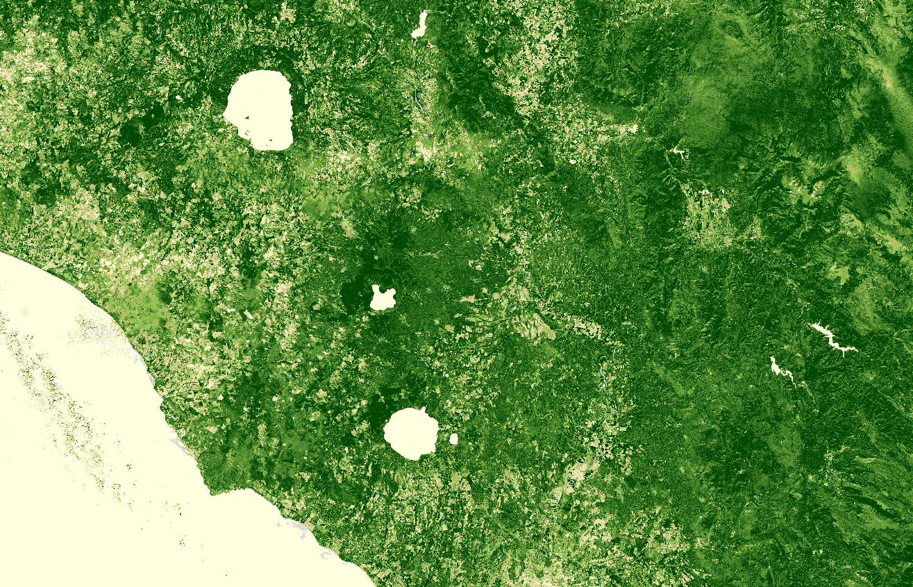

## General description of the script

For Sentinel-2, the index looks like this:

$$EVI = 2.5 \cdot (\frac{B8-B4}{B8+6 \cdot B4-7.5 \cdot B2 +1})$$ 

In areas of dense canopy cover, where leaf area index (LAI) is high, the blue wavelengths can be used to improve the accuracy of NDVI, as it corrects for soil background signals and atmospheric influences.

Values description: The range of values for EVI is -1 to 1, with healthy vegetation generally around 0.20 to 0.80.

## Description of representative images

EVI, Italy. Acquired on 08.10.2017, processed by Sentinel Hub. 

