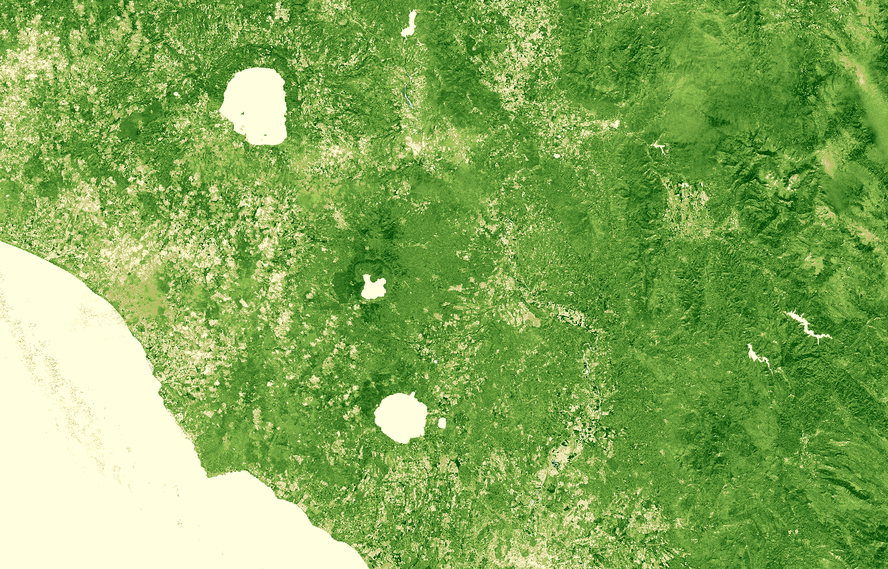

## General description of the script

In areas of dense canopy where the leaf area index (LAI) is high, the NDVI values can be improved by leveraging information in the blue wavelength. Information in this portion of the spectrum can help correct for soil background signals and atmospheric influences.

## Description of representative images

EVI2, Italy. Acquired on 08.10.2017, processed by Sentinel Hub. 

