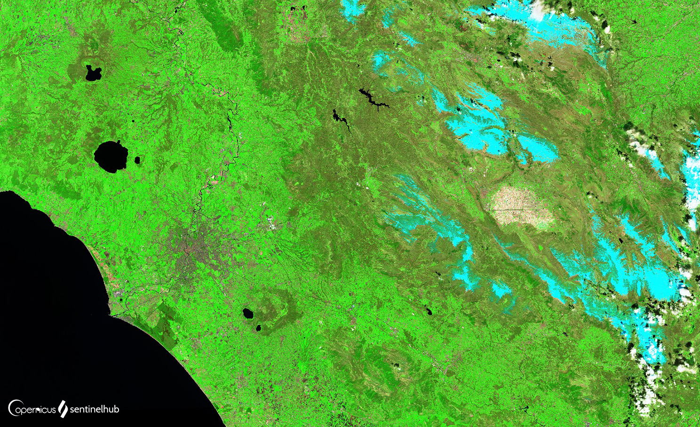

## General description of the script

This composite is used to visualize urbanized areas more clearly. Vegetation is visible in shades of green, while urbanized areas are represented by white, grey, or purple. Soils, sand, and minerals are shown in a variety of colors. Snow and ice appear as dark blue, and water as black or blue. Flooded areas are very dark blue and almost black. The composite is useful for detecting wildfires and calderas of volcanoes, as they are displayed in shades of red and yellow.

#### The composite:

**return [2.5 * B12, 2.5 * B11, 2.5 * B04]**

## Description of representative images

False Color Urban composite  of Rome, Italy. 

## References

- EOS False Color Analysis: https://eos.com/make-an-analysis/false-color/

