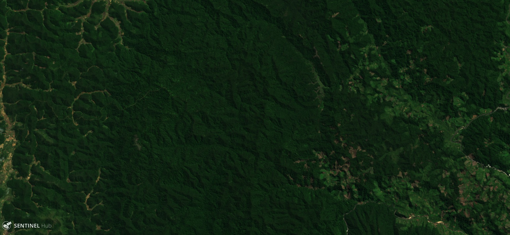
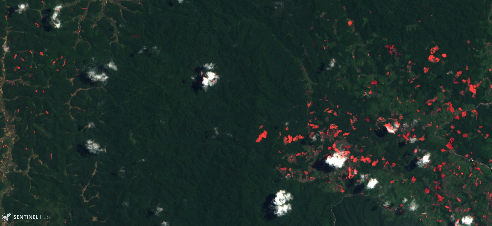
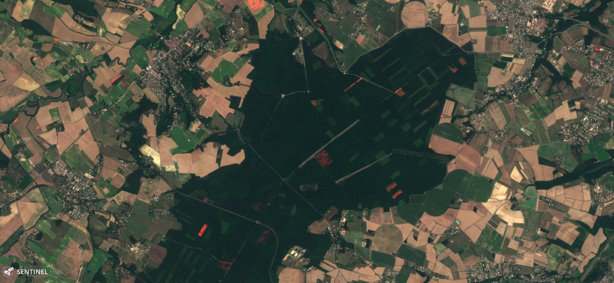

## General description of the script

Forests are essential for wildlife, biodiversity and to fight climate change.

In order to map forest cutting from one year to another, this script compares:
* the mean ndvi of the three previous months from the selected image
* to the mean ndvi of the three same months but from the previous year 

If the NDVI decreases above 0.25, it is certainly a clear cut.

As the aim of the script is to represent the forest cutting, it will color in red the pixel where cuts have been detected. 

The limitations are essentially:
* can't work if no unclouded pixel is available in the last three months 
* forest can be confused with crops (it is best to know it was forest previous year)
* cuts can be confused with later phenology (e.g. drought)

## Author of the script

Karasiak Nicolas

## Description of representative images

The two images are from Madagascar forest. The first one represent the forest in 2017 (raw image from S2 L2A). The second is from 2018 and the script highlights in red where forest clear cuttings have been made.

The third and the fourth images are the same things for Bouconne forest in France (near Toulouse).

More information is available in the [supplementary material](supplementary_material.pdf).

## Credits

Inspired by [Harel Dan temporal script](https://github.com/hareldunn/GIS_Repo/blob/master/Multi-Temporal%20NDVI%20for%20Sentinel%20Hub%20Custom%20Scripts){:target="_blank"}  
