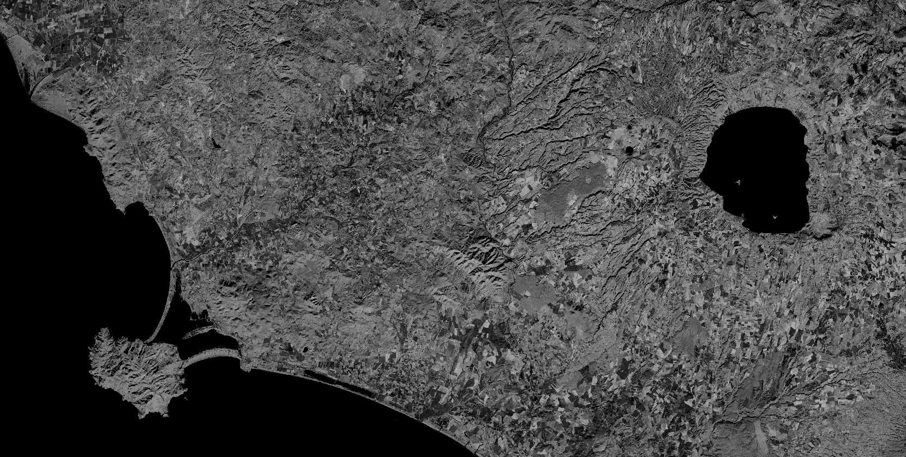

## General description of the script

GNDVI is more sensitive to variation in chlorophyll content than is NDVI (Gitelson et al., 1996)

## Description of representative images

GNDVI, Italy. Acquired on 08.10.2017, processed by Sentinel Hub. 

