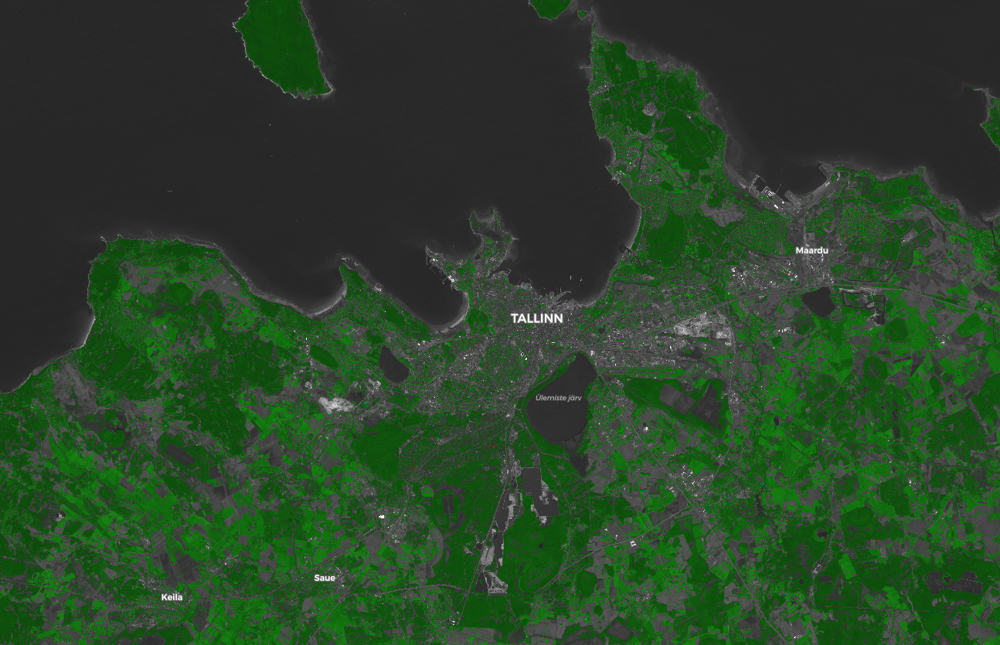
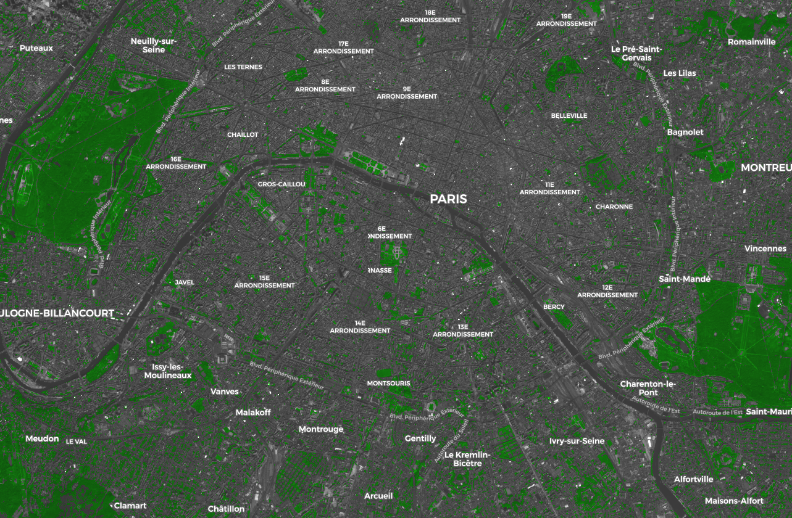
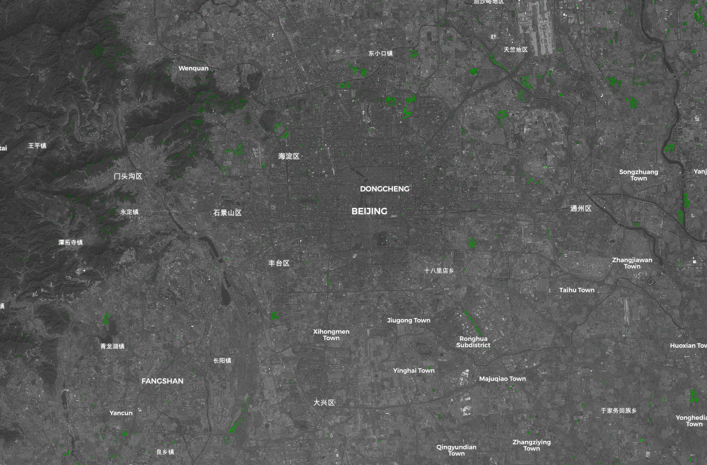

# Green City Script

<a href="#" id='togglescript'>Show</a> script or [download](script.js){:target="_blank"} it.


      


## Evaluate and visualize
 - [Sentinel Playground](https://apps.sentinel-hub.com/sentinel-playground/?source=S2&lat=59.43739477678559&lng=24.67975616455078&zoom=11&preset=CUSTOM&layers=B01,B02,B03&maxcc=20&gain=1.0&gamma=1.0&time=2018-10-01%7C2019-04-28&atmFilter=&showDates=false&evalscript=Ly8gTm9ybWFsaXplZCBEaWZmZXJlbmNlIFZlZ2V0YXRpb24gSW5kZXgKdmFyIG5kdmkgPSAoQjA4LUIwNCkvKEIwOCtCMDQpOwoKLy8gVGhyZXNob2xkIGZvciB2ZWdldGF0aW9uCnZhciB2ZWdfdGggPSAwLjQ7CgovLyBTaW1wbGUgUkdCCnZhciBSID0gMi41KkIwNDsKdmFyIEcgPSAyLjUqQjAzOwp2YXIgQiA9IDIuNSpCMDI7CgovLyBUcmFuc2Zvcm0gdG8gQmxhY2sgYW5kIFdoaXRlCnZhciBZID0gMC4yKlIgKyAwLjcqRyArIDAuMSpCOwp2YXIgcGl4ZWwgPSBbWSwgWSwgWV07CgovLyBDaGFuZ2UgdmVnZXRhdGlvbiBjb2xvcgppZihuZHZpID49IHZlZ190aCkKICBwaXhlbCA9IFswLjEqWSwgMS44KlksIDAuMSpZXTsKCnJldHVybiBwaXhlbDs%3D){:target="_blank"}    
 - [EO Browser](https://apps.sentinel-hub.com/eo-browser/?lat=59.4100&lng=24.6159&zoom=11&time=2019-04-28&preset=CUSTOM&datasource=Sentinel-2%20L1C&layers=B01,B02,B03&evalscript=Ly8gLS0tLS0tLS0tLS0tLS0tLS0tLS0tLS0tLS0tLS0tLS0tLS0KLy8gICAgICAgICAgICAgR3JlZW4gY2l0aWVzCi8vIAovLyBDLkIuIDIwMTkuMDUuMDQKLy8gLS0tLS0tLS0tLS0tLS0tLS0tLS0tLS0tLS0tLS0tLS0tLS0KLy8gVXNlcyBOVkRJIHRvIGNvbG9yIFNlbnRpbmVsLTIgaW1hZ2UKLy8gdG8gY3JlYXRlIGF3YXJlbmVzcyBvZiBncmVlbiBhcmVhcwovLyBpbiBjaXRpZXMgYXJvdW5kIHRoZSBXb3JsZAoKLy8gTm9ybWFsaXplZCBEaWZmZXJlbmNlIFZlZ2V0YXRpb24gSW5kZXgKdmFyIG5kdmkgPSAoQjA4LUIwNCkvKEIwOCtCMDQpOwoKLy8gVGhyZXNob2xkIGZvciB2ZWdldGF0aW9uCnZhciB2ZWdfdGggPSAwLjQ7CgovLyBTaW1wbGUgUkdCCnZhciBSID0gMi41KkIwNDsKdmFyIEcgPSAyLjUqQjAzOwp2YXIgQiA9IDIuNSpCMDI7CgovLyBUcmFuc2Zvcm0gdG8gQmxhY2sgYW5kIFdoaXRlCnZhciBZID0gMC4yKlIgKyAwLjcqRyArIDAuMSpCOwp2YXIgcGl4ZWwgPSBbWSwgWSwgWV07CgovLyBDaGFuZ2UgdmVnZXRhdGlvbiBjb2xvcgppZihuZHZpID49IHZlZ190aCkKICBwaXhlbCA9IFswLjEqWSwgMS44KlksIDAuMSpZXTsKCnJldHVybiBwaXhlbDs%3D){:target="_blank"} 

## General description of the script

Uses NDVI [1] to color Sentinel-2 images and create awareness of green areas in cities around the World.

## Author of the script

Carlos Bentes

## Description of representative images

Visualization of Tallinn with the Green City script.

Visualization of Paris with the Green City script.

Visualization of Beijing with the Green City script.

## References

[1] Normalized difference vegetation index: 
https://en.wikipedia.org/wiki/Normalized_difference_vegetation_index

## Credits

Y. Zha, J. Gao & S. Ni (2003) Use of normalized difference built-up index in automatically mapping urban areas from TM imagery, International Journal of Remote Sensing, 24:3, 583-594, DOI: 10.1080/01431160304987
