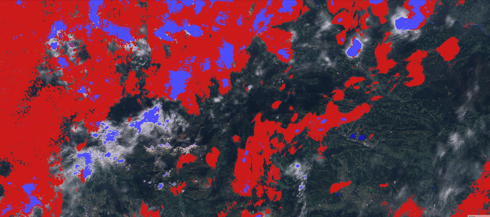

## General description

A paper about cloud detection [1], shows a fairly complex classification decision tree (figure 8 in the article), based on derived feature space resulting in 91% of correctly classified spectra.

![The decision tree from [1][1]](fig/tree.png)

The colours correspond to the colours from the article, apart from the colours for clear and shadow, which are made into natural (true) colour from red, green and blue bands.

## Description of representative images

Hollstein cloud detection, Slovenia. Acquired on 9.10.2017.

## References

[1] A. Hollstein et al., [Ready-to-Use Methods for the Detection of Clouds, Cirrus, Snow, Shadow, Water and Clear Sky Pixels in Sentinel-2 MSI Images](https://www.mdpi.com/2072-4292/8/8/666). Remote Sensing (2016). 10.3390/rs8080666
