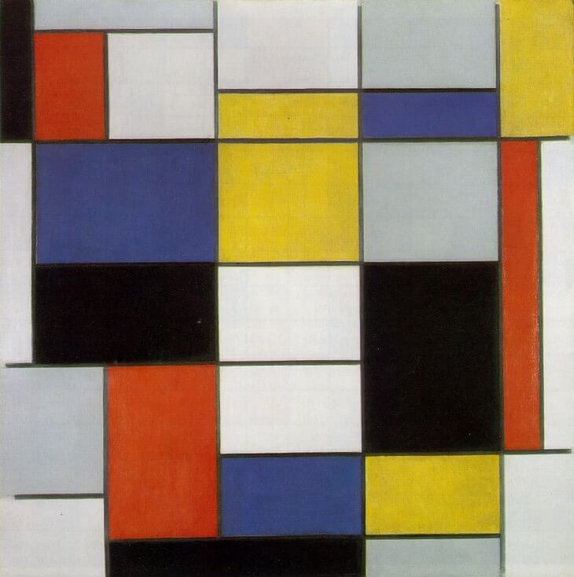
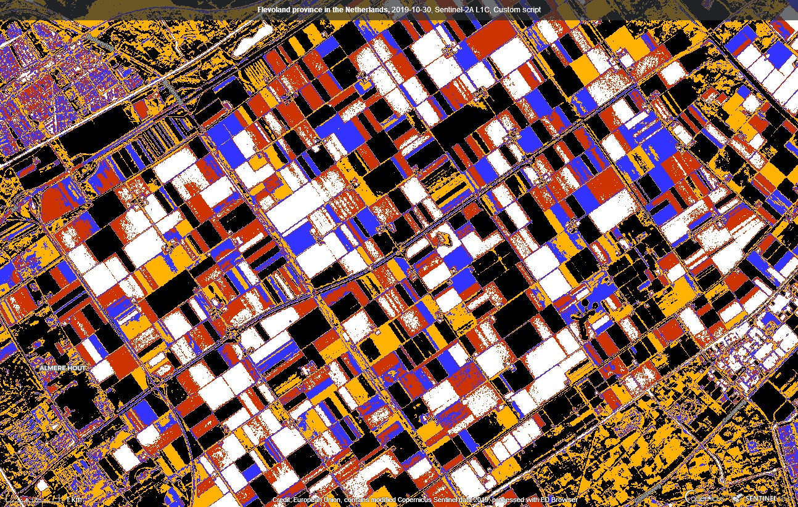
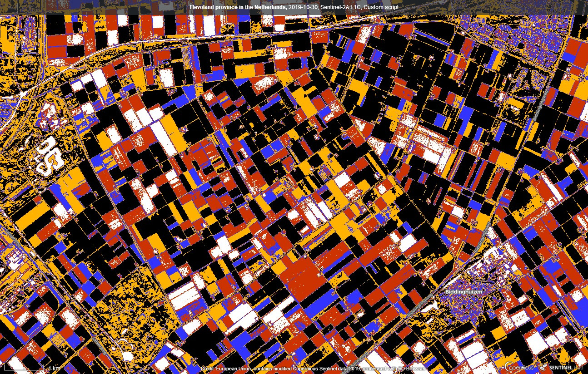
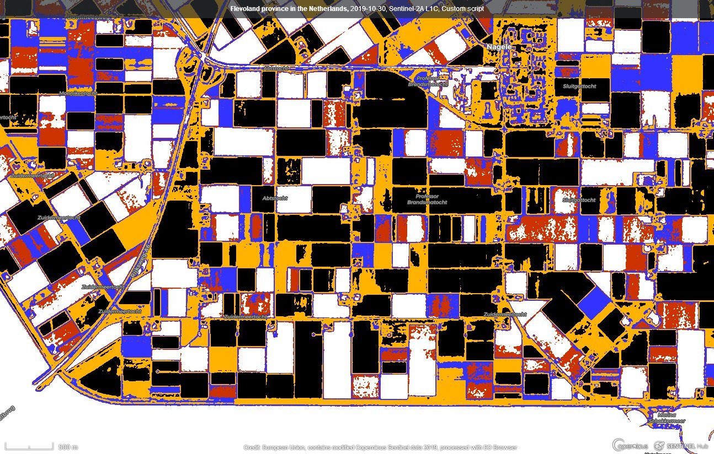

# Homage to Mondrian Script

<a href="#" id='togglescript'>Show</a> script or [download](script.js){:target="_blank"} it.


      


## Evaluate and visualize   
 - [EO Browser](https://apps.sentinel-hub.com/eo-browser/?lat=52.64765&lng=5.74326&zoom=13&time=2019-10-30&preset=CUSTOM&datasource=Sentinel-2%20L1C&layers=B01,B02,B03&evalscript=dmFyIE5EVkkgPSBpbmRleCAoQjA4LCBCMDQpOyAvLyBjYWxjdWxhdGUgdGhlIGluZGV4IAoKaWYgKE5EVkkgPCAwLjEpIHsgCiAgCXJldHVybiBbMSwgMSwgMV0gLy8gd2hpdGUKfSAKaWYgKE5EVkkgPCAwLjIpIHsgCglyZXR1cm4gWzAuOCwgMC4yLCAwLl0gLy8gbmljZSByZWQKfSAKaWYgKE5EVkkgPCAwLjQpIHsKCXJldHVybiBbMC4yLCAwLjIsIDFdIC8vIG5pY2UgYmx1ZQp9CmlmIChORFZJIDwgMC42KSB7CglyZXR1cm4gWzEuLCAwLjcsIDAuXSAvLyBuaWNlIHllbGxvdwp9IAplbHNlIHsgCglyZXR1cm4gWzAsIDAsIDBdIC8vIGJsYWNrCn0%3D){:target="_blank"} 

## General description of the script

This is an artistic script to pay tribute to Dutch painter Piet Mondrian. It takes normalized difference vegetation index (NDVI) and paints pixels in 5 different colors depending on its value. Colors are chosen to match those in the most popular Mondrian's paintings.

Piet Mondrian was a Dutch painter and theoretician who is regarded as one of the greatest artists of the 20th century. He is known for being one of the pioneers of 20th century abstract art, as he changed his artistic direction from figurative painting to an increasingly abstract style, until he reached a point where his artistic vocabulary was reduced to simple geometric elements.

## Details of the script

The script is universally applicable but the best artistic effects are reached in locations with repetitive and geometrically uniform landscape, for example in large agricultural fields. It can be further improved by manually adjusting limits of NDVI for each color, depending on geographic location and personal taste.

More details are available in the [supplementary material](supplementary_material.pdf){:target="_blank"}.

## Author of the script

Matevž Pintar

## Description of representative images

1) Mondrian's painting

2) Flevoland province in the Netherlands

## References

[1] [Wikipedia: Piet Mondrian](https://en.wikipedia.org/wiki/Piet_Mondrian){:target="_blank"} 

[2] [www.piet-mondrian.org](https://www.piet-mondrian.org){:target="_blank"}