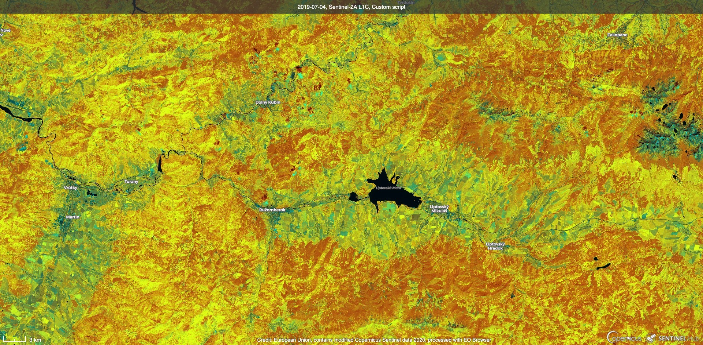

# Index Visualization Script

<a href="#" id='togglescript'>Show</a> script or [download](script.js){:target="_blank"} it.


      


## Evaluate and visualize   
 - [EO Browser](https://apps.sentinel-hub.com/eo-browser/?lat=49.0874&lng=19.4832&zoom=11&time=2019-07-04&preset=CUSTOM&datasource=Sentinel-2%20L1C&layers=B01,B02,B03&evalscript=ZnVuY3Rpb24gdmlzdWFsaXplX2lkeChiYW5kMSwgYmFuZDIsIGdhaW4pIHsKICBsZXQgaWR4ID0gaW5kZXgoYmFuZDEsIGJhbmQyKTsKICByZXR1cm4gW2lkeCwgYmFuZDEqIGdhaW4sIGJhbmQyICogZ2Fpbl07Cn0KLy9sZXQgbmRzaV92aXogPSB2aXN1YWxpemVfaWR4KEIwMywgQjEyLCAxKTsKLy9sZXQgbmR3aV92aXogPSB2aXN1YWxpemVfaWR4KEIwOCwgQjEyLCAxLjUpOwpsZXQgbmR2aV92aXogPSB2aXN1YWxpemVfaWR4KEIwOCwgQjA0LCAyKTsKLy9sZXQgZ25kdmlfdml6ID0gdmlzdWFsaXplX2lkeChCMDgsIEIwMywgMSk7Ci8vbGV0IGJuZHZpX3ZpeiA9IHZpc3VhbGl6ZV9pZHgoQjA4LCBCMDIsIDEuNSk7Ci8vbGV0IGdibmR2aV92aXogPSB2aXN1YWxpemVfaWR4KEIwOCwgQjA0K0IwMywgMSk7CnJldHVybiBuZHZpX3ZpejsK){:target="_blank"} 

## General description of the script

Universal script for visualization of indices. It's creating a color composite of the index value and bands used for calculating the index.

## Details of the script

It works for indices calculated as dividing an addition of two bands from the difference of two bands.

## Author of the script

Martin Javorka

## Description of representative images

1) The NDVI visualization of Liptov, Slovakia.

2) The NDSI visualization of the Danube Delta in summer, which nicely differentiates water (shown as red) from the land.

