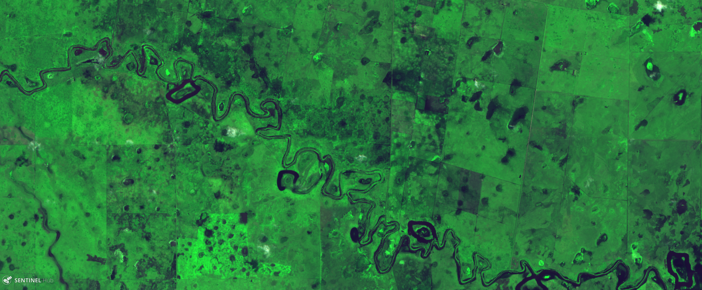

## General description of the script

Combining band 4 (red), band 8 (nir) and band 2 (blue) on RGB display, vegetation is highlighted so it's easier to detect crops anomalies, and healthy vegetation can be seen in bright green.

## Author of the script

Roberto Gagliardi

## Description of representative images

In the image of the 9 de Julio departament, Santa Fe Province, Argentina, it can be clearly seen the areas with good vegetation in green tonalities, and the darker areas correspond to flooded areas that are now begining to get vegetation.

Image: Sentinel 2- L1C, 20 JPN, acquired on 2019-03-18
