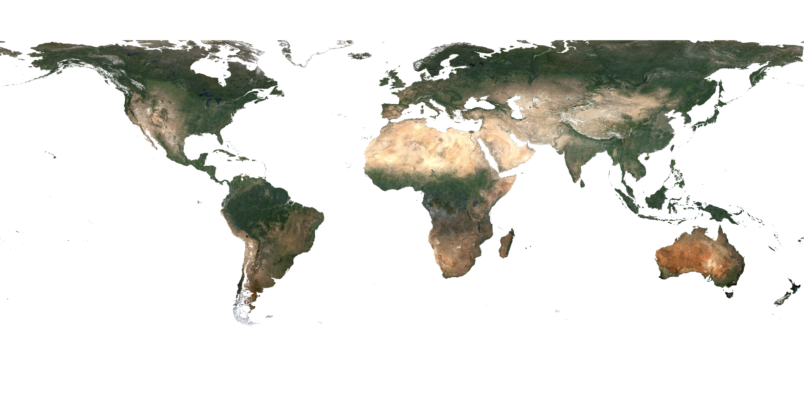
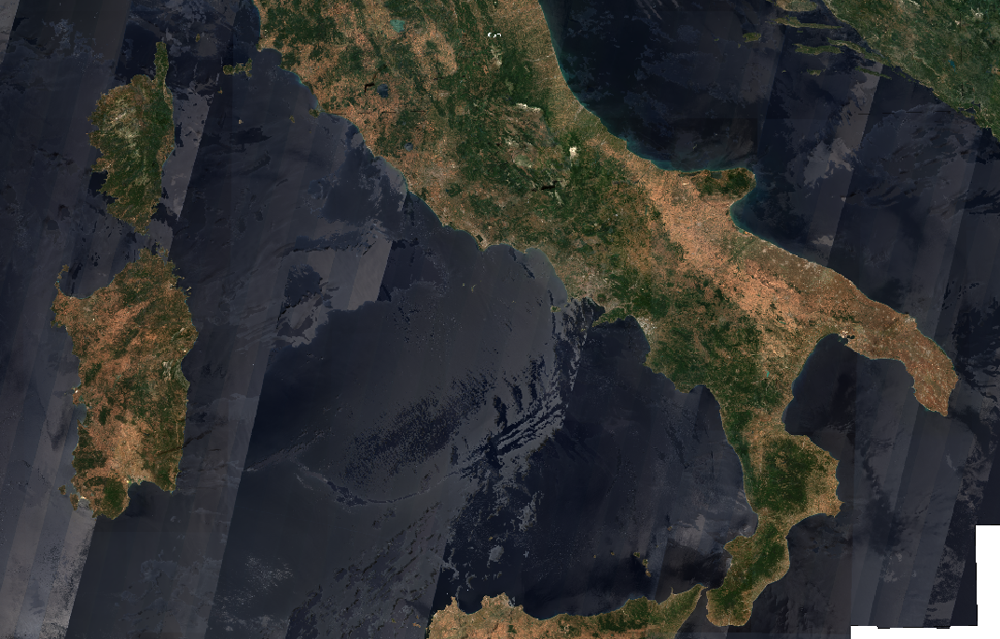
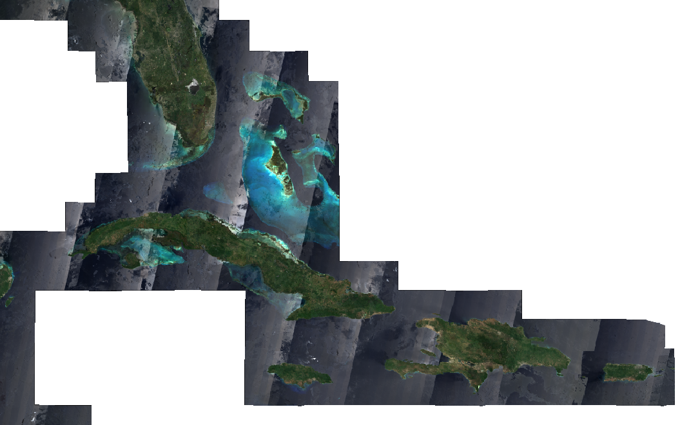
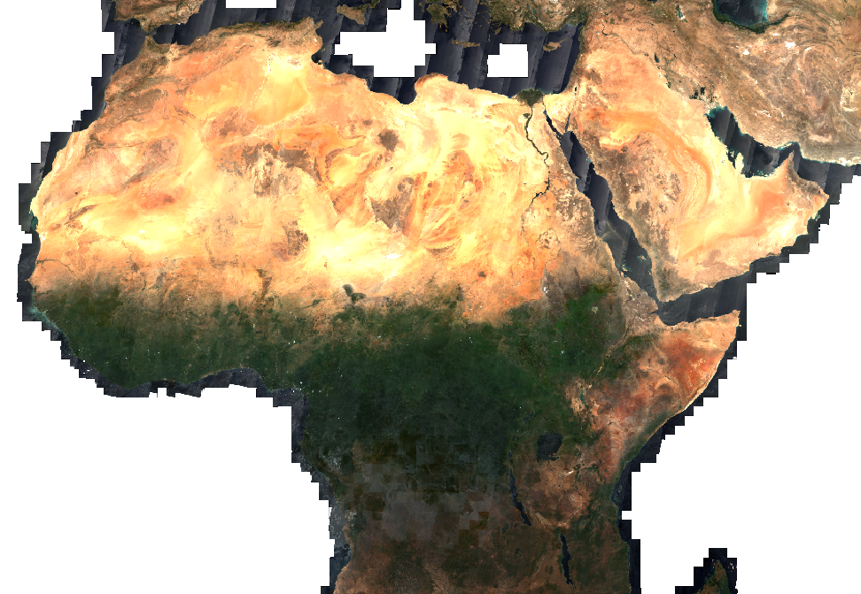

This evalscript returns a temporally-interpolated stack of band or band indices values.

**Warning:** In this `evalscript` the `time_interval` must be defined **both** in the request as well as in the evalscript itself.

## General description

From the provided time interval and the frequency, a new list of dates is determined on which the temporally interpolated values are estimated.

The evalscript applies cloud masking from the service. If there are not enough valid data poins to fill the time interval, the `CLP` (cloud probability) threshold is dynamically loosened in order to bring more points in.

More information about the general use of a similar script [on this blog post](https://medium.com/sentinel-hub/scale-up-your-eo-learn-workflow-using-batch-processing-api-d183b70ea237).

## Example request usage

```python
request = SentinelHubRequest(
    evalscript=evalscript,
    input_data=[
        SentinelHubRequest.input_data(
            data_collection=DataCollection.SENTINEL2_L2A,
            time_interval=time_interval,  # must be same as in the evalscript
            mosaicking_order='leastRecent',  # order is important
            other_args={'dataFilter':{'previewMode': 'DETAIL'}}  # because of `CLM` and `CLP`
        )
    ],
    responses=[
        SentinelHubRequest.output_response('B01', MimeType.TIFF),
        SentinelHubRequest.output_response('B02', MimeType.TIFF),
        SentinelHubRequest.output_response('B03', MimeType.TIFF),
        SentinelHubRequest.output_response('B04', MimeType.TIFF),
        SentinelHubRequest.output_response('B05', MimeType.TIFF),
        SentinelHubRequest.output_response('B06', MimeType.TIFF),
        SentinelHubRequest.output_response('B07', MimeType.TIFF),
        SentinelHubRequest.output_response('B08', MimeType.TIFF),
        SentinelHubRequest.output_response('B8A', MimeType.TIFF),
        SentinelHubRequest.output_response('B09', MimeType.TIFF),
        SentinelHubRequest.output_response('B11', MimeType.TIFF),
        SentinelHubRequest.output_response('B12', MimeType.TIFF),
        SentinelHubRequest.output_response('QM', MimeType.TIFF),
    ],
    geometry=geometry,
    size=bbox_to_dimensions(bbox, resolution)
    config=config
)
```

## Output result

<br>

<br>









