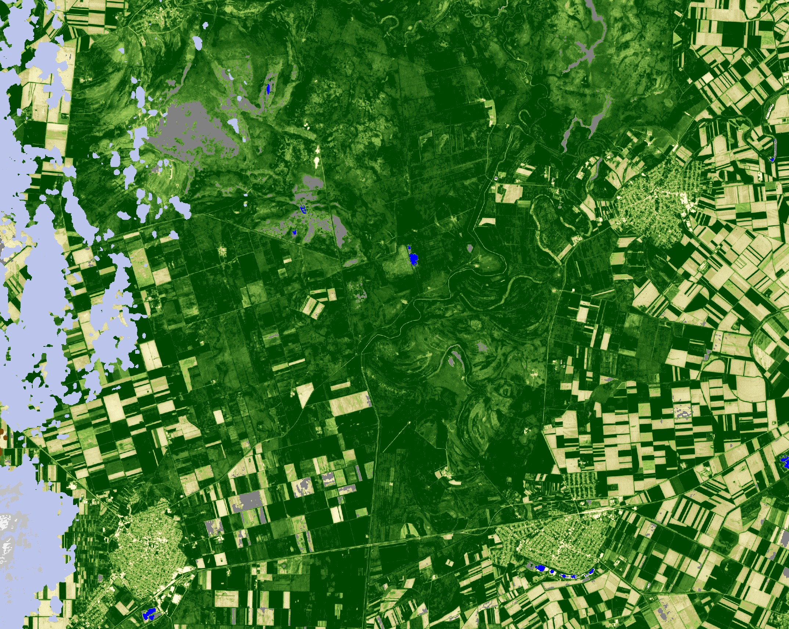
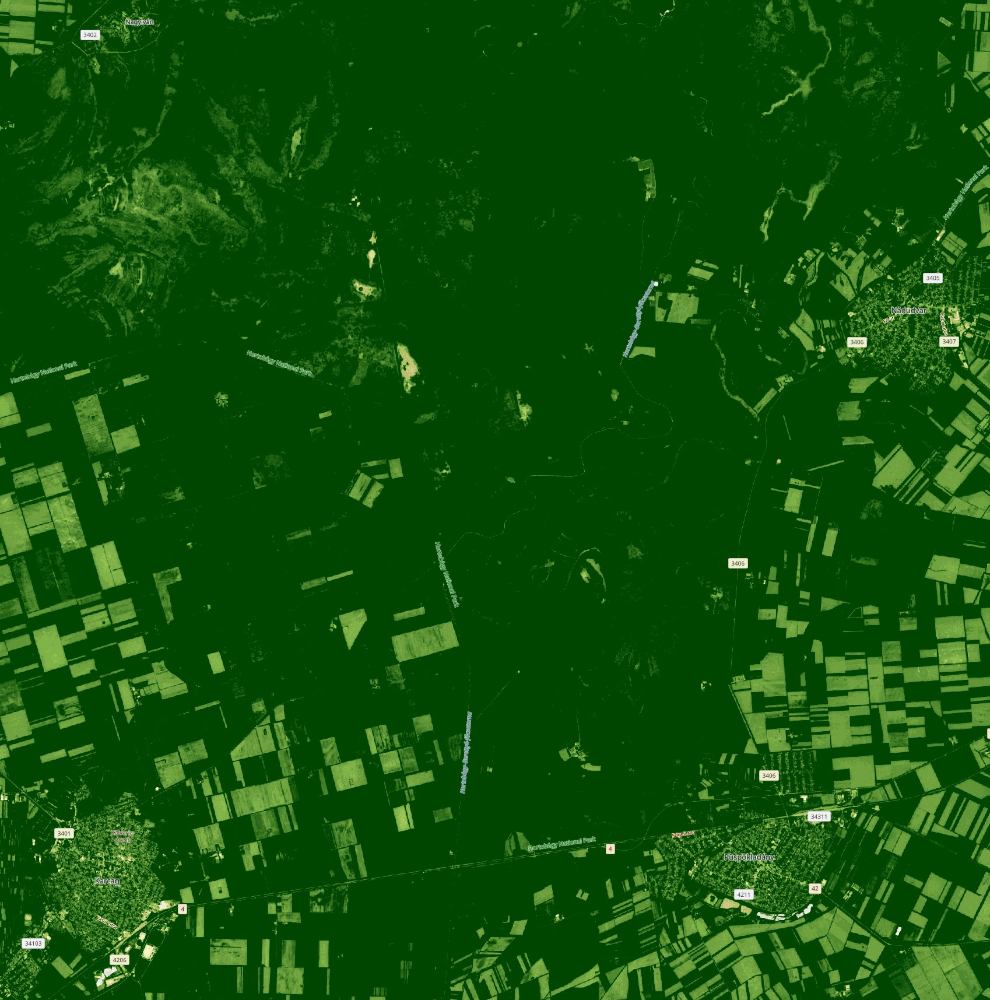

Interlaken, Switzerland (to show green vegetation, bare rock, snow and ice, and clouds together with kNDVI)

---

## Description of the Script

kNDVI (Kernel NDVI) is a recently proposed vegetation index (Camps-Valls 2021) based on a nonlinear generalization of the popular Normalized Differential Vegetation Index (NDVI). kNDVI works by re-scaling the relation between the difference in Red and Near Infrared (NIR) from a simple linear difference to a more complex relationship. Here we coded the simplest definition of kNDVI with a Radial Basis Function kernel as proposed in Camps-Valls (2021).
It seems based on the cited literature that kNDVI provides better correlation with field biomass or crop yield and provides higher accuracy for classification than NDVI. Note that for some machine learning applications, since this is "just" a rescaling of the spectral index, kNDVI might not perform differently than NDVI.
However, due to the second-order relationship with the difference of Red and NIR, kNDVI can produce high values when the difference is negative. Such cases include non-vegetated surfaces, which may thus be incorrectly displayed. Therefore, kNDVI is highly suitable for following vegetation patterns and processes, but not at all suitable on its own for separating vegetated surfaces from water, ice or clouds.
This was solved by embedding the kNDVI script into the [simple scene classification](https://www.sentinel-hub.com/faq/how-get-s2a-scene-classification-sentinel-2/) available in Sentinel-2 L2A data based on Sen2Cor outputs. The resulting script now provides shades of green, yellow or white for vegetation; and blue for water, gray for clouds, brown for cloud shadows, cyan for snow and ice and red for defective pixels. I trust that by adding this classification functionality to the script kNDVI can unfold its potential for visualizing vegetation processes.

The script has 4 different outputs:
- Default has 4 bands (Red, Green, Blue and Transparency, for visualization in Copernicus Browser)
- Index is the value of kndvi for the purpose of generating histograms in the Browser, unless the image is cloudy - then it is null.
- eobrowserStats is the value of kndvi for the purpose of generating Statistics API outputs such as time series, unless the image is cloudy - then it is null. 
- dataMask is a simple mask for valid/invalid pixels - note that cloudy pixels will also have valid values!

## Description of representative images

kNDVI is highly sensitive to the typical range of vegetation greenness, and is less sensitive to saturation at high biomass levels. Therefore it is useful for visualizing fine-scale patterns in crops or vegetation.

Grasslands and crop fields near Püspökladány, Hungary, **Sentinel-2A**, 2019-05-19, [**kNDVI**](https://tinyurl.com/pladanykndvi). The image highlights the fine patterns in vegetation greenness and biomass governed by microtopography. The meandering lines across the grassland are old river channels that are somewhat lower and therefore wetter than their surroundings. 

For comparison, here is a visualization of the same image with the default NDVI script available in Copernicus Browser. **Sentinel-2A**, 2019-05-19, [**NDVI**](https://link.dataspace.copernicus.eu/yv4r). This visualization is saturated for large parts of the image, not showing the patterns of the grassland. 

Finally, for orientation, here is a true colour image. **Sentinel-2A**, 2019-05-19, [**True Color**](https://link.dataspace.copernicus.eu/m2u2). Here you can see the various land cover categories, the haze and clouds affecting the area and the wide variety of grassland biomass. 

## References

- Camps-Valls, Gustau, et al. "A unified vegetation index for quantifying the terrestrial biosphere." Science Advances 7.9 (2021): eabc7447. [link](https://www.science.org/doi/10.1126/sciadv.abc7447)