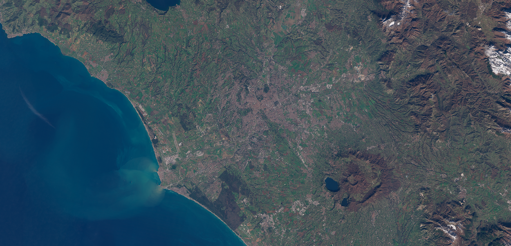

## Description

True color composite uses visible light bands red, green and blue in the corresponding red, green and blue color channels, resulting in a natural colored product, that is a good representation of the Earth as humans would see it naturally. This visualization uses highlight compression to ensure no maxing-out of clouds or snow, adds the offset to the RGB reflectances to improve the contrast and the color vividness, uses sRGB encoding for no extra darkening of shadows and adds a small amount of saturation boost.

## Description of representative images

Optimized True Color image of Rome. Acquired on 2023-01-30, processed by Sentinel Hub. 

