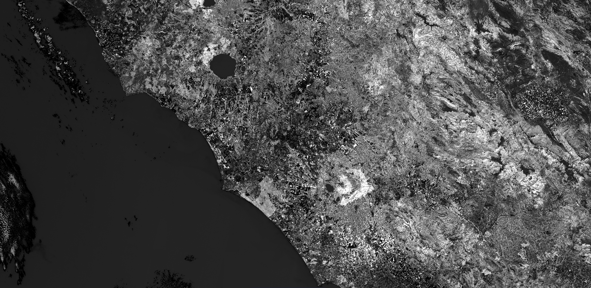

## General description of the script

LAI is a dimensionless index measuring the one-sided green leaf area over a unit of land (m^2 / m^2).

Note that the LAI script is as implemented in SNAP but without input and output validation!
Input/output values which are suspect are not reported or changed. Most values, however, do not fall under this category.
Visualized as an interval from 0-3. This can be adjusted in the evaluatePixel method.

## Description of representative images

Leaf area index, Rome. Acquired on 08.10.2017.

