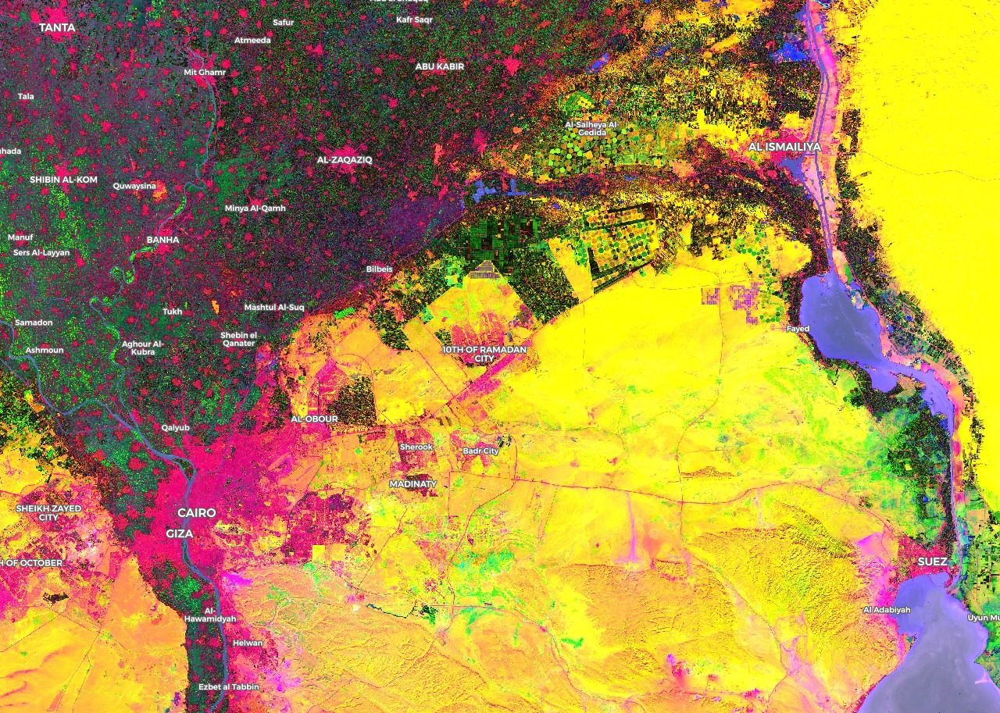
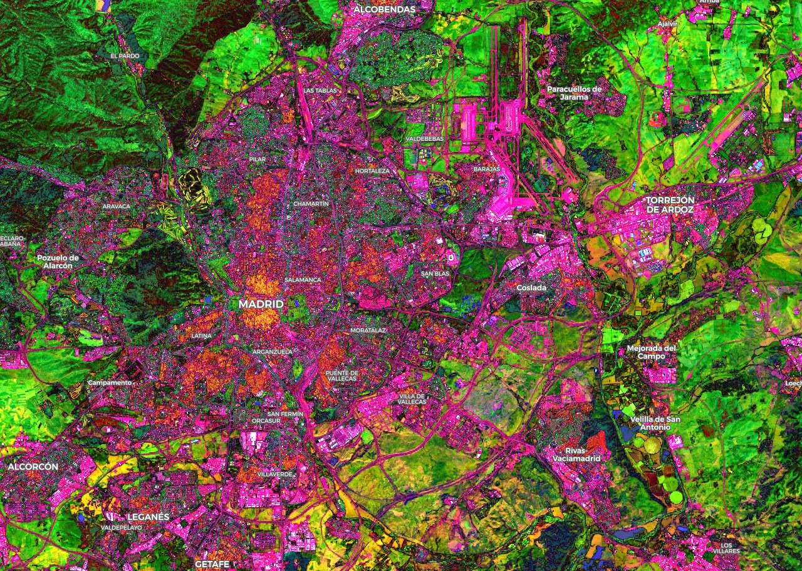
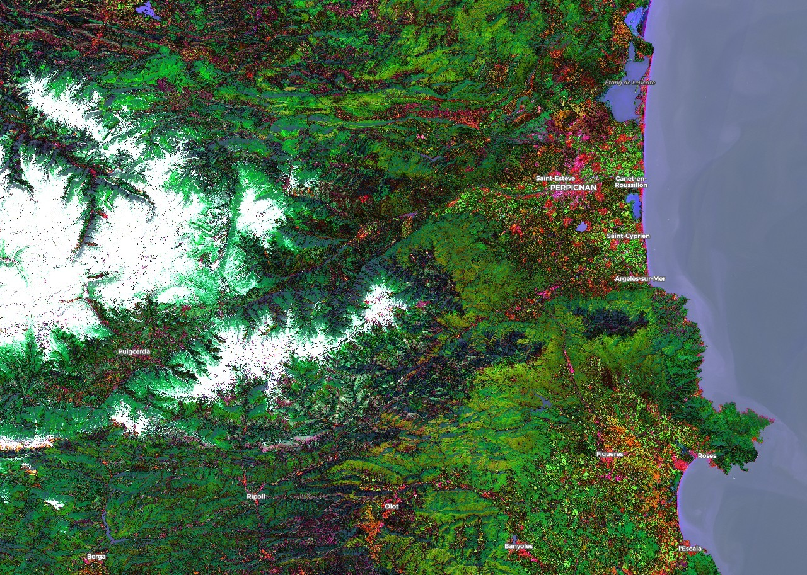

# Land Use Visualization for Sentinel-2 Using Linear Discriminant Analysis Script

<a href="#" id='togglescript'>Show</a> script or [download](script.js){:target="_blank"} it.


      


## Evaluate and visualize   
 - [EO Browser](https://apps.sentinel-hub.com/eo-browser/?lat=40.3840&lng=-3.6440&zoom=11&time=2019-09-26&preset=CUSTOM&datasource=Sentinel-2%20L1C&layers=B01,B02,B03&evalscript=cmV0dXJuIFtNYXRoLmFicyggMC40ODA5ICogKCgoKEIwMiAqIDIuNSkgLSAwLjMzMjkpICogLTkuNDQyNSkgKyAoKChCMDMgKiAyLjUpIC0gMC4zMTgyKSAqIDIuMTg0NikgKyAoKChCMDQgKiAyLjUpIC0gMC4zMzgwKSAqIDIuNTMzMykgKyAoKChCMTEgKiAyLjUpIC0gMC41NjQ0KSAqIDkuOTI1NikgKyAoKChCMTIgKiAyLjUpIC0gMC40MjE2KSAqIC0xMy42OTExKSkgKyAtMC40NzY2KSwKICAgICAgICBNYXRoLmFicyggMC4zMjc1ICogKCgoKEIwMiAqIDIuNSkgLSAwLjI4NDQpICogMTMuMzY0NCkgKyAoKChCMDMgKiAyLjUpIC0gMC4yNzM2KSAqIC02LjY1ODgpICsgKCgoQjA0ICogMi41KSAtIDAuMjc1MCkgKiAtMS4xOTk0KSArICgoKEIwOCAqIDIuNSkgLSAwLjU5NzIpICogLTAuMjA5MCkgKyAoKChCOEEgKiAyLjUpIC0gMC42NjQ4KSAqIDUuMTYzMCkgKyAoKChCMTEgKiAyLjUpIC0gMC41NjUxKSAqIC03LjIxODMpKSArIDAuMDQ2MyksCiAgICAgICAgTWF0aC5hYnMoIDAuMjM2MSAqICgoKChCMDMgKiAyLjUpIC0gMC4yNDI5KSAqIDIxLjg3NTkpICsgKCgoQjA0ICogMi41KSAtIDAuMjMyMSkgKiAtNi4wNjc5KSArICgoKEIwOCAqIDIuNSkgLSAwLjQzNzEpICogLTMuMDYwOCkgKyAoKChCMTEgKiAyLjUpIC0gMC40MTQ2KSAqIC00LjQ0MjApKSArIDAuMjA2MSldOw%3D%3D){:target="_blank"} 

## General description of the script

We have used LDA to create a visualization where each image channel (red, green and blue) codes the maximum information to identify respectively urban, crop and water related classes. Input class labels where taken from Spanish SIOSE land use classification. We have thus created three different transformations using LDA, one per component. Finally, as we have used a multiclass classifier for each type of data (for instance, urban data is separated into non urban, urban, industrial...), we transform the new axis obtained in order to translate the center of non-urban (resp. non-vegetation and non-water) classes to 0, and get the absolute value to recover any of the urban (resp. vegetation, water) classes that might have passed to the negative axis.

## Details of the script

This script for EO Browser is specifically designed to visualize Sentinel-2 13 band data in a way that facilitates differentiation of urban areas (red channel), vegetation areas (green channel) and water areas (blue channel).

We have created our model in Python using LDA method of the scikit-learn library. For the input data, we have taken around 80 images of Sentinel-2 L1C and land use classification from Siose. All the images where taken from the Spanish region of La Rioja (with dates ranging from 2015 to 2019). The script consist of three components (RGB), each component is created by applying a different LDA to reduce the data to a single dimension for the corresponding color channel.

Given the way that the script is designed, it is expected that the urban areas will appear in red, the vegetation in green tones and the areas of water in blue, which appears to be the standard behaviour of the script. However we also see the appearance of red in certain crops, and some rivers might also appear in tones other than blue.

## Authors of the script

Marta Elvira, Roberto Calvo, Javier Becerra

## Description of representative images

In general, the colors for each zone are:

* Urban areas: pink, orange.
* Industrial: brigth purple.
* Crops: purple and bright green tones.
* Forests: dark greens.
* No vegetation: yellow and pink.
* Water: blue.
* Snow: white.

## References

[1] [Scikit-learn, Linear Discriminant Analysis (LDA).](https://scikit-learn.org/stable/modules/generated/sklearn.discriminant_analysis.LinearDiscriminantAnalysis.html#sklearn.discriminant_analysis.LinearDiscriminantAnalysis){:target="_blank"}

[2] GitHub repository, [Collection of custom scripts.](https://github.com/sentinel-hub/custom-scripts){:target="_blank"} 

[3] [List of spectral indexes for Sentinel and Landsat.](http://www.gisandbeers.com/listado-indices-espectrales-sentinel-landsat/){:target="_blank"} 

[4] Borras, J. & Delegido, Jes˙s & Pezzola, Alejandro & Pereira, M. & Morassi, G. & Camps-Valls, Gustau. (2017). [Clasificación de usos del suelo a partir de imágenes Sentinel-2. Revista de Teledeteccion.](https://www.researchgate.net/publication/317715999_Clasificacion_de_usos_del_suelo_a_partir_de_imagenes_Sentinel-2){:target="_blank"}

[5] Pirotti, Francesco & Sunar, Filiz & Piragnolo, M.. (2016). [BENCHMARK OF MACHINE LEARNING METHODS FOR CLASSIFICATION OF A SENTINEL-2 IMAGE. ISPRS - International Archives of the Photogrammetry, Remote Sensing and Spatial Information Sciences.](https://www.researchgate.net/publication/314501156_BENCHMARK_OF_MACHINE_LEARNING_METHODS_FOR_CLASSIFICATION_OF_A_SENTINEL-2_IMAGE){:target="_blank"}

[6] Anaya Isaza, Andres & Peluffo, Diego & Alvarado PÈrez, Juan & Rios, Jorge & Castro Silva, Juan Antonio & Rosero, Paul & PeÒa, Diego & Salazar Castro, Jose & Umaquinga, Ana. (2016). [Estudio comparativo de mÈtodos espectrales para reducciÛn de la dimensionalidad: LDA versus PCA.](https://www.researchgate.net/publication/311450410_Estudio_comparativo_de_metodos_espectrales_para_reduccion_de_la_dimensionalidad_LDA_versus_PCA_Comparative_study_between_spectral_methods_for_dimension_reduction_LDA_versus_PCA){:target="_blank"}

[7] [GitHub repository.](https://github.com/PANOimagen/eobrowser-land-use-visualization){:target="_blank"}