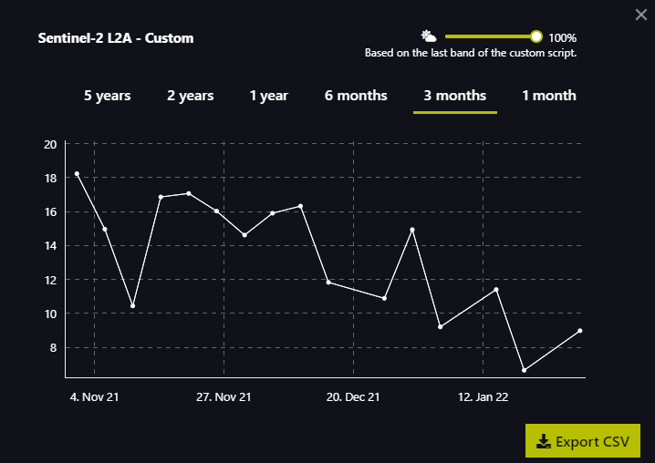
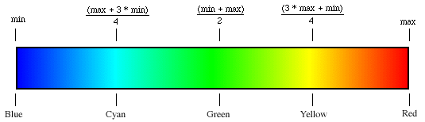
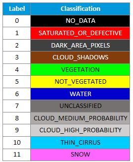
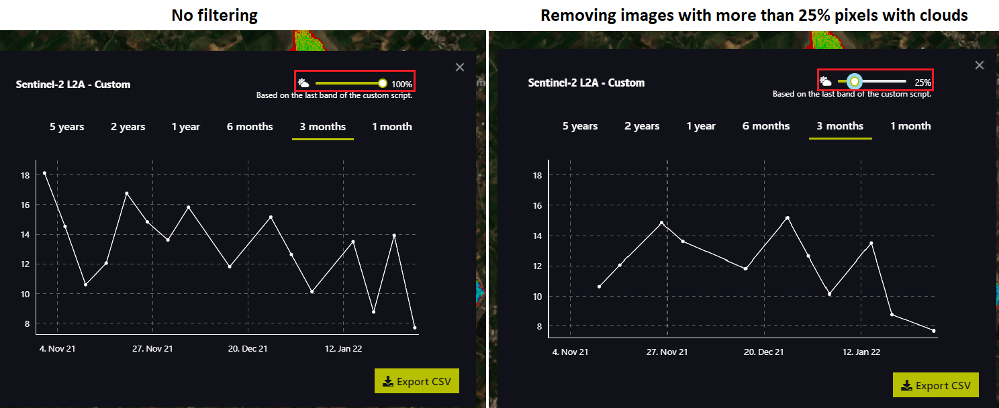
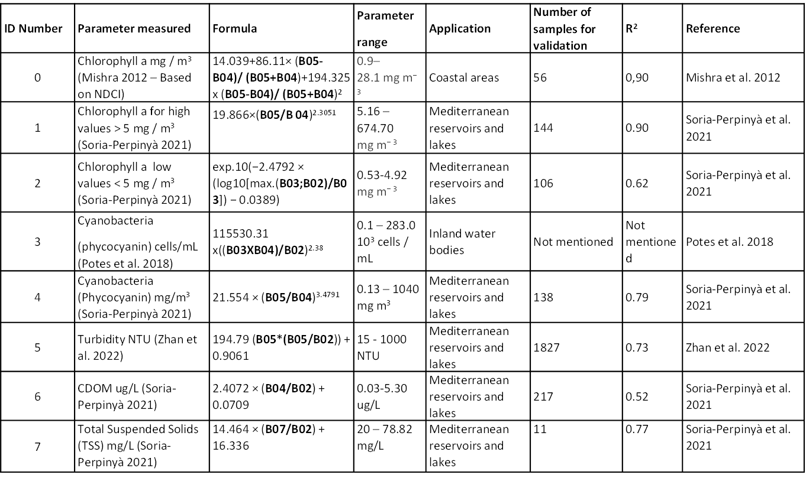

## General description of the script
MAGO Water Quality Monitoring tool is a code to estimate water quality parameters in lakes, reservoir or large ponds from Sentinel-2 images. The user can visualize water quality parameters (chlorophyll-a, cyanotoxins, turbidity...) on the EO Browser map  and get the corresponding time series at selected points or areas.

### Visuals
The following is the display that can be obtained for concentration of Chrlorophyll-a for the day 2022-01-30 at Barrage Lebna (Tunisia)
- Configuration of variables:

<p align="center"></p>

- Map visualization

<p align="center"></p>

- Time series plot

<p align="center"></p>

### Script description

The following lines will describe relevant aspects of the **MAGO Water Quality Monitoring Tool** code.

#### index Number

The user chooses one of the indicators to be visualized (each indicator has an ID number). Indicators are described in the Scientific Background section below. In order to make this selection, the user must modify the value of the following variable:

```
var indexNumber = 0;
```

#### Color scale

<span dir="">By modifying the min/max values of the script it is possible to adjust the numerical thresholds to fit the visualization to the current conditions.</span> Only the following two lines need to be modified:

```
var minValue = 0; 
var maxValue = 30;
```

<span dir="">More in detail</span>:

* **<span dir="">minValue</span>**: <span dir="">decrease this for more sensitivity to low concentrations of the selected index.</span>
* **<span dir="">maxValue</span>**<span dir="">: increase this for more sensitivity to high concentrations of the selected index.</span>

<p align="center"> </p>

```
var scaleLimits = [minValue, (maxValue + 3*minValue)/4, (maxValue + minValue)/2, (3*maxValue + minValue)/4, maxValue]
var s = 255; // Values range from 0 to 255 for every color channel
var colorScale =  // Define the RGB colors for each border
  [
   [0/s, 0/s, 255/s], // Blue
   [0/s, 255/s, 255/s], // Cyan
   [0/s, 255/s, 0/s], // Green
   [255/s, 255/s, 0/s], // Yellow
   [255/s, 0/s, 0/s], // Red
  ];
```

#### Pixel filtering

##### Filter by NDWI

We made a first filter by **NDWI** (<span dir="">Normalized Difference Water Index</span>) in order to differentiate the pixels with water from those without. <span dir="">If the NDWI is lower than 0 it is not water, so all pixels identified as "no water" will be shown in true color.</span>

```
if (NDWI < -0) { // If NDWI is lower than 0 is not water, so return  true color
  imgVals = [...TrueColor, samples.dataMask];
```

##### Filter by clouds

The purpose is to be able to make a subsequent filtering by removing the pixels containing clouds. This is achieved by the following function that use the SCL results:

```
function isCloud(scl)
```

Scene Classification Map (SCL) aims at providing a pixel classification map, with values from 0 to 11. The labels can be seen in the table below.

<p align="center"></p>

Based on this classification, the function will evaluate every pixel and return true for labels 1, 3, 8, 9, 10 and 11. This will allow images with a high percentage of pixels considered as cloudy to be disregarded in the time series plot display.

<p align="center"></p>
        
## Scientific Background
### Introduction

<span dir="">Satellite-based water quality monitoring have been applied for many years and are supported by the different absortion and reflectance of the sun light by the water components. For exemple, algae pigment chlorophyll-a reflects the green spectral band (between 530-590 nm) but absorb red band (between 640-670 nm).</span>

Sentinel 2 offers a greater frequency in the measurement than previous satellite missions providing regular analysis every 5 days. It is equipped with a Multi-Spectral Instrument (MSI) providing high resolution images that allow measuring Earth's reflections on 13 different spectral bands including Near Infrared (NIR) and Short Wave Infrared (SWIR).

### Description of the water quality parameters calculated

The MAGO water quality monitoring tool aims at integrating different water quality parameters calculated by using the formulas listed in the table below - listed by **Index Number** from 0 to 7.

<p align="center"></p>

The MAGO Water Quality Monitoring Tool was focused on chlorophyll-a and cyanobacteria analysis, as well as some physicochemical parameters were included. A brief explanation of the algorithms selected is the following:

#### Chlorophyll-a

For the measurement of this parameter in the MAGO tool we selected three different formulas.

**NDCI developed by Mishra et al. 2012 and adapted to the S2-MSI satellite** is one of the most commonly used index. Despite it has been developed for coastal areas its application to other water bodies has been carried out with successful results.

**Chlorophyll-a high values (Soria-Perpinyà 2021)** this formula has been optimized for its application to inland water bodies from the Mediterranean zone, so it can be more specific for this type of water than NDCI.

**Chlorophyll-a low values also optimized by Soria-Perpinyà 2021** has been applied in Mediterranean inland waters with low concentrations of Chl-a which can be more challenge to detect, so it is applicable in those situations were low concentrations of Chl-a are expected.


#### Cyanobacteria

For the determination of Phycocyanin as a proxy of cyanobacteria occurrence two index were included in the MAGO tool.

Both indices were developed for its application to inland water bodies. **Potes et al. 2018** showed good results in a preliminary test (see example of application section). Besides, **Soria-Perpinyà 2021** formula was included as it provides a broader range of phycocyanin concentration (this later formula is similar to Chlorophyll-a high values (Soria-Perpinyà 2021) since it is based on the correlation between Chl-a concentration and cyanobacteria concentration)


#### Physicochemical parameters

Three physicochemical parameters were included in the MAGO Water Quality Monitoring Tool, such as, Turbidity, Colored Dissolved Organic Matter (cDOM) and Total Suspended Solids (TSS).These parameters were selected as they are some of the most relevant for water quality monitoring and they can be measured through satellite analysis.The formulas included in the MAGO Tool were selected based on the following criteria:They were developed for inland water bodies, specifically for the Mediterranean zone.They were validated through comparison between satellite and in-situ data.Satellite data provided good correlation with in-situ measurements.


## Limitations

Satellite-based estimation of water parameters are dependent on the reflectance of the sun light by the water components.

This suffers from several limitations:

- sun light is only reflected from the **top water layer** (e.g. first 50cm) so no information are provided on lower layer (this has some importance in the case of stratified water or moving elements such as some cyanobacteria); some investigation are being developed to get more information deeper in the water column but no operative advances are expected in the next years.
- the reflectance may be influenced by the **atmospheric composition** (e.g. water vapour, aerosol...) - some corrections are applied in the raw data but the standard correction used for Sentinel data (Sen2Cor) is not optimal for water surfaces (that reflect only very few sun light) - this may lead to error in measurement and introduce some outlier in time series analysis (even if cloud filter are applied); different alternative atmospheric correction more adapted to water surfaces are already available (but they are not used yet in platform such as the Sentinel Hub EO Browser).
- measurements are taken at **specific times** (e.g. 11am), constant for one satellite and region – this might be important for some variables that can vary during the day; the exact time of the satellite images can be check in the platform such as the Sentinel Hub EO Browser)
- obviously the reflectance is influenced by the **water composition** and if there is a mix of components, this difficults the estimation of each of them; an example could be a very muddy water (high turbidity) with also a high algal content (high chlorophyll-a).

## References

### Use of previous scripts

The script itself has been written in Java Script by using as a basis other open scripts such as:
-  Ulyssys Water Quality Viewer (UWQV) available at https://custom-scripts.sentinel-hub.com/sentinel-2/ulyssys_water_quality_viewer/
-  Se2WaQ - Sentinel-2 Water Quality Script available at https://custom-scripts.sentinel-hub.com/sentinel-2/se2waq/
-  Normalized difference vegetation index template code available at https://custom-scripts.sentinel-hub.com/custom-scripts/sentinel-2/ndvi/

### Scientific references

- Mishra, S., Mishra, D.R., 2012. Normalized difference chlorophyll index: A novel model for remote estimation of chlorophyll-a concentration in turbid productive waters. Remote Sens. Environ. 117, 394–406. https://doi.org/10.1016/j.rse.2011.10.016

- Potes, M., Rodrigues, G., Marchã Penha, A., Helena Novais, M., João Costa, M., Salgado, R., Manuela Morais, M., 2018. Use of Sentinel 2-MSI for water quality monitoring at Alqueva reservoir, Portugal. Proc. Int. Assoc. Hydrol. Sci. 380, 73–79. https://doi.org/10.5194/piahs-380-73-2018

- Sòria-Perpinyà, X., Vicente, E., Urrego, P., Pereira-Sandoval, M., Tenjo, C., Ruíz-Verdú, A., Delegido, J., Soria, J.M., Peña, R., Moreno, J., 2021. Validation of water quality monitoring algorithms for sentinel-2 and sentinel-3 in mediterranean inland waters with in situ reflectance data. Water (Switzerland) 13. https://doi.org/10.3390/w13050686

- Zhan, Y., Delegido, J., Erena, M., Soria, J.M., Ruiz-Verdú, A., Urrego, P., Sòria-Perpinyà, X., Vicente, E., Moreno, J., 2022. Mar Menor lagoon (SE Spain) chlorophyll-a and turbidity estimation with Sentinel-2. Limnetica 41, 1. https://doi.org/10.23818/limn.41.18

### Acknowledgment

This project is part of the PRIMA programme supported by the European Union


## License

This work is licensed under CC BY-SA 4.0 https://creativecommons.org/licenses/by-sa/4.0/ 
If needed, please cite as "MAGO Water Quality Monitoring Tool, open code for EO Browser developed within the PRIMA MAGO Project by CETAQUA"
