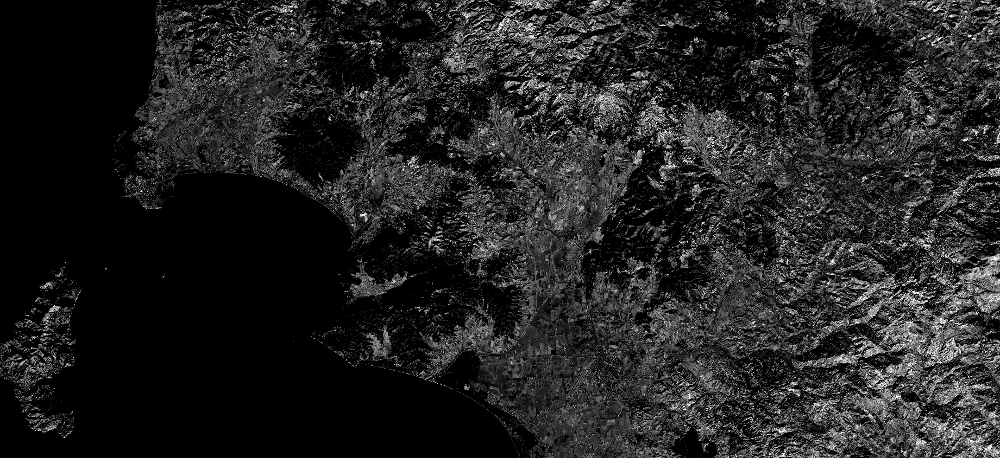

## General description of the script

To correct for leaf density and thickness, the near infrared spectral band (in the recommended wavelengths of 760-800nm), which is related to leaf scattering, is added to the basic ARI index. The new index is called modified ARI or mARI (also ARI2). 

**mARI(ARI2) = ((1 / 550nm) - (1 / 700nm)) * NIR**

**mARI(ARI2) = ((1 / B03) - (1 / B05)) * B07**  for Sentinel-2.

mARI values for the examined trees in [this original article](https://digitalcommons.unl.edu/cgi/viewcontent.cgi?article=1227&context=natrespapers){:target="_blank"} ranged in values from 0 to 8.

mARI(ARI2) = ((1 / 550nm) - (1 / 700nm)) * NIR

## Description of representative images

mARI applied to Rome. Acquired on 10.12.2019, processed by Sentinel Hub. 

## References
- [Non-Destructive Estimation of Anthocyanins and Chlorophylls in Anthocyanic Leaves (Gitelson, Chivkunova, Merzlyak)](https://digitalcommons.unl.edu/cgi/viewcontent.cgi?article=1227&context=natrespapers){:target="_blank"}
