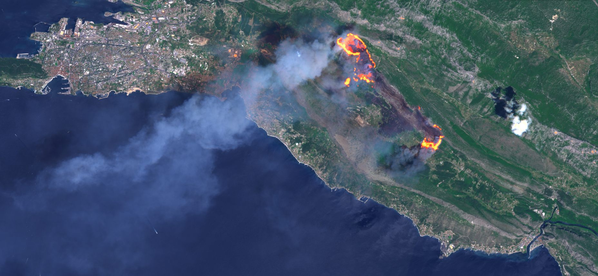

# Wildfire visualization

<a href="#" id='togglescript'>Show</a> script or [download](script.js){:target="_blank"} it.


      


## Evaluate and visualize
 - [Sentinel Playground](https://apps.sentinel-hub.com/sentinel-playground/?source=S2&lat=43.518057847237294&lng=16.574935913085938&zoom=12&preset=CUSTOM&layers=B01,B02,B03&maxcc=20&gain=1.0&gamma=1.0&time=2017-01-01%7C2017-07-17&atmFilter=&showDates=false&evalscript=Ly8gKioqCi8vIFZpc3VhbGl6aW5nICh3aWxkKWZpcmVzIGluIFNlbnRpbmVsLTIgaW1hZ2VyeQovLyBGb3IgdXNlIGluIFNpbmVyZ2lzZSBFTyBCcm93c2VyIChodHRwOi8vYXBwcy5zZW50aW5lbC1odWIuY29tL2VvLWJyb3dzZXIpCi8vIFBpZXJyZSBNYXJrdXNlIChAcGllcnJlX21hcmt1c2UpCi8vICoqKgovLyBGdW5jdGlvbnMKZnVuY3Rpb24gQShhLCBiKSB7cmV0dXJuIGEgKyBifTsKZnVuY3Rpb24gc3RyZXRjaCh2YWwsIG1pbiwgbWF4KSAgewoJcmV0dXJuICh2YWwgLSBtaW4pIC8gKG1heCAtIG1pbik7Cn0KCi8vIEJhbmQgY29tYmluYXRpb25zCnZhciBOYXR1cmFsQ29sb3JzID0gW3N0cmV0Y2goMy4xICogQjA0LDAuMDUsMC45KSwgc3RyZXRjaCgzICogQjAzLDAuMDUsMC45KSwgc3RyZXRjaCgzLjAgKiBCMDIsMC4wNSwwLjkpXTsKdmFyIEVuaGFuY2VkTmF0dXJhbENvbG9ycyA9IFtzdHJldGNoKCgzLjEgKiBCMDQgKyAwLjEgKiBCMDUpLDAuMDUsMC45KSwgc3RyZXRjaCgoMyAqIEIwMyArIDAuMTUgKiBCMDgpLDAuMDUsMC45KSwgc3RyZXRjaCgzICogQjAyLDAuMDUsMC45KV07CnZhciBOSVJTV0lSQ29sb3JzID0gW3N0cmV0Y2goMi42ICogQjEyLDAuMDUsMC45KSwgc3RyZXRjaCgxLjkgKiBCMDgsMC4wNSwwLjkpLCBzdHJldGNoKDIuNyAqIEIwMiwwLjA1LDAuOSldOwp2YXIgUGFuQmFuZCA9IFtzdHJldGNoKEIwOCwwLjAxLDAuOTkpLHN0cmV0Y2goQjA4LDAuMDEsMC45OSksc3RyZXRjaChCMDgsMC4wMSwwLjk5KV07CnZhciBOYXR1cmFsTklSU1dJUk1peCA9IFtzdHJldGNoKCgyLjEgKiBCMDQgKyAwLjUgKiBCMTIpLDAuMDEsMC45OSksIHN0cmV0Y2goKDIuMiAqIEIwMyArIDAuNSAqIEIwOCksMC4wMSwwLjk5KSwgc3RyZXRjaCgzLjIgKiBCMDIsMC4wMSwwLjk5KV07CnZhciBQYW5UaW50ZWRHcmVlbiA9IFtCMDggKiAwLjIsIEIwOCwgQjA4ICogMC4yXTsKdmFyIEZpcmUxT1ZMID0gW3N0cmV0Y2goKDIuMSAqIEIwNCArIDAuNSAqIEIxMiksMC4wMSwwLjk5KSsxLjEsIHN0cmV0Y2goKDIuMiAqIEIwMyArIDAuNSAqIEIwOCksMC4wMSwwLjk5KSwgc3RyZXRjaCgyLjEgKiBCMDIsMC4wMSwwLjk5KV07CnZhciBGaXJlMk9WTCA9IFtzdHJldGNoKCgyLjEgKiBCMDQgKyAwLjUgKiBCMTIpLDAuMDEsMC45OSkrMS4xLCBzdHJldGNoKCgyLjIgKiBCMDMgKyAwLjUgKiBCMDgpLDAuMDEsMC45OSkrMC41LCBzdHJldGNoKDIuMSAqIEIwMiwwLjAxLDAuOTkpXTsKLy8gQ2hvb3NlIGEgQ29sb3IsIEJhbmQgQ29tYmluYXRpb24sIG9yIG1ha2UgdXAgeW91ciBvd24gdmlzdWFsCi8vIEluIGNhc2UgaXQgZG9lc24ndCBoYXZlIHRvIGxvb2sgYWVzdGhldGljYWxseSBwbGVhc2luZyB5b3UgY2FuIHB1dCBSRUQgYW5kIFlFTExPVyBoZXJlIAp2YXIgRklSRTEgPSBGaXJlMU9WTDsgLy8gT3V0ZXIgZmlyZSB6b25lLCBkZWYgPSBGaXJlMU9WTAp2YXIgRklSRTIgPSBGaXJlMk9WTDsgLy8gSW5uZXIgZmlyZSB6b25lLCBkZWYgPSBGaXJlMk9WTAovLyBJIHJlY29tbWVuZCBOYXR1cmFsTklSU1dJUk1peCBvciBOSVJTV0lSQ29sb3JzIGZvciBiZXN0IHZpc3VhbHMKLy8gVHJ5IE5hdHVyYWxDb2xvcnMsIEVuaGFuY2VkTmF0dXJhbENvbG9ycywgUGFuVGludGVkR3JlZW4sIGFuZCBQYW5CYW5kIGFzIHdlbGwKdmFyIE5PRklSRSA9IE5hdHVyYWxOSVJTV0lSTWl4OwovLyBVc2luZyBCMTIgYW5kIEIxMSB0byBoaWdobGlnaHQgcG9zc2libGUgZmlyZXMgaW4gdHdvIHpvbmVzIHRvIGdldCBzb21lIG1vcmUgZGlzdGluY3Rpb24KLy8gSW5jcmVhc2UgU0VOU0lUSVZJVFkgZm9yIG1vcmUgcG9zc2libGUgZmlyZXMgYW5kIG1vcmUgd3JvbmcgaW5kaWNhdGlvbnMKdmFyIFNFTlNJVElWSVRZID0gMS4wOwpyZXR1cm4gKEEoQjEyLCBCMTEpID4gKDEuMCAvIFNFTlNJVElWSVRZKSkKPyAoQShCMTIsIEIxMSkgPiAoMi4wIC8gU0VOU0lUSVZJVFkpKSA%2FIEZJUkUyIDogRklSRTEKOiBOT0ZJUkU7Cg%3D%3D&evalscripturl=https://raw.githubusercontent.com/sentinel-hub/customScripts/master/sentinel-2/markuse_fire/script.js){:target="_blank"}
 - [EO Browser](https://apps.sentinel-hub.com/eo-browser/?zoom=12&lat=43.49765&lng=16.57373&themeId=WILDFIRES&datasetId=S2L2A&fromTime=2017-07-17T00%3A00%3A00.000Z&toTime=2017-07-17T23%3A59%3A59.999Z&visualizationUrl=https%3A%2F%2Fservices.sentinel-hub.com%2Fogc%2Fwms%2Faae18701-6b25-4001-8b2a-b98a1b3806c1&evalscript=ICAgICAgLy8gV2lsZGZpcmUgYW5kIGJ1cm4gc2NhciB2aXN1YWxpemF0aW9uIGluIFNlbnRpbmVsLTIgaW1hZ2VzIFYyLjAuMAovLyBUd2l0dGVyOiBQaWVycmUgTWFya3VzZSAoQHBpZXJyZV9tYXJrdXNlKQovLyBodHRwczovL3BpZXJyZS1tYXJrdXNlLm5ldC8yMDE4LzA0LzMwL3Zpc3VhbGl6aW5nLXdpbGRmaXJlcy1idXJuLXNjYXJzLXNlbnRpbmVsLWh1Yi1lby1icm93c2VyLwovLyBDQyBCWSA0LjAgSW50ZXJuYXRpb25hbCAtIGh0dHBzOi8vY3JlYXRpdmVjb21tb25zLm9yZy9saWNlbnNlcy9ieS80LjAvCmZ1bmN0aW9uIGEoYSwgYikge3JldHVybiBhICsgYn07CmZ1bmN0aW9uIHN0cmV0Y2godmFsLCBtaW4sIG1heCkge3JldHVybiAodmFsIC0gbWluKSAvIChtYXggLSBtaW4pO30KZnVuY3Rpb24gc2F0RW5oKHJnYkFycikgewogICAgdmFyIGF2ZyA9IHJnYkFyci5yZWR1Y2UoKGEsIGIpID0%2BIGEgKyBiLCAwKSAvIHJnYkFyci5sZW5ndGg7CiAgICByZXR1cm4gcmdiQXJyLm1hcChhID0%2BIGF2ZyAqICgxIC0gc2F0dXJhdGlvbikgKyBhICogc2F0dXJhdGlvbik7IH0KZnVuY3Rpb24gaGlnaGxpZ2h0QnVybnNjYXIodmFsLCBvTG93LCBvSGlnaCwgZGVTYXQsIGRhcmtlbikgewogICAgaWYgKChCMTIgKyBCMTEgPiAwLjA1KSAmJiAodmFsID4gMCkpIHsKICAgICAgICBpZiAoKChCOEEgLSBCMTIpIC8gKEI4QSArIEIxMikpID4gb0xvdykgewogICAgICAgICAgICBzYXR1cmF0aW9uID0gc2F0dXJhdGlvbiAtIGRlU2F0OwogICAgICAgICAgICBzdHJldGNoTWF4ID0gc3RyZXRjaE1heCArIGRhcmtlbjsKICAgICAgICB9IGVsc2UgewogICAgICAgICAgICBpZiAoKChCOEEgLSBCMTIpIC8gKEI4QSArIEIxMikpIDw9IG9IaWdoKSB7CiAgICAgICAgICAgICAgICBub0ZpcmVbMF0gPSBub0ZpcmVbMF0gKyAwLjIgKiB2YWw7CiAgICAgICAgICAgICAgICBub0ZpcmVbMV0gPSBub0ZpcmVbMV0gKyAwLjA1ICogdmFsOwogICAgICAgICAgICB9IGVsc2UgewogICAgICAgICAgICAgICAgbm9GaXJlWzBdID0gbm9GaXJlWzBdICsgMC4xNSAqIHZhbDsKICAgICAgICAgICAgICAgIG5vRmlyZVsxXSA9IG5vRmlyZVsxXSArIDAuMTUgKiB2YWw7CiAgICAgICAgICAgIH0KICAgICAgICB9CiAgICB9Cn0KZnVuY3Rpb24gaW5kZXhNYXAoaW5kLCBsVmFsLCBtVmFsLCBoVmFsLCBjb250LCBkaXIsIHBhbCkgewogIHZhciBjb2wxPUdSRUVOO3ZhciBjb2wyPVlFTExPVzt2YXIgY29sMz1SRUQ7ICAKICBpZiAocGFsID09IDEpIHtjb2wxPUNCTDtjb2wyPUNCTTtjb2wzPUNCSDt9IAogIGlmIChwYWwgPT0gMikge2NvbDE9T1dOTDtjb2wyPU9XTk07Y29sMz1PV05IO30gICAgICAgICAKICAgIHZhciBsVmFsQ29sID0gY29sMTsKICAgIHZhciBtVmFsQ29sID0gY29sMjt2YXIgaFZhbENvbCA9IGNvbDM7CiAgICBpZiAoZGlyID09IDEpewogICAgCWxWYWxDb2wgPSBjb2wzO2hWYWxDb2wgPSBjb2wxOwogICAgfQogICAgaWYgKGNvbnQgPT0gMCkgewogICAgICAgIGlmIChpbmQgPD0gbFZhbCkgcmV0dXJuIGxWYWxDb2w7IGlmICgoaW5kID4gbFZhbCkgJiYgKGluZCA8IGhWYWwpKSByZXR1cm4gbVZhbENvbDsgaWYgKGluZCA%2BPSBoVmFsKSByZXR1cm4gaFZhbENvbDsKICAgICAgfSBlbHNlIHsKICAgICAgICByZXR1cm4gY29sb3JCbGVuZChpbmQsIFtsVmFsLCBtVmFsLGhWYWxdLCBbbFZhbENvbCxtVmFsQ29sLGhWYWxDb2xdKTsKICAgIH0KfQpmdW5jdGlvbiBibGVuZChiQXJyMSwgYkFycjIsIG9wYTEsIG9wYTIpIHsKICAgIHJldHVybiBiQXJyMS5tYXAoZnVuY3Rpb24obnVtLCBpbmRleCkgewogICAgICAgIHJldHVybiAobnVtIC8gMTAwICogb3BhMSArIGJBcnIyW2luZGV4XSAvIDEwMCAqIG9wYTIpOwogICAgfSk7Cn0KZnVuY3Rpb24gYXBwbHlFbmgoYkFycikgewogICAgaGlnaGxpZ2h0QnVybnNjYXIoYnVybnNjYXJIaWdobGlnaHQsIGJ1cm5zY2FyVGhyZXNob2xkTG93LCBidXJuc2NhclRocmVzaG9sZEhpZ2gsIGJ1cm5zY2FyRGVzYXR1cmF0ZUJhY2tkcm9wLCBidXJuc2NhckRhcmtlbkJhY2tkcm9wKTsKICAgIHJldHVybiBzYXRFbmgoW3N0cmV0Y2goYkFyclswXSwgc3RyZXRjaE1pbiwgc3RyZXRjaE1heCksIHN0cmV0Y2goYkFyclsxXSwgc3RyZXRjaE1pbiwgc3RyZXRjaE1heCksIHN0cmV0Y2goYkFyclsyXSwgc3RyZXRjaE1pbiwgc3RyZXRjaE1heCldKTsKfQp2YXIgQkxBQ0sgPSBbMC4wLCAwLjAsIDAuMF07CnZhciBSRUQgPSBbMC45LCAwLjEsIDAuMV07CnZhciBZRUxMT1cgPSBbMC45LCAwLjksIDAuMV07CnZhciBHUkVFTiA9IFswLjAsIDAuNiwgMC4wXTsKdmFyIENCTCAgPSBbMC8yNTUsIDgwLzI1NSwgMC8yNTVdOwp2YXIgQ0JNICA9IFsxMjAvMjU1LCAxMjAvMjU1LCAyMzAvMjU1XTsKdmFyIENCSCAgPSBbNzAvMjU1LCAxOTUvMjU1LCAyNTUvMjU1XTsKdmFyIE9XTkwgPSBbMC4wLCAwLjAsIDAuMF07CnZhciBPV05NID0gWzAuMCwgMC4wLCAwLjBdOwp2YXIgT1dOSCA9IFswLjAsIDAuMCwgMC4wXTsKLy8gVmlzdWFsaXphdGlvbiBzdHlsZSBvZiB0aGUgZGlmZmVyZW50IGZpcmUgem9uZXMKdmFyIEZpcmUxT1ZMID0gW3N0cmV0Y2goKDIuMSAqIEIwNCArIDAuNSAqIEIxMiksIDAuMDEsIDAuOTkpICsgMS4xLCBzdHJldGNoKCgyLjIgKiBCMDMgKyAwLjUgKiBCMDgpLCAwLjAxLCAwLjk5KSwgc3RyZXRjaCgyLjEgKiBCMDIsIDAuMDEsIDAuOTkpXTsKdmFyIEZpcmUyT1ZMID0gW3N0cmV0Y2goKDIuMSAqIEIwNCArIDAuNSAqIEIxMiksIDAuMDEsIDAuOTkpICsgMS4xLCBzdHJldGNoKCgyLjIgKiBCMDMgKyAwLjUgKiBCMDgpLCAwLjAxLCAwLjk5KSArIDAuMjUsIHN0cmV0Y2goMi4xICogQjAyLCAwLjAxLCAwLjk5KV07CnZhciBGaXJlM09WTCA9IFtzdHJldGNoKCgyLjEgKiBCMDQgKyAwLjUgKiBCMTIpLCAwLjAxLCAwLjk5KSArIDEuMSwgc3RyZXRjaCgoMi4yICogQjAzICsgMC41ICogQjA4KSwgMC4wMSwgMC45OSkgKyAwLjUsIHN0cmV0Y2goMi4xICogQjAyLCAwLjAxLCAwLjk5KV07Ci8vIEJhbmQgY29tYmluYXRpb25zIChUbyBnZXQgcXVpY2tlciBwcm9jZXNzaW5nIHlvdSBzaG91bGQgY29tbWVudCBvdXQgYWxsIHRob3NlIHlvdSBhcmUgbm90IHVzaW5nIGluIHRoZSBTZXR0aW5ncyBmdXJ0aGVyIGRvd24pCnZhciBOYXR1cmFsQ29sb3JzID0gWzIuOSAqIEIwNCwgMy4xICogQjAzLCAzLjAgKiBCMDJdOwovLyB2YXIgRW5oYW5jZWROYXR1cmFsQ29sb3JzID0gWzIuOCAqIEIwNCArIDAuMSAqIEIwNSwgMi44ICogQjAzICsgMC4xNSAqIEIwOCwgMi44ICogQjAyXTsKLy8gdmFyIE5hdHVyYWxOSVJTV0lSTWl4ID0gWzIuMSAqIEIwNCArIDAuNSAqIEIxMiwgMi4yICogQjAzICsgMC41ICogQjA4LCAzLjAgKiBCMDJdOwovLyB2YXIgTklSU1dJUkNvbG9yczEgPSBbMi42ICogQjEyLCAxLjkgKiBCMDgsIDIuNyAqIEIwMl07CnZhciBOSVJTV0lSQ29sb3JzMiA9IFsyLjQgKiBCMTIsIDEuNyAqIEI4QSwgMi4yICogQjA1XTsKLy8gdmFyIE5JUlNXSVJDb2xvcnMzID0gWzAuNSAqIChCMTIgKyBCMTEpIC8gNCAvIEIwNywgMC44ICogQjhBLCAxICogQjA3XTsKLy8gdmFyIE5JUlNXSVJDb2xvcnM0ID0gWzIuMCAqIEIxMiwgMS4xICogQjExLCAxLjYgKiBCMDhdOwovLyB2YXIgRmFsc2VDb2xvciA9IFtCMDggKiAyLCBCMDQgKiAyLCBCMDMgKiAyXTsKLy8gdmFyIE5hdEZhbHNlQ29sb3IgPSBbQjEyICogMi42LCBCMTEgKiAyLCBCMDQgKiAyLjddOwovLyB2YXIgVmVnZXRhdGlvbiA9IFtCMTEgKiAyLjQsIEI4QSAqIDIsIEIwNCAqIDIuOV07Ci8vIHZhciBQYW5CYW5kID0gW0IwOCwgQjA4LCBCMDhdOwovLyB2YXIgTkJSOEExMiA9IGluZGV4TWFwKChCOEEgLSBCMTIpIC8gKEI4QSArIEIxMiksIC0wLjgsIC0wLjQsIDAuMCwgMSwgMSwgMSk7Ci8vIHZhciBORFZJID0gaW5kZXhNYXAoKEIwOCAtIEIwNCkgLyAoQjA4ICsgQjA0KSwgLTAuNCwgLTAuMiwgMC4wLCAxLCAxLCAxKTsKLy8gU2V0dGluZ3MKLy8gRmlyZSAoaG90IHNwb3QpIHZpc3VhbGl6YXRpb24KdmFyIGZpcmUxID0gRmlyZTFPVkw7CnZhciBmaXJlMiA9IEZpcmUyT1ZMOwp2YXIgZmlyZTMgPSBGaXJlM09WTDsKLy8gVXNlZCBiYW5kIGNvbWJpbmF0aW9ucyBhbmQgbWl4aW5nCnZhciBsYXllcjEgPSBOSVJTV0lSQ29sb3JzMjsKdmFyIGxheWVyMiA9IE5hdHVyYWxDb2xvcnM7CnZhciBsYXllcjFBbW91bnQgPSAwOwp2YXIgbGF5ZXIyQW1vdW50ID0gMTAwOwovLyBJbmZsdWVuY2UgY29udHJhc3QgYW5kIHNhdHVyYXRpb24KdmFyIHN0cmV0Y2hNaW4gPSAwLjAwOwp2YXIgc3RyZXRjaE1heCA9IDEuMDA7CnZhciBzYXR1cmF0aW9uID0gMS4wMDsKLy8gRmlyZSBzZW5zaXRpdml0eSAoRGVmYXVsdCA9IDEuMDApLCBoaWdoZXIgdmFsdWVzIGluY3JlYXNlIGZpcmUgKGhvdCBzcG90KSBkZXRlY3Rpb24gYW5kIGZhbHNlIHBvc2l0aXZlcwp2YXIgZmlyZVNlbnNpdGl2aXR5ID0gMS4wMDsKLy8gQnVybiBzY2FyIHZpc3VhbGl6YXRpb24KdmFyIGJ1cm5zY2FySGlnaGxpZ2h0ID0gMC4wMDsKdmFyIGJ1cm5zY2FyVGhyZXNob2xkTG93ID0gLTAuMjU7CnZhciBidXJuc2NhclRocmVzaG9sZEhpZ2ggPSAtMC4zODsKdmFyIGJ1cm5zY2FyRGVzYXR1cmF0ZUJhY2tkcm9wID0gMC4yNTsKdmFyIGJ1cm5zY2FyRGFya2VuQmFja2Ryb3AgPSAwLjI1OwovLyBNYW51YWxseSBpbmZsdWVuY2UgUkdCIG91dHB1dAp2YXIgbWFudWFsQ29ycmVjdGlvbiA9IFswLjAwLCAwLjAwLCAwLjAwXTsKLy8gSW1hZ2UgZ2VuZXJhdGlvbiBhbmQgb3V0cHV0Cm5vRmlyZSA9IGJsZW5kKGxheWVyMSwgbGF5ZXIyLCBsYXllcjFBbW91bnQsIGxheWVyMkFtb3VudCk7CmZpbmFsUkdCID0gYXBwbHlFbmgobm9GaXJlKS5tYXAoZnVuY3Rpb24obnVtLCBpbmRleCkgewogICAgcmV0dXJuIG51bSArIG1hbnVhbENvcnJlY3Rpb25baW5kZXhdO30pOwpyZXR1cm4gKGEoQjEyLCBCMTEpID4gKDEuMCAvIGZpcmVTZW5zaXRpdml0eSkpID8KICAgIChhKEIxMiwgQjExKSA%2BICgyLjAgLyBmaXJlU2Vuc2l0aXZpdHkpKSA%2FIGZpcmUzIDoKICAgIChhKEIxMiwgQjExKSA%2BICgxLjUgLyBmaXJlU2Vuc2l0aXZpdHkpKSA%2FIGZpcmUyIDogZmlyZTEgOgogICBmaW5hbFJHQjs%3D){:target="_blank"}

## General description
The script visualizes wildfires from Sentinel-2 data. It was published by Pierre Markuse on his blog [1] in August 2017.

## Description of representative images

Wildfire east of Split, Croatia. Acquired on 17.7.2017.

## References
[1] P. Markuse, [Visualizing (Wild)Fires in Sentinel-2 imagery through EO Browser
](https://pierre-markuse.net/2017/08/07/visualizing-wildfires-sentinel-2-imagery-eo-browser/). August 2017.
[2] P. Markuse, [Visualizing Wildfires and Burn Scars with the Sentinel Hub EO Browser V2](https://github.com/sentinel-hub/custom-scripts/blob/master/sentinel-2/markuse_fire/script.js), May 2018
