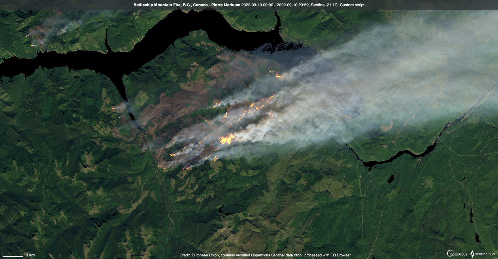
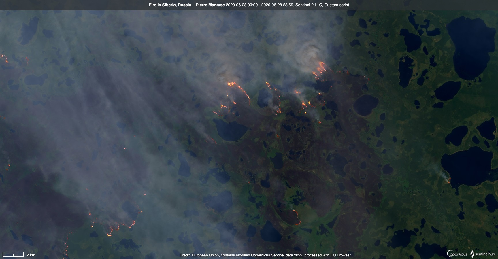

## General description
The script visualizes wildfires from Sentinel-2 data. It was published by Pierre Markuse on his blog [1] in September 2022.

## Description of representative images

Wildfire east of Split, Croatia. Acquired on 17.7.2017.

  

## References

[1] P. Markuse, [QuickFire 1.0 – Visualizing Fires in the Sentinel Hub EO Browser](https://web.archive.org/web/20230709082534/https://pierre-markuse.net/2022/09/21/quickfire-1-0-visualizing-fires-in-the-sentinel-hub-eo-browser/){:target="_blank"}  
[2] P. Markuse, [Visualizing (Wild)Fires in Sentinel-2 imagery through EO Browser](https://web.archive.org/web/20230206114533/https://pierre-markuse.net/2017/08/07/visualizing-wildfires-sentinel-2-imagery-eo-browser/){:target="_blank"}. August 2017.  
[3] P. Markuse, [Visualizing Wildfires and Burn Scars with the Sentinel Hub EO Browser V2](https://github.com/sentinel-hub/custom-scripts/blob/master/sentinel-2/markuse_fire/script.js){:target="_blank"}, May 2018
