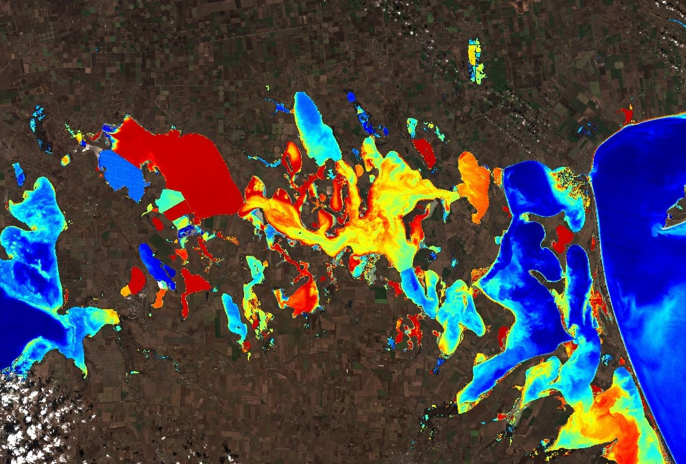

## General description of the script

A unit-less index used to visualise high-biomass submerged and floating algae and cyanobacteria blooms in lakes.

Detects the height of the scattering peak in the Sentinel-2 bands at 705 and 740 nm after 
the Maximum Peak Height Algorithm (Matthews et al., 2012) used for Sentinel-3 OLCI. 

Switches between the Maximum Chlorophyll Index (Gower et al., 2008) and the 
Floating Algal Index (Hu, 2009) approaches typically used with Sentinel-3 OLCI 
or MODIS.

Uses the [water bodies mapping](https://github.com/sentinel-hub/custom-scripts/tree/master/sentinel-2/water_bodies_mapping-wbm) 
technique of Mohor Gartner. It visualises land using a simple RGB approach. 

## Representative Images

Bloom Index applied to Tevere river, Italy. Image acquired on 2017-10-08.

Bloom Index applied to Syvash lagoon, Ukraine. Image acquired on 2022-02-15.

## Credits

Credit CyanoLakes, Jeremy Kravitz, Mark Matthews.

## References
Gower, J., King, S., & Goncalves, P. (2008). Global monitoring of plankton blooms using MERIS MCI. International Journal of Remote Sensing, 29(21), 6209-6216.

Hu, C. (2009). A novel ocean color index to detect floating algae in the global oceans. Remote Sensing of Environment, 113(10), 2118-2129.

Matthews, M. W., Bernard, S., & Robertson, L. (2012). An algorithm for detecting trophic status (chlorophyll-a), cyanobacterial-dominance, surface scums and floating vegetation in inland and coastal waters. Remote Sensing of Environment, 124, 637-652.
