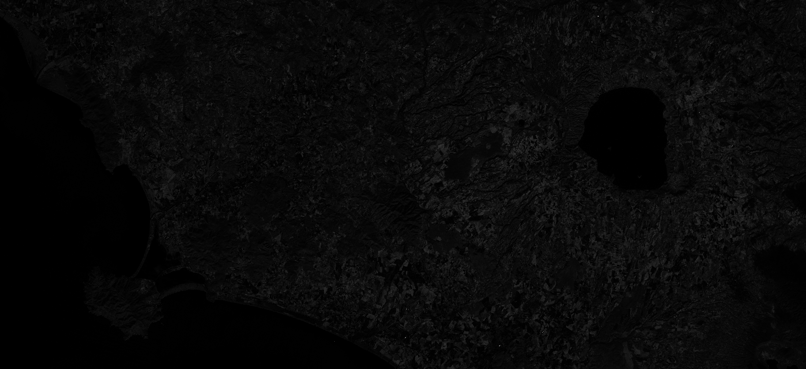

## General description of the script

MCARI gives a measure of the depth of chlorophyll absorption and is very sensitive to variations in chlorophyll concentrations as well as variations in Leaf Area Index (LAI). MCARI values are not affected by illumination conditions, the background reflectance from soil and other non-photosynthetic materials observed.

## Description of representative images

MCARI, Italy. Acquired on 08.10.2017, processed by Sentinel Hub. 

## References
https://www.hiphen-plant.com