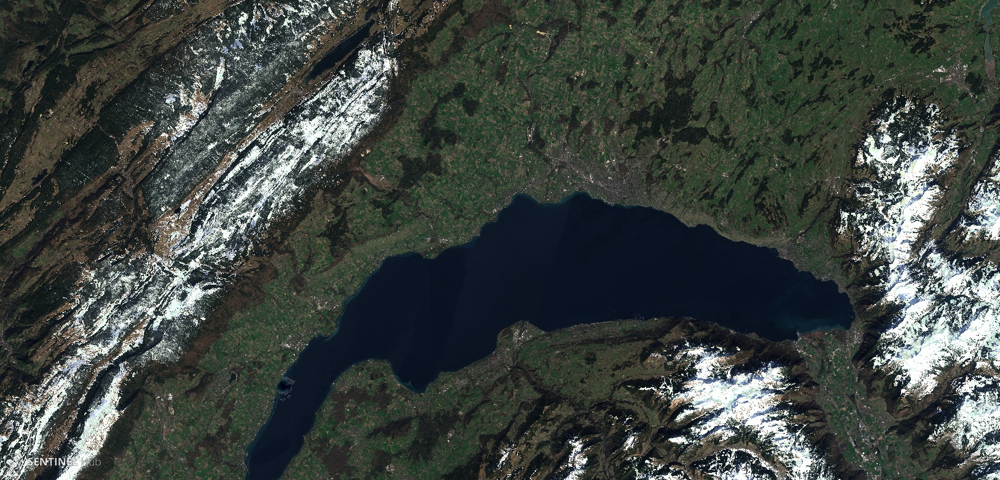
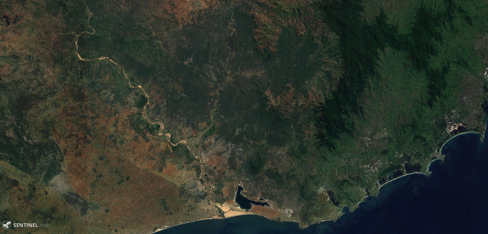

# Monthly Composite Script

<a href="#" id='togglescript'>Show</a> script or [download](script.js){:target="_blank"} it.


      


## Evaluate and visualize
 - [Sentinel Playground temporal](https://apps.sentinel-hub.com/sentinel-playground-temporal/?source=S2&lat=44.61613347064405&lng=-0.7415771484375&zoom=11&preset=CUSTOM&layers=B01,B02,B03&maxcc=100&gain=1.0&gamma=1.0&time=2015-01-01%7C2019-03-29&atmFilter=ATMCOR&showDates=false&evalscript=Ly9WRVJTSU9OPTMgKGF1dG8tY29udmVydGVkIGZyb20gMSkKLyoKQXV0aG9yOiBLYXJhc2lhayBOaWNvbGFzCiovCgovLyBQdXQgMyB0byBoYXZlIHN5bnRoZXNpcyBvZiB0aGUgbGFzdCA5MCBkYXlzCnZhciBudW1iZXJPZk1vbnRoc1RvVXNlID0gMTsKLy8gVGhyZXNvbGQgdG8gY29uc2lkZXIgcGl4ZWwgYXMgc25vdwp2YXIgTkRTSXRocmVzb2xkID0gMC4yOwovLyBJbiBvcmRlciB0byBkaXNtaXNzIHNub3cgZnJvbSB3YXRlcgp2YXIgcmVkVGhyZXNvbGQgPSAwLjI7Ci8vIEluIG9yZGVyIHRvIGRpc21pc3MgY2xvdWRzCnZhciBibHVlVGhyZXNvbGQgPSAwLjEyOwp2YXIgaGlnaEJsdWVUaHJlc29sZCA9IDAuNDU7Cgp2YXIgbnVtYmVyT2ZUaW1lc0ZvcldhdGVyID0gMjsgLy8gbWluaW11bSBudW1iZXIgb2YgdGltZXMgdG8gaWRlbnRpZnkgYXMgd2F0ZXIKCnZhciBzdHJldGNoTWluID0gMDsKdmFyIHN0cmV0Y2hNYXggPSAxOwoKZnVuY3Rpb24gc2V0dXAoKSB7CiAgcmV0dXJuIHsKICAgIGlucHV0OiBbewogICAgICBiYW5kczogWwogICAgICAgICAgICAgICAgICAiQjAyIiwKICAgICAgICAgICJCMDMiLAogICAgICAgICAgIkIwNCIsCiAgICAgICAgICAiQjA1IiwKICAgICAgICAgICJCMDgiLAogICAgICAgICAgIkIxMSIKICAgICAgXQogICAgfV0sCiAgICBvdXRwdXQ6IHsgYmFuZHM6IDMgfSwKICAgIG1vc2FpY2tpbmc6ICJPUkJJVCIKICB9Cn0KCgpmdW5jdGlvbiBORFNJKHNhbXBsZSkgewogICAgcmV0dXJuICgoc2FtcGxlLkIwMyAtIHNhbXBsZS5CMTEpIC8gKDAuMDEgKyBzYW1wbGUuQjAzICsgc2FtcGxlLkIxMSkpOwp9CgpmdW5jdGlvbiBORFdJKHNhbXBsZSkgewogICAgcmV0dXJuICgoc2FtcGxlLkIwMyAtIHNhbXBsZS5CMDgpIC8gKHNhbXBsZS5CMDMgKyBzYW1wbGUuQjA4KSk7Cgp9CgpmdW5jdGlvbiBtZWRpYW4odmFsdWVzKSB7CiAgICAvLyBmcm9tIGh0dHBzOi8vc3RhY2tvdmVyZmxvdy5jb20vcXVlc3Rpb25zLzQ1MzA5NDQ3L2NhbGN1bGF0aW5nLW1lZGlhbi1qYXZhc2NyaXB0CiAgICBpZiAodmFsdWVzLmxlbmd0aCA9PT0gMCkgcmV0dXJuIDA7CiAgICBpZiAodmFsdWVzLmxlbmd0aCA9PT0gMSkgcmV0dXJuIHZhbHVlc1swXTsKCiAgICB2YWx1ZXMuc29ydChmdW5jdGlvbihhLCBiKSB7CiAgICAgICAgcmV0dXJuIGEgLSBiOwogICAgfSk7CgogICAgdmFyIGhhbGYgPSBNYXRoLmZsb29yKHZhbHVlcy5sZW5ndGggLyAyKTsKICAgIHJldHVybiB2YWx1ZXNbaGFsZl07Cn0KCmZ1bmN0aW9uIHIoYSwgYikgewogICAgcmV0dXJuIChhIC8gYik7Cn0KCmZ1bmN0aW9uIHN0cmV0Y2godmFsLCBtaW4sIG1heCkgewogICAgcmV0dXJuICh2YWwgLSBtaW4pIC8gKG1heCAtIG1pbik7Cn0KCmZ1bmN0aW9uIGluZGV4T2ZNYXhSYXRpbyhhLCBiKSB7CiAgICByYXRpb3MgPSBbXTsKICAgIGZvciAoaSA9IDA7IGkgPCBhLmxlbmd0aDsgaSsrKSB7CiAgICAgICAgcmF0aW9zLnB1c2gocihhW2ldLCBiW2ldKSk7CiAgICB9CiAgICBpZiAocmF0aW9zLmxlbmd0aCA9PT0gMCkgewogICAgICAgIHJldHVybiAtMTsKICAgIH0KCiAgICB2YXIgbWF4ID0gcmF0aW9zWzBdOwogICAgdmFyIG1heEluZGV4ID0gMDsKCiAgICBmb3IgKHZhciBpID0gMTsgaSA8IHJhdGlvcy5sZW5ndGg7IGkrKykgewogICAgICAgIGlmIChyYXRpb3NbaV0gPiBtYXgpIHsKICAgICAgICAgICAgbWF4SW5kZXggPSBpOwogICAgICAgICAgICBtYXggPSByYXRpb3NbaV07CiAgICAgICAgfQogICAgfQoKICAgIHJldHVybiBtYXhJbmRleDsKfQoKZnVuY3Rpb24gZXZhbHVhdGVQaXhlbChzYW1wbGVzLCBzY2VuZXMpIHsKICAgIC8vIGZvciBzbm93IHNjZW5lCiAgICBsZXQgc25vd3lDb3VudCA9IDA7CiAgICBsZXQgc25vd0IwMiA9IFtdOwogICAgbGV0IHNub3dCMDMgPSBbXTsKICAgIGxldCBzbm93QjA0ID0gW107CgogICAgLy8gZm9yIHVuc25vdyBzY2VuZQogICAgbGV0IEIwMiA9IFtdOwogICAgbGV0IEIwMyA9IFtdOwogICAgbGV0IEIwNCA9IFtdOwogICAgbGV0IEIwNSA9IFtdOwogICAgbGV0IEIwOCA9IFtdOwoKICAgIC8vIGZvciBoaWdoIGJsdWUgc2NlbmVzCiAgICBsZXQgaGlnaEIwMiA9IFtdOwogICAgbGV0IGhpZ2hCMDMgPSBbXTsKICAgIGxldCBoaWdoQjA0ID0gW107CiAgICBsZXQgaGlnaEIwNSA9IFtdOwogICAgbGV0IGhpZ2hCMDggPSBbXTsKCiAgICAvLyBpc1dhdGVyCiAgICBsZXQgaXNXYXRlciA9IDA7CgogICAgLy8gdG8gbWFuYWdlIGltYWdlIGxlbmd0aCBiZXR3ZWVuIHRpbGVzCiAgICBsZXQgcmVhbFNhbXBsZUxlbmd0aCA9IDA7CgogICAgZm9yIChpID0gMDsgaSA8IHNhbXBsZXMubGVuZ3RoOyBpKyspIHsKICAgICAgICAvLyBpbiBvcmRlciB0byBhdm9pZCBibGFjayBwaXhlbCAodGhlIG9uZXMgYmV0d2VlbiB0aWxlcykKICAgICAgICBpZiAoKHNhbXBsZXNbaV0uQjAyID4gMCkgJiAoc2FtcGxlc1tpXS5CMDMgPiAwKSkgewogICAgICAgICAgICByZWFsU2FtcGxlTGVuZ3RoKys7CiAgICAgICAgICAgIGlmIChzYW1wbGVzW2ldLkIwMiA8IGJsdWVUaHJlc29sZCkgewogICAgICAgICAgICAgICAgQjAyLnB1c2goc2FtcGxlc1tpXS5CMDIpOwogICAgICAgICAgICAgICAgQjAzLnB1c2goc2FtcGxlc1tpXS5CMDMpOwogICAgICAgICAgICAgICAgQjA0LnB1c2goc2FtcGxlc1tpXS5CMDQpOwogICAgICAgICAgICAgICAgQjA1LnB1c2goc2FtcGxlc1tpXS5CMDUpOwogICAgICAgICAgICAgICAgQjA4LnB1c2goc2FtcGxlc1tpXS5CMDgpOwogICAgICAgICAgICB9IGVsc2UgaWYgKChzYW1wbGVzW2ldLkIwMiA8IGhpZ2hCbHVlVGhyZXNvbGQpICYgKHNhbXBsZXNbaV0uQjAyID4gYmx1ZVRocmVzb2xkKSkgewogICAgICAgICAgICAgICAgaGlnaEIwMi5wdXNoKHNhbXBsZXNbaV0uQjAyKTsKICAgICAgICAgICAgICAgIGhpZ2hCMDMucHVzaChzYW1wbGVzW2ldLkIwMyk7CiAgICAgICAgICAgICAgICBoaWdoQjA0LnB1c2goc2FtcGxlc1tpXS5CMDQpOwogICAgICAgICAgICAgICAgaGlnaEIwNS5wdXNoKHNhbXBsZXNbaV0uQjA1KTsKICAgICAgICAgICAgICAgIGhpZ2hCMDgucHVzaChzYW1wbGVzW2ldLkIwOCk7CiAgICAgICAgICAgIH0KICAgICAgICAgICAgaWYgKChORFNJKHNhbXBsZXNbaV0pID4gTkRTSXRocmVzb2xkKSAmIChzYW1wbGVzW2ldLkIwNCA%2BIHJlZFRocmVzb2xkKSkgewogICAgICAgICAgICAgICAgc25vd3lDb3VudCsrOwogICAgICAgICAgICAgICAgc25vd0IwMi5wdXNoKHNhbXBsZXNbaV0uQjAyKTsKICAgICAgICAgICAgICAgIHNub3dCMDMucHVzaChzYW1wbGVzW2ldLkIwMyk7CiAgICAgICAgICAgICAgICBzbm93QjA0LnB1c2goc2FtcGxlc1tpXS5CMDQpOwogICAgICAgICAgICB9CiAgICAgICAgICAgIGlmICgoc2FtcGxlc1tpXS5CMDIgPCBibHVlVGhyZXNvbGQpICYgKE5EV0koc2FtcGxlc1tpXSkgPiAwKSkgewogICAgICAgICAgICAgICAgaXNXYXRlcisrOwogICAgICAgICAgICB9CiAgICAgICAgfQogICAgfQogICAgaWYgKChCMDIubGVuZ3RoID4gMCkpIHsKICAgICAgICBpZiAoaXNXYXRlciA%2BIDIpIHsKICAgICAgICAgICAgYmVzdFJhdGlvID0gaW5kZXhPZk1heFJhdGlvKEIwMiwgQjA4KTsKICAgICAgICB9IGVsc2UgewogICAgICAgICAgICBiZXN0UmF0aW8gPSBpbmRleE9mTWF4UmF0aW8oQjA4LCBCMDMpOwogICAgICAgIH0KICAgICAgICBjb2xvck1hcCA9IFtzdHJldGNoKCgyLjggKiBCMDRbYmVzdFJhdGlvXSArIDAuMSAqIEIwNVtiZXN0UmF0aW9dKSwgc3RyZXRjaE1pbiwgc3RyZXRjaE1heCksIHN0cmV0Y2goKDIuOCAqIEIwM1tiZXN0UmF0aW9dICsgMC4xNSAqIEIwOFtiZXN0UmF0aW9dKSwgc3RyZXRjaE1pbiwgc3RyZXRjaE1heCksIHN0cmV0Y2goKDIuOCAqIEIwMltiZXN0UmF0aW9dKSwgc3RyZXRjaE1pbiwgc3RyZXRjaE1heCldOwogICAgfSBlbHNlIGlmICgoaGlnaEIwMi5sZW5ndGggPiAwKSAmIChCMDIubGVuZ3RoIDwgMSkpIHsKICAgICAgICBpZiAoaXNXYXRlciA%2BIDIpIHsKICAgICAgICAgICAgYmVzdFJhdGlvID0gaW5kZXhPZk1heFJhdGlvKEIwMiwgQjA4KTsKICAgICAgICB9IGVsc2UgewogICAgICAgICAgICBiZXN0UmF0aW8gPSBpbmRleE9mTWF4UmF0aW8oaGlnaEIwMywgaGlnaEIwMik7CiAgICAgICAgfQogICAgICAgIGNvbG9yTWFwID0gW3N0cmV0Y2goKDIuOCAqIGhpZ2hCMDRbYmVzdFJhdGlvXSArIDAuMSAqIGhpZ2hCMDVbYmVzdFJhdGlvXSksIHN0cmV0Y2hNaW4sIHN0cmV0Y2hNYXgpLCBzdHJldGNoKCgyLjggKiBoaWdoQjAzW2Jlc3RSYXRpb10gKyAwLjE1ICogaGlnaEIwOFtiZXN0UmF0aW9dKSwgc3RyZXRjaE1pbiwgc3RyZXRjaE1heCksIHN0cmV0Y2goKDIuOCAqIGhpZ2hCMDJbYmVzdFJhdGlvXSksIHN0cmV0Y2hNaW4sIHN0cmV0Y2hNYXgpXTsKICAgIH0gZWxzZSBpZiAoKHNub3d5Q291bnQgPiAwKSAmIChoaWdoQjAyLmxlbmd0aCA8IDEpICYgKEIwMi5sZW5ndGggPCAxKSkgewogICAgICAgIC8vIHNub3dDb2xvck1hcAogICAgICAgIGNvbG9yTWFwID0gWzEuMSAqIG1lZGlhbihzbm93QjA0KSwgMS4zICogbWVkaWFuKHNub3dCMDMpLCAxLjEgKiBtZWRpYW4oc25vd0IwMildOwogICAgfSBlbHNlIHsKICAgICAgICBjb2xvck1hcCA9IFsxLCAwLCAwXTsKICAgIH0KCiAgICByZXR1cm4gY29sb3JNYXA7Cn0KCmZ1bmN0aW9uIGZpbHRlclNjZW5lcyhzY2VuZXMsIGlucHV0TWV0YWRhdGEpIHsKICAgIHJldHVybiBzY2VuZXMuZmlsdGVyKGZ1bmN0aW9uKHNjZW5lKSB7CiAgICAgICAgcmV0dXJuIHNjZW5lLmRhdGUuZ2V0VGltZSgpID49IChpbnB1dE1ldGFkYXRhLnRvLmdldFRpbWUoKSAtIChudW1iZXJPZk1vbnRoc1RvVXNlICogMzEgKiAyNCAqIDM2MDAgKiAxMDAwKSk7CiAgICB9KTsKfQo%3D&temporal=true){:target="_blank"}

## General description of the script

Monthly composite (31 days before the chosen date), computed with best bands ratio. This script is here for those who want a cloud free image representing the last 31 days.

In order to select the best pixel in a month (and avoid cloud), a selection is made using a ratio :
- When blue < 0.12, date is chosen where max ratio of B08 against B02.
- If no pixel available above, when blue < 0.45, date is chosen where max ratio of B03 against B02.
- If water is detected, date is chosen where max ratio of B02 against B08.
- If snow is detected, median of scene with snow.

## Author of the script

Karasiak Nicolas

## Description of representative images

Lac léman, composite from 2019-03-29

South Madagascar, composite from 2019-04-26

See the [supplementary material](supplementary_material.pdf) for more examples.

## Credits

Thanks to :
- Pierre Markuse for his natural color script
- Harel Dan for his temporal script
