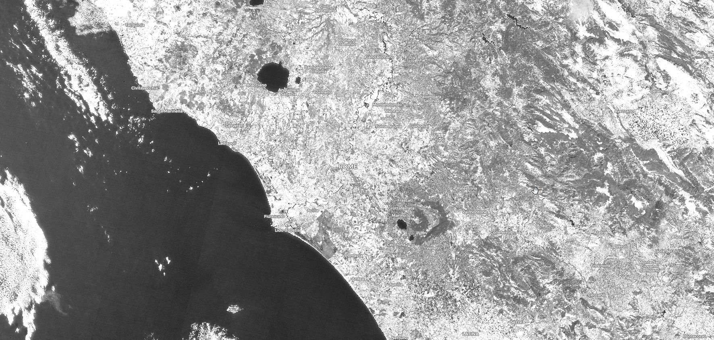

## General description of the script

The MSI is a reflectance measurement, sensitive to increases in leaf water content.

As water content in vegetation canopy leaves increases, the absorbtion at wavelengths around 1599 nm also increases. Absorption at 819nm is used as a reference, since it’s nearly unaffected by changes in water content. Applications of the MSI include canopy stress analysis, productivity prediction and modelling, fire hazard analysis, and studies of ecosystem physiology. The index is inverted relative to the other water vegetation indices; higher values indicate greater water stress and less water content.

Values description: The values of this index range from 0 to more than 3. The common range for green vegetation is 0.4 to 2.

**MSI = B11 / B08**

## Description of representative images

The MSI of Rome, Italy. Acquired on 08.10.2017, processed by Sentinel Hub. 

