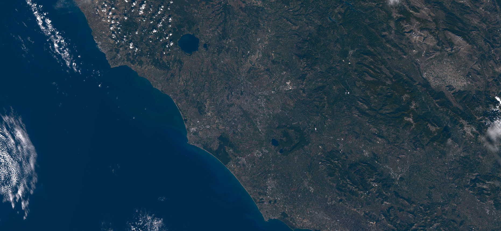

# Natural color product

<a href="#" id='togglescript'>Show</a> script or [download](script.js){:target="_blank"} it.


      


## Evaluate and visualize
 - [Sentinel Playground](https://apps.sentinel-hub.com/sentinel-playground/?source=S2&lat=41.9027835&lng=12.496365500000024&evalscripturl=https://raw.githubusercontent.com/sentinel-hub/customScripts/master/sentinel-2/natural_color/script.js){:target="_blank"}
 - [EO Browser](https://apps.sentinel-hub.com/eo-browser/?lat=41.8650&lng=12.5821&zoom=10&time=2017-10-08&preset=CUSTOM&datasource=Sentinel-2%20L1C&layers=B01,B02,B03&evalscript=ICAgICAgZnVuY3Rpb24gc3VtKGEsIGIpIHsKICAgIHJldHVybiBhICsgYjsKfQoKZnVuY3Rpb24gemlwKGEsIGIsIGYpIHsKICByZXR1cm4gYS5tYXAoZnVuY3Rpb24oYWksaSl7cmV0dXJuIGYoYWksIGJbaV0pO30pOwp9CgpmdW5jdGlvbiBtYXBDb25zdChhcnIsIGMsIGYpIHsKICByZXR1cm4gYXJyLm1hcChmdW5jdGlvbihhaSxpKXtyZXR1cm4gZihhaSwgYywgaSk7fSk7Cn0KCmZ1bmN0aW9uIGRvdFNTKGEsIGIpIHsKICByZXR1cm4gYSAqIGI7Cn0KCi8vdmVjdG9yICogc2NhbGFyCmZ1bmN0aW9uIGRvdFZTKHYsIHMpIHsKICByZXR1cm4gbWFwQ29uc3QodiwgcywgZG90U1MpOwp9CgovL3ZlY3RvciAuIHZlY3RvcgpmdW5jdGlvbiBkb3RWVihhLCBiKSB7CiAgcmV0dXJuIHppcChhLCBiLCBkb3RTUykucmVkdWNlKHN1bSk7Cn0KCi8vbWF0cml4IC4gdmVjdG9yCmZ1bmN0aW9uIGRvdE1WKEEsIHYpIHsKICByZXR1cm4gbWFwQ29uc3QoQSwgdiwgZG90VlYpOwp9CgpmdW5jdGlvbiBhZGooQykgewogIHJldHVybiBDIDwgMC4wMDMxMzA4ID8gKDEyLjkyICogQykgOiAoMS4wNTUgKiBNYXRoLnBvdyhDLCAwLjQxNjY2KSAtIDAuMDU1KTsKfQoKZnVuY3Rpb24gbGFiRih0KSB7CiAgICByZXR1cm4gdCA%2BIDAuMDA4ODU2NDUgPyBNYXRoLnBvdyh0LDEuMC8zLjApIDogKDAuMTM3OTMxICsgNy43ODcgKiB0KTsKfQoKZnVuY3Rpb24gaW52TGFiRih0KSB7CiAgICByZXR1cm4gdCA%2BIDAuMjA2OSA%2FICh0KnQqdCkgOiAoMC4xMjg0MiAqICh0IC0gMC4xMzc5MzEpKTsKfQoKZnVuY3Rpb24gWFlaX3RvX0xhYihYWVopIHsKICB2YXIgbGZZID0gbGFiRihYWVpbMV0pOwogIHJldHVybiBbKDExNi4wICogbGZZIC0gMTYpLzEwMCwKICAgICAgICAgIDUgKiAobGFiRihYWVpbMF0pIC0gbGZZKSwKICAgICAgICAgIDIgKiAobGZZIC0gbGFiRihYWVpbMl0pKV07Cn0KCmZ1bmN0aW9uIExhYl90b19YWVooTGFiKSB7CiAgdmFyIFlMID0gKDEwMCpMYWJbMF0gKyAxNikvMTE2OwogIHJldHVybiBbaW52TGFiRihZTCArIExhYlsxXS81LjApLAogICAgICAgICAgaW52TGFiRihZTCksCiAgICAgICAgICBpbnZMYWJGKFlMIC0gTGFiWzJdLzIuMCldOwp9CgpmdW5jdGlvbiBYWVpfdG9fc1JHQmxpbih4eXopIHsKICAgIHJldHVybiBkb3RNVihbWzMuMjQwLCAtMS41MzcsIC0wLjQ5OV0sIFstMC45NjksIDEuODc2LCAwLjA0Ml0sIFswLjA1NiwgLTAuMjA0LCAxLjA1N11dLCB4eXopOwp9CgpmdW5jdGlvbiBYWVpfdG9fc1JHQih4eXopIHsKICAgIHJldHVybiBYWVpfdG9fc1JHQmxpbih4eXopLm1hcChhZGopOwp9CgpmdW5jdGlvbiBMYWJfdG9fc1JHQihMYWIpIHsKICByZXR1cm4gWFlaX3RvX3NSR0IoTGFiX3RvX1hZWihMYWIpKTsKfQoKZnVuY3Rpb24gZ2V0U29sYXJJcnIoKSB7CiAgcmV0dXJuIFtCMDIsIDAuOTM5KkIwMywgMC43NzkqQjA0XTsKfQoKZnVuY3Rpb24gUzJfdG9fWFlaKHJhZCwgVCwgZ2FpbikgewogIHJldHVybiBkb3RWUyhkb3RNVihULCByYWQpLCBnYWluKTsKfQoKZnVuY3Rpb24gUHJvcGVyR2FtbWFfUzJfdG9fc1JHQihyYWQsIFQsIGdnLCBnYW1tYSwgZ0wpIHsKICB2YXIgWFlaID0gUzJfdG9fWFlaKHJhZCwgVCwgZ2cpOwogIHZhciBMYWIgPSBYWVpfdG9fTGFiKFhZWik7CiAgdmFyIEwgPSBNYXRoLnBvdyhnTCAqIExhYlswXSwgZ2FtbWEpOwogIHJldHVybiBMYWJfdG9fc1JHQihbTCwgTGFiWzFdLCBMYWJbMl1dKTsKfQoKdmFyIFQgPSBbCiAgWzAuMjY4LDAuMzYxLDAuMzcxXSwKICBbMC4yNDAsMC41ODcsMC4xNzRdLAogIFsxLjQ2MywtMC40MjcsLTAuMDQzXQpdOwoKLy8gR2FtbWEgYW5kIGdhaW4gcGFyYW1ldGVycwp2YXIgZ2FpbiA9IDIuNTsKdmFyIGdhbW1hQWRqID0gMi4yOwp2YXIgZ2FpbkwgPSAxOwoKcmV0dXJuIFByb3BlckdhbW1hX1MyX3RvX3NSR0IoZ2V0U29sYXJJcnIoKSwgVCwgZ2FpbiwgZ2FtbWFBZGosIGdhaW5MKTs%3D){:target="_blank"}

## General description
The natural color product tries to represent spectral responses of the satellite bands so as to match the color perceived by the human eye (see [1, 2] for details).

## Description of representative images

Natural color visualization of Rome, on 8.10.2017.

## References
 - [1] B. Sovdat, M. Kadunc, M. Batic, G. Milcinski, [Natural color representation of Sentinel-2 data](https://www.researchgate.net/publication/320042440_Natural_color_representation_of_Sentinel-2_data). Submitted.
 - [2] The accompanying [GitHub repository](https://github.com/sentinel-hub/natural_color).
