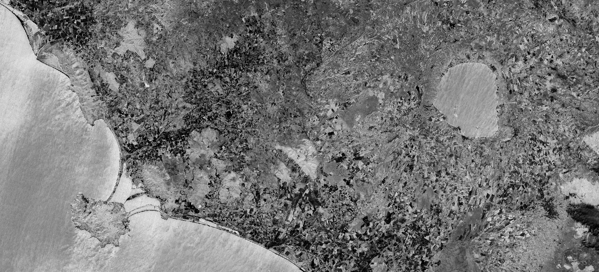

# NBR-RAW (Normalized Burn Ratio)

<a href="#" id='togglescript'>Show</a> script or [download](script.js){:target="_blank"} it.


      


## Evaluate and visualize
 - [Sentinel Playground](https://apps.sentinel-hub.com/sentinel-playground/?source=S2&lat=40.39519549132737&lng=-3.739471435546875&zoom=11&preset=CUSTOM&layers=B01,B02,B03&maxcc=7&gain=1.0&gamma=1.0&time=2019-05-01%7C2019-11-21&atmFilter=&showDates=false&evalscript=IC8vIE5vcm1hbGl6ZWQgRGlmZmVyZW5jZSBOSVIvU1dJUiBOb3JtYWxpemVkIEJ1cm4gUmF0aW8gKGFiYnJ2LiBOQlIpCi8vIEdlbmVyYWwgZm9ybXVsYTogKE5JUiAtIFNXSVIpIC8gKE5JUiArIFNXSVIpCi8vIFVSTCBodHRwczovL3d3dy5pbmRleGRhdGFiYXNlLmRlL2RiL3NpLXNpbmdsZS5waHA%2Fc2Vuc29yX2lkPTk2JnJzaW5kZXhfaWQ9NTMKCmxldCBpbmRleCA9IChCMDggLSBCMTIpIC8gKEIwOCArIEIxMik7CnJldHVybltpbmRleF0%3D){:target="_blank"}
 - [EO Browser](https://apps.sentinel-hub.com/eo-browser/?zoom=11&lat=42.5463&lng=11.5961&themeId=DEFAULT-THEME&datasetId=S2L1C&fromTime=2019-12-10T00%3A00%3A00.000Z&toTime=2019-12-10T23%3A59%3A59.999Z&visualizationUrl=https%3A%2F%2Fservices.sentinel-hub.com%2Fogc%2Fwms%2F42924c6c-257a-4d04-9b8e-36387513a99c&evalscript=Ly8gTm9ybWFsaXplZCBEaWZmZXJlbmNlIE5JUi9TV0lSIE5vcm1hbGl6ZWQgQnVybiBSYXRpbyAoYWJicnYuIE5CUikKLy8KLy8gR2VuZXJhbCBmb3JtdWxhOiAoTklSIC0gU1dJUikgLyAoTklSICsgU1dJUikKLy8KLy8gVVJMIGh0dHBzOi8vd3d3LmluZGV4ZGF0YWJhc2UuZGUvZGIvc2ktc2luZ2xlLnBocD9zZW5zb3JfaWQ9OTYmcnNpbmRleF9pZD01MwovLwoKbGV0IGluZGV4ID0gKEIwOCAtIEIxMikgLyAoQjA4ICsgQjEyKTsKcmV0dXJuW2luZGV4XQ%3D%3D){:target="_blank"}

## General description of the script

To detect burned areas, the NBR-RAW index is the most appropriate choice. Using bands 8 and 12 it highlights burnt areas in large fire zones greater than 500 acres. To observe burn severity, you may subtract the post-fire NBR image from the pre-fire NBR image.

Values description: Darker pixels indicate burned areas.

**NBR = (B08 - B12) / (B08 + B12)**

## Description of representative images

NBR-RAW, Italy. Acquired on 08.10.2017, processed by Sentinel Hub. 

