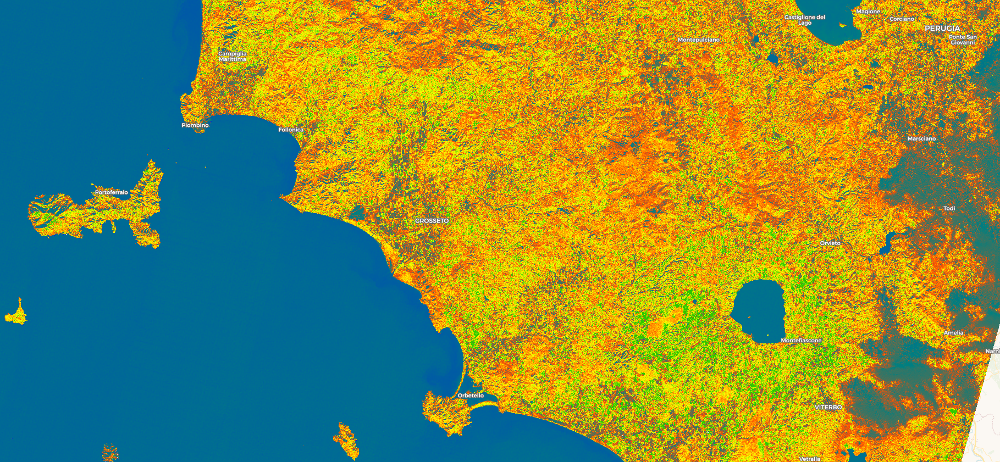

## General description of the script

For Sentinel-2, the index looks like this:

$$NDCI = \frac{B5-B4}{B5+B4}$$  

NDCI is an index that aims to predict the chlorophyll content in turbid productive waters. It is calculated using the red spectral band B04 with the red edge spectral band B05. 

## Description of representative images

Visualization of the NDCI index September 2021 over Pyramid Lake Nevada.

## References

 - [Normalized difference chlorophyll index: A novel model for remote estimation of chlorophyll-a concentration in turbid productive waters](https://www.semanticscholar.org/paper/Normalized-difference-chlorophyll-index%3A-A-novel-of-Mishra-Mishra/2fbacaa14adb43d5bc8d2dd274304f60814d933c){:target="_blank"}
 - [A spectral space partition guided ensemble method for retrieving chlorophyll-a concentration in inland waters from Sentinel-2A satellite imagery](https://www.sciencedirect.com/science/article/abs/pii/S0380133018301801){:target="_blank"}
 - [Comparison of satellite reflectance algorithms for estimating chlorophyll-a in a temperate reservoir using coincident hyperspectral aircraft imagery and dense coincident surface observations](https://www.researchgate.net/publication/297718964_Comparison_of_satellite_reflectance_algorithms_for_estimating_chlorophyll-a_in_a_temperate_reservoir_using_coincident_hyperspectral_aircraft_imagery_and_dense_coincident_surface_observations){:target="_blank"}