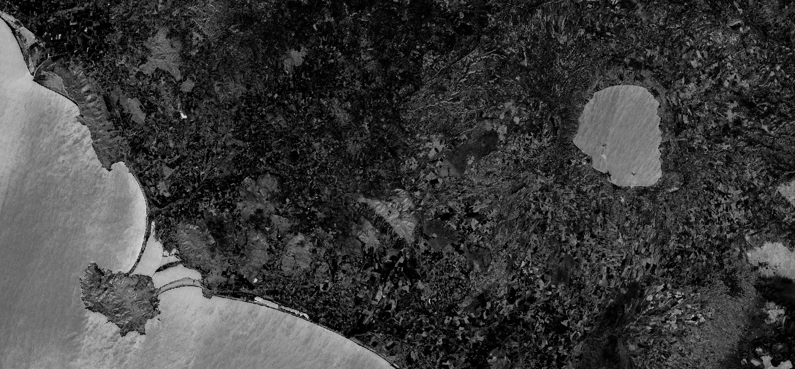

# NDII (Normalized difference 819/1600)
<a href="#" id='togglescript'>Show</a> script or [download](script.js){:target="_blank"} it.


      


## Evaluate and visualize
 - [Sentinel Playground](https://apps.sentinel-hub.com/sentinel-playground/?source=S2&lat=43.514198796857976&lng=16.601028442382812&zoom=11&preset=CUSTOM&layers=B01,B02,B03&maxcc=20&gain=1.0&gamma=1.0&time=2019-06-01%7C2019-12-23&atmFilter=&showDates=false&evalscript=ICAgICAgLy8KLy8gTm9ybWFsaXplZCBEaWZmZXJlbmNlIDgxOS8xNjAwIE5ESUkgKGFiYnJ2LiBORElJKQovLwovLyBHZW5lcmFsIGZvcm11bGE6ICg4MTlubS0xNjAwbm0pLyg4MTlubSsxNjAwbm0pCi8vCi8vIFVSTCBodHRwczovL3d3dy5pbmRleGRhdGFiYXNlLmRlL2RiL3NpLXNpbmdsZS5waHA%2Fc2Vuc29yX2lkPTk2JnJzaW5kZXhfaWQ9MjQyCi8vCgpsZXQgaW5kZXggPSAoQjA4IC0gQjExKSAvIChCMDggKyBCMTEpOwpyZXR1cm5baW5kZXhd&evalscripturl=https://raw.githubusercontent.com/sentinel-hub/custom-scripts/master/sentinel-2/ndwi/script.js){:target="_blank"}
 - [EO Browser](https://apps.sentinel-hub.com/eo-browser/?lat=42.5463&lng=11.5961&zoom=11&time=2019-12-10&preset=CUSTOM&datasource=Sentinel-2%20L1C&layers=B01,B02,B03&evalscript=ICAgICAgLy8KLy8gTm9ybWFsaXplZCBEaWZmZXJlbmNlIDgxOS8xNjAwIE5ESUkgKGFiYnJ2LiBORElJKQovLwovLyBHZW5lcmFsIGZvcm11bGE6ICg4MTlubS0xNjAwbm0pLyg4MTlubSsxNjAwbm0pCi8vCi8vIFVSTCBodHRwczovL3d3dy5pbmRleGRhdGFiYXNlLmRlL2RiL3NpLXNpbmdsZS5waHA%2Fc2Vuc29yX2lkPTk2JnJzaW5kZXhfaWQ9MjQyCi8vCgpsZXQgaW5kZXggPSAoQjA4IC0gQjExKSAvIChCMDggKyBCMTEpOwpyZXR1cm5baW5kZXhd){:target="_blank"}
## General description of the script

This index uses a normalized difference formulation index of wavelengths 819/1600 nm, which corresponds to bands B08 and B11 for Sentinel-2. It is a reflectance measurement, sensitive to changes in water content of plant canopies. The index values increase with increasing water content. Applications of NDII include agricultural crop management, forest canopy monitoring, and stressed vegetation detection.

Values description: The values of this index range from -1 to 1. The common range for green vegetation is between the values of 0.02 to 0.6.

**NBR = (B08 - B11) / (B08 + B11)**

## Description of representative images

NDII, Italy. Acquired on 08.10.2017, processed by Sentinel Hub. 

