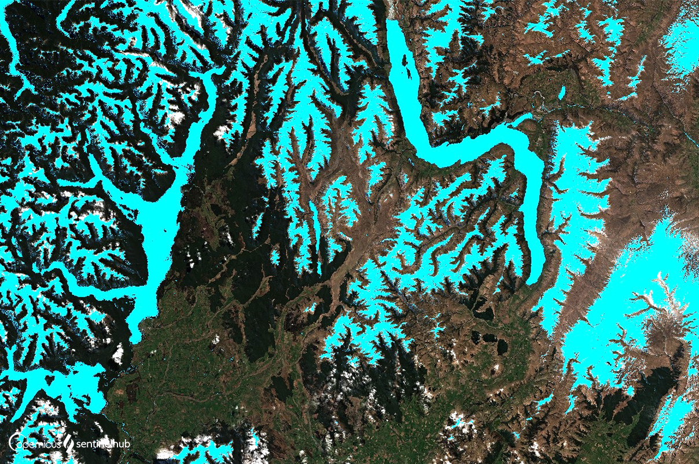

# Normalised Difference Snow Index, NDSI, Visualized

<a href="#" id='togglescript'>Show</a> script or [download](script.js){:target="_blank"} it.


      


## Evaluate and visualize

 - [EO Browser](https://sentinelshare.page.link/twxy){:target="_blank"} 

## General description of the script

The Sentinel-2 normalised difference snow index can be used to differentiate between cloud and snow cover as snow absorbs in the short-wave infrared light, but reflects the visible light, whereas cloud is generally reflective in both wavelengths. Snow cover is represented in bright vivid blue.

## Description of representative images

Visualized NDSI over Rome, acquired on 2019-09-19. 

 

## References

- [ESA, Level-2A Algorithm Overview](https://sentinel.esa.int/web/sentinel/technical-guides/sentinel-2-msi/level-2a/algorithm)
