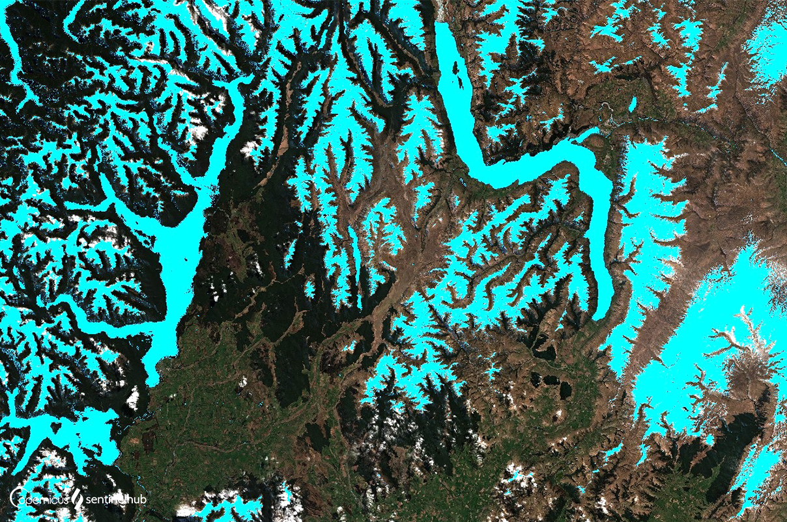

## General description of the script

For Sentinel-2, the index looks like this:

$$NDSI = \frac{B3-B11}{B3+B11}$$   

The Sentinel-2 normalized difference snow index is a ratio of two bands: one in the VIR (Band 3) and one in the SWIR (Band 11). Values above 0.42 are usually snow. More info [here.](https://sentinels.copernicus.eu/web/sentinel/technical-guides/sentinel-2-msi/level-2a/algorithm-overview){:target="_blank"}

The Sentinel-2 normalised difference snow index can be used to differentiate between cloud and snow cover as snow absorbs in the short-wave infrared light, but reflects the visible light, whereas cloud is generally reflective in both wavelengths. In the visualization script snow cover is represented in bright vivid blue.

## Description of representative images

Visualized NDSI over New Zealand, acquired on 2019-09-19. 

 

The NDSI script applied to Klagenfurt, Austria returning raw values. 

 
