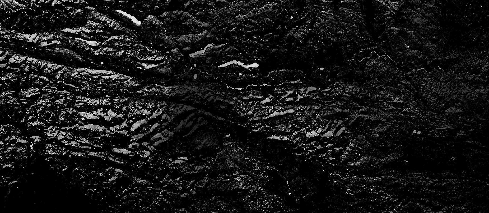

# Normalised Difference Snow Index, NDSI

<a href="#" id='togglescript'>Show</a> script or [download](script.js){:target="_blank"} it.


      


## Evaluate and visualize
 - [Sentinel Playground](https://apps.sentinel-hub.com/sentinel-playground/?source=S2&lat=40.39519549132737&lng=-3.739471435546875&zoom=11&preset=CUSTOM&layers=B01,B02,B03&maxcc=20&gain=1.0&gamma=1.0&time=2020-01-01%7C2020-07-13&atmFilter=&showDates=false&evalscript=Ly9WRVJTSU9OPTMgKGF1dG8tY29udmVydGVkIGZyb20gMSkKCi8vIE5vcm1hbGlzZWQgRGlmZmVyZW5jZSBTbm93IEluZGV4Ci8vIFNvdXJjZTogaHR0cHM6Ly9lYXJ0aC5lc2EuaW50L3dlYi9zZW50aW5lbC90ZWNobmljYWwtZ3VpZGVzL3NlbnRpbmVsLTItbXNpL2xldmVsLTJhL2FsZ29yaXRobQovLyB2YWx1ZXMgYWJvdmUgMC40MiBhcmUgdXN1YWxseSBzbm93CgpsZXQgdml6ID0gbmV3IElkZW50aXR5KCk7CgpmdW5jdGlvbiBldmFsdWF0ZVBpeGVsKHNhbXBsZXMpIHsKICAgIGxldCB2YWwgPSBpbmRleChzYW1wbGVzLkIwMywgc2FtcGxlcy5CMTEpOwogICAgcmV0dXJuIHZpei5wcm9jZXNzKHZhbCk7Cn0KCmZ1bmN0aW9uIHNldHVwKCkgewogIHJldHVybiB7CiAgICBpbnB1dDogW3sKICAgICAgYmFuZHM6IFsKICAgICAgICAgICJCMDMiLAogICAgICAgICAgIkIxMSIKICAgICAgXQogICAgfV0sCiAgICBvdXRwdXQ6IHsgYmFuZHM6IDEgfSAgfQp9Cg%3D%3D&evalscripturl=https://raw.githubusercontent.com/sentinel-hub/customScripts/master/sentinel-2/ndvi_uncertainty/script.js){:target="_blank"}    
 - [EO Browser](https://apps.sentinel-hub.com/eo-browser/?lat=46.4833&lng=14.2094&zoom=10&time=2019-10-23&preset=CUSTOM&datasource=Sentinel-2%20L1C&layers=B01,B02,B03&evalscript=Ly9WRVJTSU9OPTMgKGF1dG8tY29udmVydGVkIGZyb20gMSkKCi8vIE5vcm1hbGlzZWQgRGlmZmVyZW5jZSBTbm93IEluZGV4Ci8vIFNvdXJjZTogaHR0cHM6Ly9lYXJ0aC5lc2EuaW50L3dlYi9zZW50aW5lbC90ZWNobmljYWwtZ3VpZGVzL3NlbnRpbmVsLTItbXNpL2xldmVsLTJhL2FsZ29yaXRobQovLyB2YWx1ZXMgYWJvdmUgMC40MiBhcmUgdXN1YWxseSBzbm93CgpsZXQgdml6ID0gbmV3IElkZW50aXR5KCk7CgpmdW5jdGlvbiBldmFsdWF0ZVBpeGVsKHNhbXBsZXMpIHsKICAgIGxldCB2YWwgPSBpbmRleChzYW1wbGVzLkIwMywgc2FtcGxlcy5CMTEpOwogICAgcmV0dXJuIHZpei5wcm9jZXNzKHZhbCk7Cn0KCmZ1bmN0aW9uIHNldHVwKCkgewogIHJldHVybiB7CiAgICBpbnB1dDogW3sKICAgICAgYmFuZHM6IFsKICAgICAgICAgICJCMDMiLAogICAgICAgICAgIkIxMSIKICAgICAgXQogICAgfV0sCiAgICBvdXRwdXQ6IHsgYmFuZHM6IDEgfSAgfQp9Cg%3D%3D){:target="_blank"} 

## General description of the script

The Sentinel-2 normalized difference snow index is a ratio of two bands: one in the VIR (Band 3) and one in the SWIR (Band 11). Values above 0.42 are usually snow. More info [here.](https://earth.esa.int/web/sentinel/technical-guides/sentinel-2-msi/level-2a/algorithm){:target="_blank"}

## Description of representative images

The NDSI script applied to Klagenfurt, Austria. 

 
