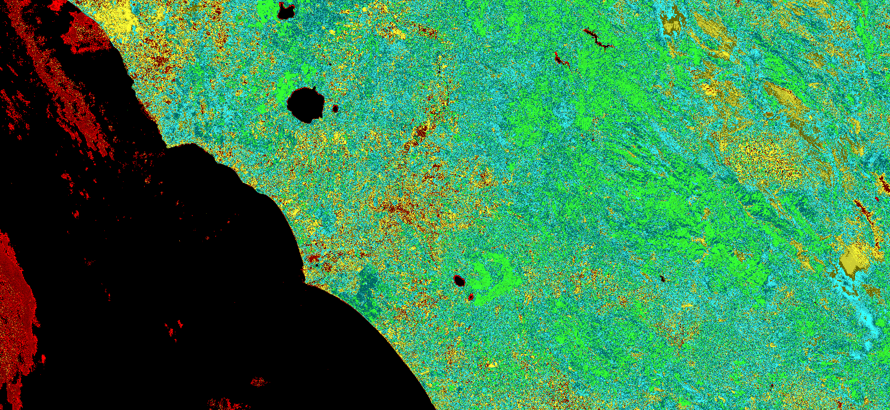

# Normalized difference vegetation index

<a href="#" id='togglescript'>Show</a> script or [download](script.js){:target="_blank"} it.


      


## Evaluate and visualize
 - [Sentinel Playground](https://apps.sentinel-hub.com/sentinel-playground/?source=S2&lat=41.9027835&lng=12.496365500000024&zoom=12&preset=CUSTOM&layers=B01,B02,B03&maxcc=20&gain=1.0&gamma=1.0&time=2019-05-01%7C2019-11-04&atmFilter=&showDates=false&evalscript=bGV0IG5kdmkgPSAoQjA4IC0gQjA0KSAvIChCMDggKyBCMDQpOwoKcmV0dXJuIGNvbG9yQmxlbmQobmR2aSwKICAgWy0wLjIsIDAsIDAuMSwgMC4yLCAwLjMsIDAuNCwgMC41LCAwLjYsIDAuNywgMC44LCAwLjksIDEuMCBdLAogICBbWzAsIDAsIDBdLAkJCQkJCQkgICAvLyAgPCAtLjIgPSAjMDAwMDAwIChibGFjaykKICAgIFsxNjUvMjU1LDAsMzgvMjU1XSwgICAgICAgIC8vICAtPiAwID0gI2E1MDAyNgogICAgWzIxNS8yNTUsNDgvMjU1LDM5LzI1NV0sICAgLy8gIC0%2BIC4xID0gI2Q3MzAyNwogICAgWzI0NC8yNTUsMTA5LzI1NSw2Ny8yNTVdLCAgLy8gIC0%2BIC4yID0gI2Y0NmQ0MwogICAgWzI1My8yNTUsMTc0LzI1NSw5Ny8yNTVdLCAgLy8gIC0%2BIC4zID0gI2ZkYWU2MQogICAgWzI1NC8yNTUsMjI0LzI1NSwxMzkvMjU1XSwgLy8gIC0%2BIC40ID0gI2ZlZTA4YgogICAgWzI1NS8yNTUsMjU1LzI1NSwxOTEvMjU1XSwgLy8gIC0%2BIC41ID0gI2ZmZmZiZgogICAgWzIxNy8yNTUsMjM5LzI1NSwxMzkvMjU1XSwgLy8gIC0%2BIC42ID0gI2Q5ZWY4YgogICAgWzE2Ni8yNTUsMjE3LzI1NSwxMDYvMjU1XSwgLy8gIC0%2BIC43ID0gI2E2ZDk2YQogICAgWzEwMi8yNTUsMTg5LzI1NSw5OS8yNTVdLCAgLy8gIC0%2BIC44ID0gIzY2YmQ2MwogICAgWzI2LzI1NSwxNTIvMjU1LDgwLzI1NV0sICAgLy8gIC0%2BIC45ID0gIzFhOTg1MAogICAgWzAsMTA0LzI1NSw1NS8yNTVdICAgICAgICAgLy8gIC0%2BIDEuMCA9ICMwMDY4MzcKICAgXSk7CgovKiBBbHRlcm5hdGl2ZSB2aXN1YWxpemF0aW9uIGFzIHVzZWQgaW4gU2VudGluZWwgUGxheWdyb3VuZAppZiAobmR2aTwtMC4yKSByZXR1cm4gWzAsMCwwXTsKZWxzZSBpZiAobmR2aTwtMC4xKSByZXR1cm4gWzEsMCwwXTsKZWxzZSBpZiAobmR2aTwwKSByZXR1cm4gWzAuNSwwLjYsMCwwXTsKZWxzZSBpZiAobmR2aTwwLjEpIHJldHVybiBbMC40LDAsMF07CmVsc2UgaWYgKG5kdmk8MC4yKSByZXR1cm4gWzEsMSwwLjJdOwplbHNlIGlmIChuZHZpPDAuMykgcmV0dXJuIFswLjgsMC44LDAuMl07CmVsc2UgaWYgKG5kdmk8MC40KSByZXR1cm4gWzAuNCwwLjQsMF07CmVsc2UgaWYgKG5kdmk8MC41KSByZXR1cm4gWzAuMiwxLDFdOwplbHNlIGlmIChuZHZpPDAuNikgcmV0dXJuIFswLjIsMC44LDAuOF07CmVsc2UgaWYgKG5kdmk8MC43KSByZXR1cm4gWzAsMC40LDAuNF07CmVsc2UgaWYgKG5kdmk8MC44KSByZXR1cm4gWzAuMiwxLDAuMl07CmVsc2UgaWYgKG5kdmk8MC45KSByZXR1cm4gWzAuMiwwLjgsMC4yXTsKZWxzZSByZXR1cm4gWzAsMC40LDBdOwoqLwovKiBBbHRlcm5hdGl2ZSB2aXN1YWxpemF0aW9uIGFzIHVzZWQgaW4gRU8gQnJvd3NlcgppZiAobmR2aTwtMS4xKSByZXR1cm4gWzAsMCwwXTsKZWxzZSBpZiAobmR2aTwtMC4yKSByZXR1cm4gWzAuNzUsMC43NSwwLjc1XTsKZWxzZSBpZiAobmR2aTwtMC4xKSByZXR1cm4gWzAuODYsMC44NiwwLjg2XTsKZWxzZSBpZiAobmR2aTwwKSByZXR1cm4gWzEsMSwwLjg4XTsKZWxzZSBpZiAobmR2aTwwLjAyNSkgcmV0dXJuIFsxLDAuOTgsMC44XTsKZWxzZSBpZiAobmR2aTwwLjA1KSByZXR1cm4gWzAuOTMsMC45MSwwLjcxXTsKZWxzZSBpZiAobmR2aTwwLjA3NSkgcmV0dXJuIFswLjg3LDAuODUsMC42MV07CmVsc2UgaWYgKG5kdmk8MC4xKSByZXR1cm4gWzAuOCwwLjc4LDAuNTFdOwplbHNlIGlmIChuZHZpPDAuMTI1KSByZXR1cm4gWzAuNzQsMC43MiwwLjQyXTsKZWxzZSBpZiAobmR2aTwwLjE1KSByZXR1cm4gWzAuNjksMC43NiwwLjM4XTsKZWxzZSBpZiAobmR2aTwwLjE3NSkgcmV0dXJuIFswLjY0LDAuOCwwLjM1XTsKZWxzZSBpZiAobmR2aTwwLjIpIHJldHVybiBbMC41NywwLjc1LDAuMzJdOwplbHNlIGlmIChuZHZpPDAuMjUpIHJldHVybiBbMC41LDAuNywwLjI4XTsKZWxzZSBpZiAobmR2aTwwLjMpIHJldHVybiBbMC40NCwwLjY0LDAuMjVdOwplbHNlIGlmIChuZHZpPDAuMzUpIHJldHVybiBbMC4zOCwwLjU5LDAuMjFdOwplbHNlIGlmIChuZHZpPDAuNCkgcmV0dXJuIFswLjMxLDAuNTQsMC4xOF07CmVsc2UgaWYgKG5kdmk8MC40NSkgcmV0dXJuIFswLjI1LDAuNDksMC4xNF07CmVsc2UgaWYgKG5kdmk8MC41KSByZXR1cm4gWzAuMTksMC40MywwLjExXTsKZWxzZSBpZiAobmR2aTwwLjU1KSByZXR1cm4gWzAuMTMsMC4zOCwwLjA3XTsKZWxzZSBpZiAobmR2aTwwLjYpIHJldHVybiBbMC4wNiwwLjMzLDAuMDRdOwplbHNlIHJldHVybiBbMCwwLjI3LDBdOwoqLw%3D%3D&evalscripturl=https://raw.githubusercontent.com/sentinel-hub/customScripts/master/sentinel-2/ndvi/script.js){:target="_blank"}
 - [EO Browser](https://apps.sentinel-hub.com/eo-browser/?zoom=10&lat=42.76703&lng=11.22847&themeId=DEFAULT-THEME&datasetId=S2L2A&fromTime=2020-07-12T00%3A00%3A00.000Z&toTime=2020-07-12T23%3A59%3A59.999Z&visualizationUrl=https%3A%2F%2Fservices.sentinel-hub.com%2Fogc%2Fwms%2Fbd86bcc0-f318-402b-a145-015f85b9427e&evalscript=ICAgbGV0IG5kdmkgPSAoQjA4IC0gQjA0KSAvIChCMDggKyBCMDQpOwoKcmV0dXJuIGNvbG9yQmxlbmQobmR2aSwKICAgWy0wLjIsIDAsIDAuMSwgMC4yLCAwLjMsIDAuNCwgMC41LCAwLjYsIDAuNywgMC44LCAwLjksIDEuMCBdLAogICBbWzAsIDAsIDBdLAkJCQkJCQkgICAvLyAgPCAtLjIgPSAjMDAwMDAwIChibGFjaykKICAgIFsxNjUvMjU1LDAsMzgvMjU1XSwgICAgICAgIC8vICAtPiAwID0gI2E1MDAyNgogICAgWzIxNS8yNTUsNDgvMjU1LDM5LzI1NV0sICAgLy8gIC0%2BIC4xID0gI2Q3MzAyNwogICAgWzI0NC8yNTUsMTA5LzI1NSw2Ny8yNTVdLCAgLy8gIC0%2BIC4yID0gI2Y0NmQ0MwogICAgWzI1My8yNTUsMTc0LzI1NSw5Ny8yNTVdLCAgLy8gIC0%2BIC4zID0gI2ZkYWU2MQogICAgWzI1NC8yNTUsMjI0LzI1NSwxMzkvMjU1XSwgLy8gIC0%2BIC40ID0gI2ZlZTA4YgogICAgWzI1NS8yNTUsMjU1LzI1NSwxOTEvMjU1XSwgLy8gIC0%2BIC41ID0gI2ZmZmZiZgogICAgWzIxNy8yNTUsMjM5LzI1NSwxMzkvMjU1XSwgLy8gIC0%2BIC42ID0gI2Q5ZWY4YgogICAgWzE2Ni8yNTUsMjE3LzI1NSwxMDYvMjU1XSwgLy8gIC0%2BIC43ID0gI2E2ZDk2YQogICAgWzEwMi8yNTUsMTg5LzI1NSw5OS8yNTVdLCAgLy8gIC0%2BIC44ID0gIzY2YmQ2MwogICAgWzI2LzI1NSwxNTIvMjU1LDgwLzI1NV0sICAgLy8gIC0%2BIC45ID0gIzFhOTg1MAogICAgWzAsMTA0LzI1NSw1NS8yNTVdICAgICAgICAgLy8gIC0%2BIDEuMCA9ICMwMDY4MzcKICAgXSk7Cgo%3D){:target="_blank"}

## General description

The well known and widely used NDVI is a simple, but effective index for quantifying green vegetation. It normalizes green leaf scattering in Near Infra-red wavelengths with chlorophyll absorption in red wavelengths.

The value range of the NDVI is -1 to 1. Negative values of NDVI (values approaching -1) correspond to water. Values close to zero (-0.1 to 0.1) generally correspond to barren areas of rock, sand, or snow. Low, positive values represent shrub and grassland (approximately 0.2 to 0.4), while high values indicate temperate and tropical rainforests (values approaching 1). It is a good proxy for live green vegetation; see [1] for details.

The normalized difference vegetation index, abbreviated NDVI, is defined as   

$$NDVI := \mathtt{Index}(NIR,RED) = \frac{NIR-RED}{NIR+RED}.$$  

For Sentinel-2, the index looks like this:

$$NDVI := \mathtt{Index}(B8,B4) = \frac{B8-B4}{B8+B4}.$$   

## NDVI for other datasets: 

[Landsat 8 NDVI](https://custom-scripts.sentinel-hub.com/landsat-8/ndvi/){:target="_blank"} = **(B05 - B04) / (B05 + B04)**

Landsat 5 and 7 NDVI = **(B04 - B03) / (B04 + B03)**

MODIS NDVI = **(B02 - B01) / (B02 + B01)**

ENVISAT MERIS NDVI = **(B13 - B07) / (B13 + B07)**

## Description of representative images

NDVI of Rome. Acquired on 8.10.2017.

## Color legend
<table>
  <tr>
    <th>NDVI range</th>
    <th>HTLM color code</th>
    <th>Color</th>
  </tr>
  <tr>
    <td>NDVI &lt; -0.2</td>
    <td>#000000</td>
    <td style="background-color: #000000;"></td>
  </tr>
  <tr>
    <td>-.2 &lt; NDVI &leq; 0</td>
    <td>#a50026</td>
    <td style="background-color: #a50026;"></td>
  </tr>
  <tr>
    <td>0 &lt; NDVI &leq; .1</td>
    <td>#d73027</td>
    <td style="background-color: #d73027;"></td>
  </tr>
  <tr>
    <td>.1 &lt; NDVI &leq; .2</td>
    <td>#f46d43</td>
    <td style="background-color: #f46d43;"></td>
  </tr>
  <tr>
    <td>.2 &lt; NDVI &leq; .3</td>
    <td>#fdae61</td>
    <td style="background-color: #fdae61;"></td>
  </tr>
  <tr>
    <td>.3 &lt; NDVI &leq; .4</td>
    <td>#fee08b</td>
    <td style="background-color: #fee08b;"></td>
  </tr>
  <tr>
    <td>.4 &lt; NDVI &leq; .5</td>
    <td>#ffffbf</td>
    <td style="background-color: #ffffbf;"></td>
  </tr>
  <tr>
    <td>.5 &lt; NDVI &leq; .6</td>
    <td>#d9ef8b</td>
    <td style="background-color: #d9ef8b;"></td>
  </tr>
  <tr>
    <td>.6 &lt; NDVI &leq; .7</td>
    <td>#a6d96a</td>
    <td style="background-color: #a6d96a;"></td>
  </tr>
  <tr>
    <td>.7 &lt; NDVI &leq; .8</td>
    <td>#66bd63</td>
    <td style="background-color: #66bd63;"></td>
  </tr>
  <tr>
    <td>.8 &lt; NDVI &leq; .9</td>
    <td>#1a9850</td>
    <td style="background-color: #1a9850;"></td>
  </tr>
  <tr>
    <td>.9 &lt; NDVI &leq; 1.0</td>
    <td>#006837</td>
    <td style="background-color: #006837;"></td>
  </tr>

</table>

## References
 [1] Wikipedia, [Normalized Difference Vegetation Index
](https://en.wikipedia.org/wiki/Normalized_Difference_Vegetation_Index). Accessed on October 4th 2017.
