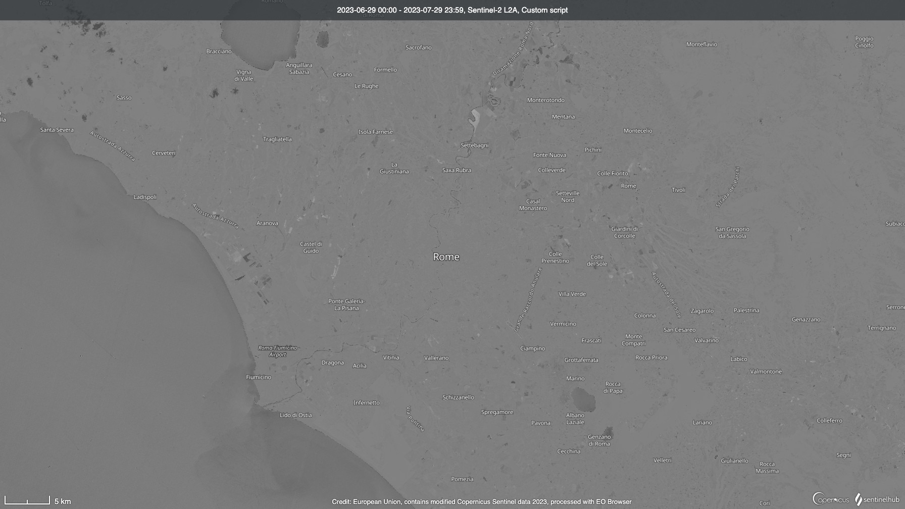

## Evaluate and visualize
- [EO Browser](https://sentinelshare.page.link/bCyt)

**Note**: The default output in the script is the visualisation layer for the EO Browser generated via the [ColorRampVisualizer](https://docs.sentinel-hub.com/api/latest/evalscript/functions/#colorrampvisualizer) which interpolates the range of NDVI difference from -2 to 2 to a grayscale image. The actual value of the NDVI difference can be obtained from the output `index`.

## General description
This script aims to obtain the diffence of NDVI between the latest acquisition and the acquisition 10-day prior to the latest on within a specified time period. Multi-temporal analysis is common in the Earth Observation field. Here we take NDVI as an example and demonstrate how to calculate the difference of NDVI between two acquisitions using [`mosaicking: ORBIT`](https://docs.sentinel-hub.com/api/latest/evalscript/v3/#mosaicking) and [`preProcessScenes`](https://docs.sentinel-hub.com/api/latest/evalscript/v3/#preprocessscenes-function-optional) in one single request.

To implement multi-temporal analysis in the Evalscript, we apply `ORBIT` mosaicking to query daily mosaic in the specified time period. Then, by using the optional `preProcessScenes` function, we find out the acquisition acquired on the date closest to the date 10-day prior to the latest acquisition and filter the out other unused acquisitions to save the PUs. Last but not least, in the `evaluatePixel` function we initialise a combined mask to ensure the difference of NDVI between two acquisitions exists only if there is data on both dates.

**Note**: The example script contains 4 outputs: default, index, eobrowserStats and dataMask. The default layer is a visualisation layer to visualise NDVI difference in EO Browser. The index layer is the actual value of the NDVI difference. For users focusing on the actual value, please make a Processing API request using this example script with the index output only. The eobrowserStats and the dataMask layer is configured to activate statistical features on EO Browser. Please see the [FAQ](https://www.sentinel-hub.com/faq/#how-configure-your-layers-statistical-info-eo-browser) for more details.

## Author of the script

Chung-Xiang Hong

## Description of representative images
The following image shows the NDVI difference between the latest acquisition and the acquisition 10-day prior to the latest one during the time period from 29th of June, 2023 to 29th July, 2023.

