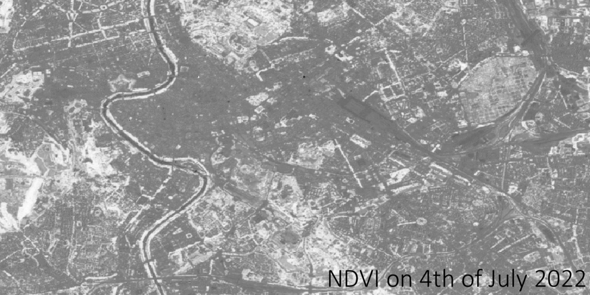

## General description

This script aims to obtain a time series within a specific time period by a single request. Usually, the number of output bands is required to be set in the evalscript when making a request; however, in case users are interested in a time-series analysis, they would like to have all (or partial if a filtering step is needed) available acquisitions whose number is not always clear before making a request.

In this script we take NDVI as an example, but this can be easily changed to other data. To obtain the exact NDVI value in the centre of Rome from 1st of July 2022 to 11th of July 2022, `updateOutput` function is used to update the number of output bands without knowing beforehand how many there are, which allows users to create a multi-band tiff having data of selected acquisition dates in each band. Furthermore, `updateOutputMetadata` function is used in the script to generate a json file with a list of the NDVI dates used in the analysis, which would be really useful in a time-series analysis.

To make this script work, the `responses` parameter in the payload need to be set as following:
```json
"reponses": [
    {
        "identifier": "default",
        "format": {
            "type": "image/jpeg"
        }
    },
    {
        "identifier": "userdata",
        "format": {
            "type": "application/json"
        }
    }
]
```

As an alternative, copy the curl command below to the `Request Preview` window of [Requests Builder](https://apps.sentinel-hub.com/requests-builder/), the application can automatically generate the payload in JSON format or the Python code which is compatible with `sentinelhub` Python package.

```curl
curl -X POST https://services.sentinel-hub.com/api/v1/process  -H 'Content-Type: application/json' -H 'Authorization: Bearer ' -H 'Accept: application/tar'  -d '{  "input": {    "bounds": {      "bbox": [        12.44693,        41.870072,        12.541001,        41.917096      ]    },    "data": [      {        "dataFilter": {          "timeRange": {            "from": "2022-07-01T00:00:00Z",            "to": "2022-07-11T23:59:59Z"          }        },        "type": "sentinel-2-l2a"      }    ]  },  "output": {    "width": 779.8034286939699,    "height": 523.4687735062655,    "responses": [      {        "identifier": "default",        "format": {          "type": "image/tiff"        }      },      {        "identifier": "userdata",        "format": {          "type": "application/json"        }      }    ]  },  "evalscript": "//VERSION=3\n// Script to extract a time series of NDVI values using \n// Sentinel 2 Level 2A data and  metadata file.\nfunction setup() {\n    return {\n      input: [{\n        bands: [\"B04\", \"B08\"],\n        units: \"DN\"\n      }],\n      output: {\n        bands: 1,\n        sampleType: SampleType.FLOAT32\n      },\n      mosaicking: Mosaicking.ORBIT\n    }\n    \n  }\n  \n  // The following function is designed to update the number of\n  // output bands without knowing beforehand how many there are\n  function updateOutput(outputs, collection) {\n      Object.values(outputs).forEach((output) => {\n          output.bands = collection.scenes.length;\n      });\n  }\n  // function to generate a json file with a list of the NDVI \n  // dates used in the analysis. \n  function updateOutputMetadata(scenes, inputMetadata, outputMetadata) {\n      var dds = [];\n      for (i=0; i<scenes.length; i++){\n        dds.push(scenes[i].date)\n      }\n      outputMetadata.userData = { \"acquisition_dates\":  JSON.stringify(dds) }\n  }\n  \n  function evaluatePixel(samples) {\n    // Precompute an array to contain NDVI observations\n    var n_observations = samples.length;\n    let ndvi = new Array(n_observations).fill(0);\n    \n    // Fill the array with NDVI values\n    samples.forEach((sample, index) => {\n      ndvi[index] = (sample.B08 - sample.B04) / (sample.B08 + sample.B04) ;\n    });\n                       \n    return ndvi;\n  }"}'
```

## Author of the script

William Ray

## Description of representative images

The following GIF is the NDVI time series from 1st of July 2022 to 11th of July 2022 displayed in grayscale with QGIS.


