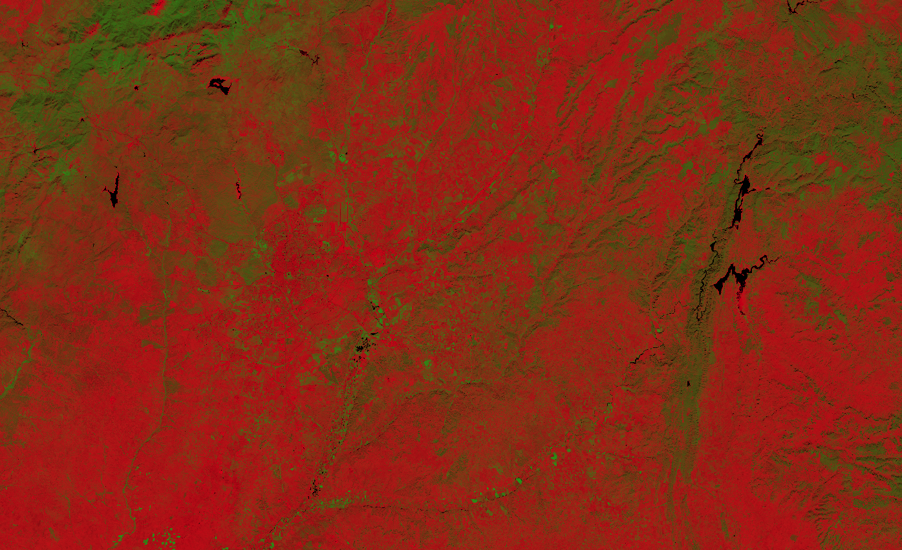

# Normalized difference vegetation index with uncertainty

<a href="#" id='togglescript'>Show</a> script or [download](script.js){:target="_blank"} it.


      


## Evaluate and visualize
 - [Sentinel Playground](https://apps.sentinel-hub.com/sentinel-playground/?source=S2&lat=40.39519549132737&lng=-3.739471435546875&zoom=11&evalscripturl=https://raw.githubusercontent.com/sentinel-hub/customScripts/master/sentinel-2/ndvi_uncertainty/script.js){:target="_blank"}
 - [EO Browser](https://apps.sentinel-hub.com/eo-browser/?zoom=9&lat=45.33797&lng=8.78216&themeId=DEFAULT-THEME&datasetId=S2L1C&fromTime=2017-10-09T00%3A00%3A00.000Z&toTime=2017-10-09T23%3A59%3A59.999Z&visualizationUrl=https%3A%2F%2Fservices.sentinel-hub.com%2Fogc%2Fwms%2F42924c6c-257a-4d04-9b8e-36387513a99c&evalscript=ZnVuY3Rpb24gY2xhbXAgKGEpIHsKICByZXR1cm4gYTwwID8gMCA6IGEgPiAxID8gMSA6IGE7Cn0KZnVuY3Rpb24gc2lnTkRWSSAoYjQsIHM0LCBiOCwgczgpIHsKICB2YXIgc3VtID0gYjggKyBiNDsKICB2YXIgbmR2aSA9IChiOCAtIGI0KS9zdW07CiAgdmFyIHNfbmR2aSA9IDIgLyAoc3VtKnN1bSkgKgogICAgICBNYXRoLnNxcnQoYjgqYjgqczQqczQrYjQqYjQqczgqczgpOwogIHZhciBkYXJrbmVzcyA9IGNsYW1wKDEtMipzX25kdmkpOwogIHJldHVybiBbCiAgICAwLjkqY2xhbXAoMS1uZHZpKSpkYXJrbmVzcywKICAgIDAuOCpjbGFtcChuZHZpKSpkYXJrbmVzcywKICAgIDAuMSpkYXJrbmVzc107Cn0KcmV0dXJuIHNpZ05EVkkoQjA0LCAwLjAyLCBCMDgsIDAuMDMpOw%3D%3D){:target="_blank"}

## Basic information
 - Bands used to calculate NDVI index: B4, B8
 - Bands used by the script: B2, B3, B4, B8

## General description

This script allows you to visually interpret how the normalized density vegetation index (NDVI) [[1]](#ref1) is affected by the uncertainties in detector reflectances of the L1C products.

Since NDVI is defined as a ratio of difference over sum of bands 8 and 4 (near infrared and red):   
$$NDVI := \mathtt{Index}(B8,B4) = \frac{B8-B4}{B8+B4}.$$

the uncertainty propagation [[3]](#ref3) gives us the uncertainty of the index itself as

$$\Delta_{NDVI} := \frac{\sqrt{B8^2 \Delta_{B4}^2 + B4^2 \Delta_{B8}^2 - 2B4 B8 \Delta_{B4B8}}}{(B8+B4)^2}$$.

where $\Delta_{B4}$ and $\Delta_{B8}$ are uncertainties of red and near infrared bands respectively (reported by ESA to be 0.02 and 0.03). We left out the mixed part $\Delta_{B4B8}$ as if the two uncertainties were not correlated.

The script encodes the uncertainty with darkness, as can be seen in following figure [[2]](#ref2)  
![Color map of the NDVI uncertainty script from [2][1]](fig/cmap.jpg)

## Description of representative images

NDVI with uncertainty of Madrid. Acquired on 10.26.2019.

## References
[1] Wikipedia, [Normalized Difference Vegetation Index
](https://en.wikipedia.org/wiki/Normalized_Difference_Vegetation_Index). Accessed on October 4th 2017.   
[2] Sentinel-Hub, [Ad hoc testing of algorithms globally](https://medium.com/sentinel-hub/ad-hoc-testing-of-algorithms-globally-8fb1f564f0f5). Accessed October 10th 2017.   
[3] Wikipedia, [Propagation of uncertainty](https://en.wikipedia.org/wiki/Propagation_of_uncertainty). Accessed October 10th 2017.
