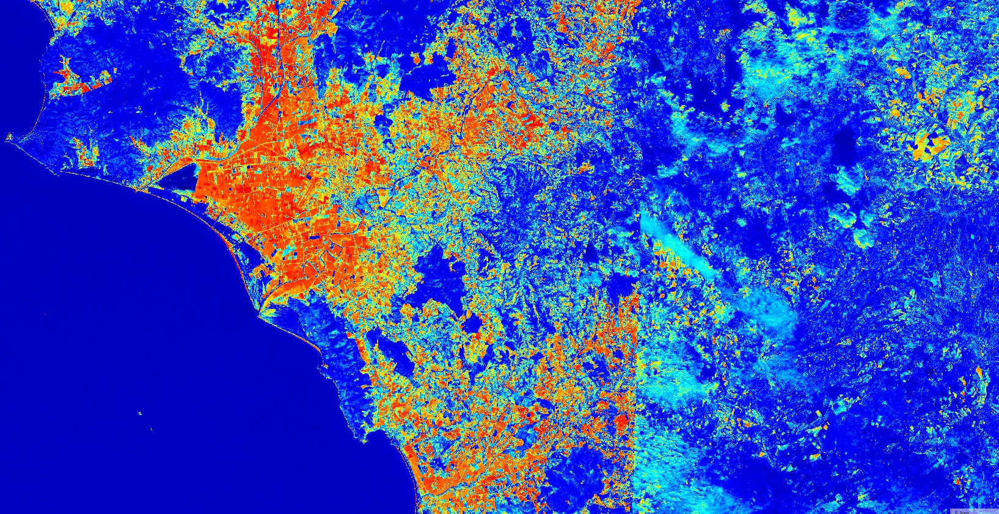
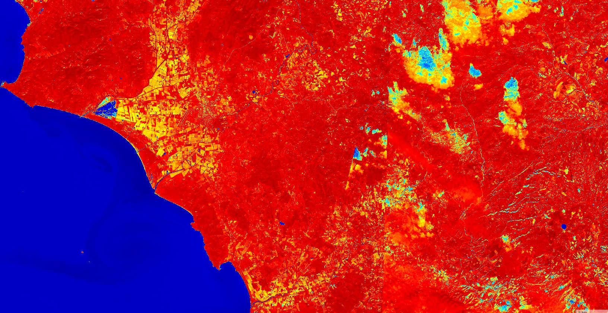

# NDWI Normalized Difference Water Index

<a href="#" id='togglescript'>Show</a> script or [download](script.js){:target="_blank"} it.


      


## Evaluate and visualize
 - [Sentinel Playground](https://apps.sentinel-hub.com/sentinel-playground/?source=S2&lat=43.514198796857976&lng=16.601028442382812&zoom=11&evalscripturl=https://raw.githubusercontent.com/sentinel-hub/custom-scripts/master/sentinel-2/ndwi/script.js){:target="_blank"}    
 - [EO Browser](https://apps.sentinel-hub.com/eo-browser/?lat=41.9000&lng=12.5000&zoom=10&time=2017-10-08&preset=CUSTOM&datasource=Sentinel-2%20L1C&layers=B01,B02,B03&evalscript=Ly9Tb3VyY2U6IGh0dHBzOi8vZW4ud2lraXBlZGlhLm9yZy93aWtpL05vcm1hbGl6ZWRfZGlmZmVyZW5jZV93YXRlcl9pbmRleAoKLy9vcHRpb24gMSwgdXNlZCB0byBtb25pdG9yIGNoYW5nZXMgaW4gd2F0ZXIgY29udGVudCBvZiBsZWF2ZXMsIHByb3Bvc2VkIGJ5IEdhbwovL2h0dHA6Ly9jZWVzZXJ2ZXIuY2VlLmNvcm5lbGwuZWR1L3dkcDIvY2VlNjE1MC9SZWFkaW5ncy9HYW9fMTk5Nl9SU0VfNThfMjU3LTI2Nl9ORFdJLnBkZgp2YXIgbmR3aSA9IChCMDgtQjExKS8oQjA4K0IxMSk7CgovL29wdGlvbiAyLCB1c2VkIHRvIG1vbml0b3IgY2hhbmdlcyByZWxhdGVkIHRvIHdhdGVyIGNvbnRlbnQgaW4gd2F0ZXIgYm9kaWVzLCB1c2luZyBncmVlbiBhbmQgTklSIHdhdmVsZW5ndGhzLCBkZWZpbmVkIGJ5IE1jRmVldGVycyAoMTk5Nik6Ci8vdmFyIG5kd2kgPSAoQjAzIC0gQjA4KSAvIChCMDMgKyBCMDgpOwoKaWYgKG5kd2kgPCAtMCkgewogIHJldHVybiBjb2xvckJsZW5kKC1uZHdpLCBbMCwxXSwgW1sxLDEsMV0sWzAsMC41LDBdXSk7CiAgCn0gZWxzZSB7CiAgcmV0dXJuIGNvbG9yQmxlbmQoTWF0aC5wb3cobmR3aSwwLjI1KSwgWzAsMV0sIFtbMSwxLDFdLFswLDAsMC44XV0pOwp9Cgo%3D){:target="_blank"}   

## General description of the script

Normalized Difference Water Index (NDWI) may refer to one of at least two remote sensing-derived indexes related to liquid water:

One is used to monitor changes in water content of leaves, using near-infrared (NIR) and short-wave infrared (SWIR) wavelengths, proposed by Gao in 1996.

**NDWI = (B08 - B11) / (B08 + B11)**

Another is used to monitor changes related to water content in water bodies, using green and NIR wavelengths, defined by McFeeters (1996).

**NDWI = (B03 - B08) / (B03 + B08)**

## Description of representative images

NDWI (for water content in leaves) of Rome. Acquired on 8.10.2017.

NDWI (for water content in water bodies) of Rome. Acquired on 8.10.2017.

## References
Source: https://en.wikipedia.org/wiki/Normalized_difference_water_index
