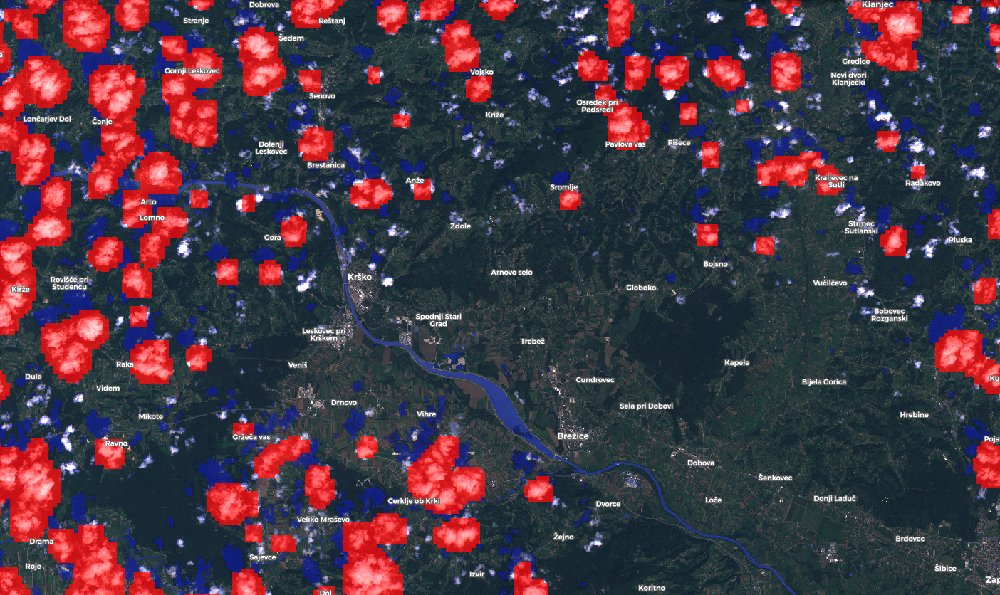

# Observation outlier detector

<a href="#" id='togglescript'>Show</a> script or [download](script.js) it.

## Evaluate and visualize
 - [Sentinel Playground](https://apps.sentinel-hub.com/sentinel-playground/?source=S2&lat=45.958906975029585&lng=15.492095947265625&zoom=13&preset=CUSTOM&layers=B01,B02,B03&maxcc=33&gain=1.0&gamma=1.0&time=2020-09-02%7C2020-09-02&atmFilter=&showDates=false&evalscript=&evalscripturl=https://raw.githubusercontent.com/sentinel-hub/custom-scripts/master/sentinel-2/obs_outlier_detector/v2/script.js) 
 - [EO Browser](https://apps.sentinel-hub.com/eo-browser/?zoom=12&lat=45.94291&lng=15.50274&themeId=DEFAULT-THEME&datasetId=S2L1C&fromTime=2020-09-02T00%3A00%3A00.000Z&toTime=2020-09-02T23%3A59%3A59.999Z&visualizationUrl=https%3A%2F%2Fservices.sentinel-hub.com%2Fogc%2Fwms%2F42924c6c-257a-4d04-9b8e-36387513a99c&evalscripturl=https%3A%2F%2Fraw.githubusercontent.com%2Fsentinel-hub%2Fcustom-scripts%2Fmaster%2Fsentinel-2%2Fobs_outlier_detector%2Fv2%2Fscript.js#custom-script)

## General description of the script

Once the cloudy observations have been filtered out, what is left is a mixture of valid observations and a set of undetected anomalous observations.
These are mostly caused by:
* cloud shadows
* snow
* haze
  
The goal of the observation outlier detection algorithm is to identify anomalous observations.
In this script the results of two masking algorithms is shown using two different colors:

* red: pixels detected as clouds by the cloud detector (s2cloudless).
* blue: pixels detected as outliers by the outlier detector, setting a detection threshold of 0.5.

More information about the approach in the [blog post](https://medium.com/sentinel-hub/area-monitoring-observation-outlier-detection-34f86b7cc63)

## Description of representative images

Outlier detection over Slovenia. Acquired on 2020-09-02.

