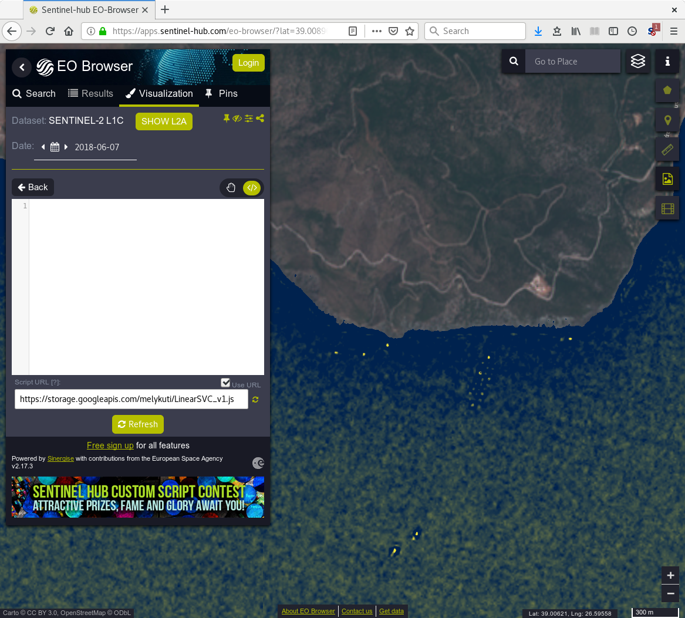
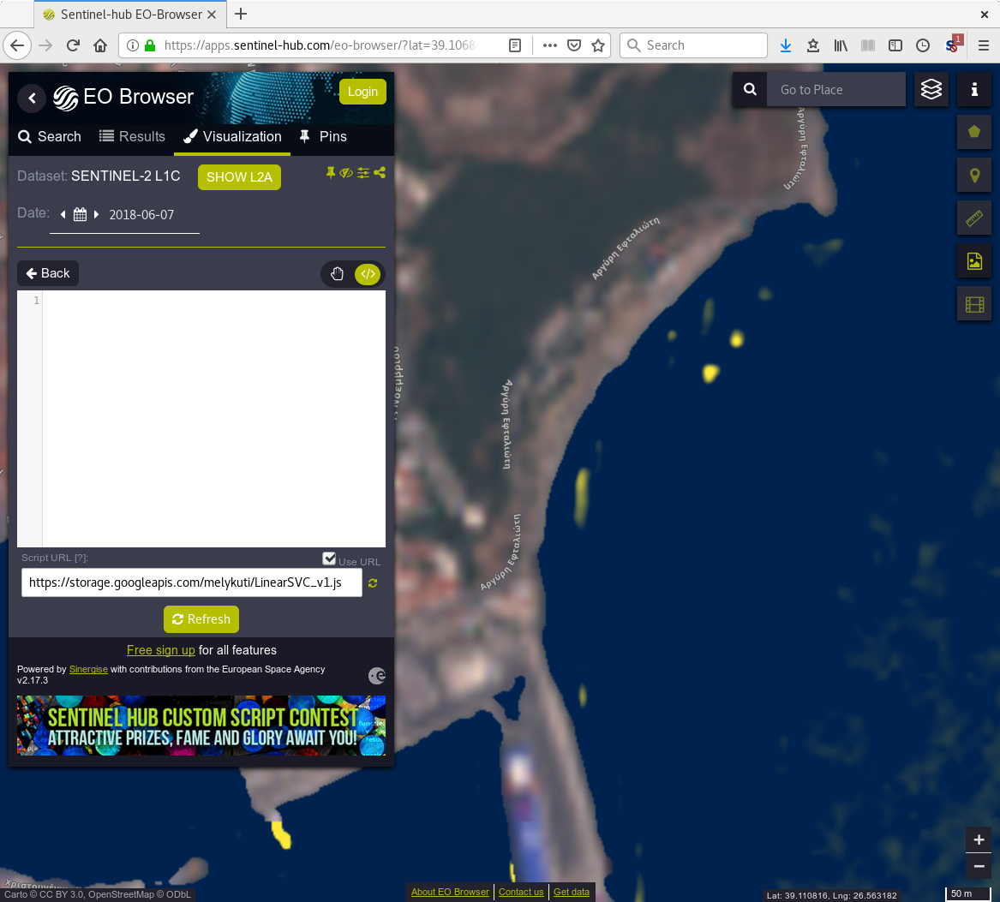

# Ocean Plastic Detector Prototype Script

<a href="#" id='togglescript'>Show</a> script or [download](script.js){:target="_blank"} it.


      


## Evaluate and visualize
 - [Sentinel Playground](https://apps.sentinel-hub.com/sentinel-playground/?source=S2&lat=39.00782967735243&lng=26.60217046737671&zoom=15&preset=CUSTOM&layers=B01,B02,B03&maxcc=26&gain=1.0&gamma=1.0&time=2017-12-01%7C2018-06-07&atmFilter=&showDates=false&evalscript=LyoKQXV0aG9yIG9mIHRoZSBzY3JpcHQ6IEJlbmNlIE3pbHlr%2BnRpLCBEUGhpbCAoT3hmKQoqLwoKCnZhciBlc3RpbWF0b3IgPSAtMS43NmUtMDUgKyAxMDAwMCooLTAuMDAwMzQwMipCMDEgLTAuMDAwNDU4NSpCMDIgKyAwLjAwMTQxNSpCMDMgKyAwLjAxMjU0KkIwNCAtMC4wMTExMipCMDUgLTAuMDEzNDYqQjA2ICsgMC4wMDI3NjIqQjA3ICsgMC4wMDI0ODEqQjA4ICsgMC4wMDk2MDUqQjhBICsgMC4wMDEyNDcqQjA5IC0wLjAxNDYyKkIxMSArIDAuMDA0MDYqQjEyKTsKCmZ1bmN0aW9uIGNsYW1wIChhKSB7CiAgcmV0dXJuIGE8LTEgPyAwIDogYSA%2BIDEgPyAxIDogKDErYSkvMjsKfQoKZnVuY3Rpb24gY2l2aWRpcyAoeCkgewogIC8vIHggbXVzdCBiZSBpbiBbMCwxXQogIC8vIGh0dHBzOi8vZ2l0aHViLmNvbS9tYXRwbG90bGliL21hdHBsb3RsaWIvYmxvYi9tYXN0ZXIvbGliL21hdHBsb3RsaWIvX2NtX2xpc3RlZC5weQogIHJldHVybiBbeCowLjk5NTczNywgeCowLjkwOTM0NCsoMS14KSowLjEzNTExMiwgeCowLjIxNzc3MisoMS14KSowLjMwNDc1MV07Cn0KCnZhciBORFdJID0gKEIwMyAtIEIwOCkgLyAoQjAzICsgQjA4KTsKCnJldHVybiBORFdJIDwgMCA%2FIFsyLjUqQjA0LCAyLjUqQjAzLCAyLjUqQjAyXSA6IGNpdmlkaXMoY2xhbXAoZXN0aW1hdG9yKSk7Cg%3D%3D){:target="_blank"}    
 - [EO Browser](https://apps.sentinel-hub.com/eo-browser/?lat=39.00623&lng=26.59994&zoom=15&time=2018-06-07&preset=CUSTOM&datasource=Sentinel-2%20L1C&layers=B01,B02,B03&evalscript=LyoKQXV0aG9yIG9mIHRoZSBzY3JpcHQ6IEJlbmNlIE3pbHlr%2BnRpLCBEUGhpbCAoT3hmKQoqLwoKCnZhciBlc3RpbWF0b3IgPSAtMS43NmUtMDUgKyAxMDAwMCooLTAuMDAwMzQwMipCMDEgLTAuMDAwNDU4NSpCMDIgKyAwLjAwMTQxNSpCMDMgKyAwLjAxMjU0KkIwNCAtMC4wMTExMipCMDUgLTAuMDEzNDYqQjA2ICsgMC4wMDI3NjIqQjA3ICsgMC4wMDI0ODEqQjA4ICsgMC4wMDk2MDUqQjhBICsgMC4wMDEyNDcqQjA5IC0wLjAxNDYyKkIxMSArIDAuMDA0MDYqQjEyKTsKCmZ1bmN0aW9uIGNsYW1wIChhKSB7CiAgcmV0dXJuIGE8LTEgPyAwIDogYSA%2BIDEgPyAxIDogKDErYSkvMjsKfQoKZnVuY3Rpb24gY2l2aWRpcyAoeCkgewogIC8vIHggbXVzdCBiZSBpbiBbMCwxXQogIC8vIGh0dHBzOi8vZ2l0aHViLmNvbS9tYXRwbG90bGliL21hdHBsb3RsaWIvYmxvYi9tYXN0ZXIvbGliL21hdHBsb3RsaWIvX2NtX2xpc3RlZC5weQogIHJldHVybiBbeCowLjk5NTczNywgeCowLjkwOTM0NCsoMS14KSowLjEzNTExMiwgeCowLjIxNzc3MisoMS14KSowLjMwNDc1MV07Cn0KCnZhciBORFdJID0gKEIwMyAtIEIwOCkgLyAoQjAzICsgQjA4KTsKCnJldHVybiBORFdJIDwgMCA%2FIFsyLjUqQjA0LCAyLjUqQjAzLCAyLjUqQjAyXSA6IGNpdmlkaXMoY2xhbXAoZXN0aW1hdG9yKSk7Cg%3D%3D){:target="_blank"} 

## General description of the script

The script is adapted to Sentinel-2 Level-1C images. It separates land from water using the Normalised Difference Water Index (NDWI). It displays land in natural colour. On the water, it should display the presence of plastic in the water on a dark blue/yellow scale, with dark blue representing no contamination. My prototype does not work reliably but it is a proof of principle in an emerging and pressing area with current, active research. It probably works best (gives the least false positives) around Lesbos, Greece, where most data originated from.

The author tested different machine learning methods (different versions of the support vector machine with linear, polynomial and radial basis function kernels), and selected the best found. For training, he labeled 115 pixels (13 with plastic, 102 without), and used all 12 bands which reach the bottom of the atmosphere as explanatory variables (B01, B02, B03, B04, B05, B06, B07, B08, B8A, B09, B11, B12). Plastic labeling comes from a study where researchers placed three 10m by 10m frames full of plastic material into the sea for a single overpass of Sentinel-1 and -2 satellites (2018-06-07, the beach of Tsamakia of Mytilene, N 39.10769, E 26.56523, WGS84).

Several notable contributions:
1) A facility was written in Python3, implemented in a Jupyter notebook, to select and visualize selected pixels. Their values in the 12 bands are read out. Bands with lower resolution are upsampled to 10m resolution.
2) The implementation in Python3 using only basic operations, of the evaluation of fitted machine learning models from Scikit-Learn, tested against the Scikit-Learn implementations themselves.
3) For each model, tailored Python3 code turns author's implementation into Javascript code for Sentinel Hub.
4) A Google Cloud Storage bucket was created to host various scripts.

Given more images of plastic (just more pixels!), more area in images that are known to contain no plastic, more effort spent labeling, and by testing a wider range of machine learning models, major improvements are possible. There is a research group working on this (Dr. Lauren Biermann, Plymouth Marine Laboratory, UK).

## Author of the script

Bence Mélykúti, DPhil (Oxf)

## Description of representative images

Author's visualisation shows the script detecting the three 10-by-10-metre patches of plastic that was placed on the water by researchers. This is the positive data used for the training.
The same three patches are also seen on the Sentinel Hub EO Browser running the script.
The script shows around the southeast tip of Lesbos island some vessels and an interesting pattern of three rows of some man-made structure off the coast. (All from the 2018-06-07 detection.)

## References

[1] Konstantinos Topouzelis, Apostolos Papakonstantinou, Shungudzemwoyo P. Garaba. Detection of floating plastics from satellite and unmanned aerial systems (Plastic Litter Project 2018). Int J Appl Earth Obs Geoinformation 79 (2019) 175ñ183.

[2] [Plastic Litter Project 2018](https://mrsg.aegean.gr/?content=&nav=55){:target="_blank"} 

[3] [Plastic Litter Project 2019](https://mrsg.aegean.gr/?content=&nav=65){:target="_blank"} 

[4] Lauren Biermann, Victor Martinez Vincente, Sevrine Sailley, Aser Mata, and Christopher Steele. Towards a method for detecting macroplastics by satellite: examining Sentinel-2 earth observation data for floating debris in the coastal zone. Geophysical Research Abstracts Vol. 21, EGU2019-17469, 2019. European Geosciences Union General Assembly 2019.

[5] Jonathan Amos. [Can you spot ocean plastic from space?](https://www.bbc.com/news/science-environment-47910600){:target="_blank"}, BBC News, 12 April 2019.

[6] Sentinel satellites track ocean plastic. [Interview with Dr Lauren Biermann by Jonathan Amos.](https://www.bbc.com/news/av/science-environment-47910604/sentinel-satellites-track-ocean-plastic){:target="_blank"} BBC News, 12 Apr 2019.
